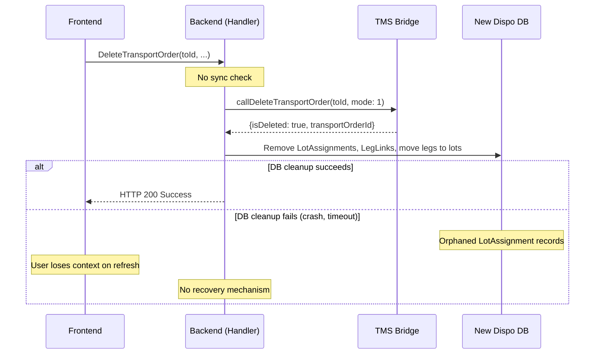

# Flow #7: Delete Transport Order

**Date:** 2026-05-18
**Status:** Minimal implementation (branch: `implement-final-changes-for-delete-transport-order`, no PR linked yet)
**Concept Source:** [07-DeleteTransportOrder.md](../2026-04-08_Transactional_State_Verification_-_CreateTransportOrderFromLeg/07-DeleteTransportOrder.md)
**User Story:** #124364

---

## 1. Sync Detection

### Planned (Concept)

1. Query `V_DIS_TransportOrder` for `TransportOrderId` — absence check (TO should exist before deletion)
2. Pre-check required: `pDIS_TransportOrder.Delete` is NOT idempotent (error 20016 on retry for already-deleted TO)
3. Business rule guards: TO must be in planning status (NEU/UNVOLLST/AVIS) — not DIS/ABF/END
4. Single TMS mutation — fully atomic within PL/pgSQL, no partial failure risk
5. Orphaned assignment problem: if TMS delete succeeds but New Dispo cleanup fails, LotAssignmentEntity records become orphaned

### Implemented (Code)

**Only change:** adds `mode: {1}` to the GraphQL mutation in `DeleteTransportOrderSubHandler`:

```csharp
var mutation =
    $@"mutation {mutationName} {{
        {mutationName} (databaseIdentifier: ""{databaseIdentifier}""
          input: {{
            transportOrderId: {transportOrderId}
            mode: {1}
          }}
        ) {{ isDeleted transportOrderId }}
    }}";
```

Comment in code: "the 'mode' field is hard coded to null in TMS Bridge — here we use example value in order to send the GraphQL request properly"

No sync detection, no pre-check, no error handling changes, no orphaned assignment recovery.



---

## 2. Concept vs. Implementation

**Concept:** Absence-based verification — check if the TO still exists in TMS before attempting deletion. Pre-check prevents the non-idempotent error 20016. The concept extensively documented the orphaned assignment problem (TMS delete succeeds, New Dispo cleanup fails) with four recovery options (A: immediate retry, B: background reconciliation, C: CDC, D: manual).

**Implementation:** Only adds a `mode` parameter to make the GraphQL request work. No sync detection, no pre-check, no verification query, no orphaned assignment handling.

**vs. Option 1:** Underdelivered

**Difference:** Option 1 specified "state-checking query → display error → user retries." Nothing from Option 1 is implemented. The only change is a technical fix (adding `mode` parameter). The concept's orphaned assignment analysis (added 2026-05-12 after team discussion) is not addressed.

---

## 3. Option 1 Requirements

| Requirement | Status | Notes |
|-------------|--------|-------|
| State-checking query before TMS action | Not done | No pre-check for TO existence |
| Display error to user | Not done | Default exception handling only |
| User manually retries | Not done | Retry will hit error 20016 for already-deleted TO |
| Incident ID in error response | Not done | — |
| Structured error payload for Frontend | Not done | — |
| Support team can investigate | Not done | — |
| Monitoring for failure frequency | Not done | — |

---

## 4. Retry Effect

**Polly retry covers transient failures only.** If the TMS Bridge is temporarily unavailable, Polly retries the `callDeleteTransportOrder` mutation 3 times. But if the first call succeeds and the response is lost (Scenario 3: network interruption), the retry will hit error 20016 because the TO is already deleted. This error is NOT in Polly's retry predicate, so it surfaces as a failure.

**User-level retry is dangerous without pre-check.** If the user retries (e.g., page refresh + click delete again), the TMS call will fail with error 20016 ("record modified/not found"). The concept recommended pre-checking `V_DIS_TransportOrder` to detect already-deleted TOs and return success without calling TMS.

---

## 5. Error Information & Data Reaching Frontend

### Implemented

No sync-specific error handling. Possible errors come from default exception handlers:

| Scenario | HTTP Status | Error |
|----------|-------------|-------|
| TMS delete succeeds | 200 | `{isDeleted: true}` |
| TMS business rule rejects (TO in wrong status) | 500 | Generic exception from TMS Bridge |
| TMS already deleted (retry) | 500 | Error 20016 "record modified/not found" |
| New Dispo DB cleanup fails | 500 | Generic exception |

No ConflictException, no UpsertOperationResponseDto, no structured error info.

### Desired / Possible (VA suggestion)

Data available at the pre-check point (concept verification query):

| Field | Available | Surfaced | Could Be Useful For |
|-------|-----------|----------|---------------------|
| TO existence in TMS | Yes (via `V_DIS_TransportOrder`) | Not checked | "TO was already deleted" (benign) vs. "TO still exists" |
| TO status | Yes (via `V_DIS_TransportOrder`) | Not checked | "TO cannot be deleted — status is ABF" (business rule) |
| Orphaned assignments | Yes (via local DB check) | Not checked | "Delete succeeded in TMS but local cleanup failed" |

**VA suggestion (minimal):** Add a pre-check query `V_DIS_TransportOrder WHERE TransportOrderId = :id`. If no row → return success (already deleted). If row exists → proceed with deletion. This prevents the non-idempotent error 20016 and aligns with Option 1.

**VA suggestion (full):** Implement orphaned assignment detection as a post-condition check. After TMS delete succeeds, if local DB cleanup fails, log a structured incident (with incident ID) and return a degraded success: "TO deleted in TMS, local cleanup pending. Incident ID: X."

**AC check (#123326):**
- AC1 "Snackbar" — no sync-specific error, just generic 500
- AC2 "Auto-refresh" — no auto-repair
- AC3 "Edge cases" — orphaned assignment is a critical edge case, not handled
- AC4 "No auto-retry" — retry is dangerous (error 20016)

---

## 6. UX Scenarios

### Scenario A: Normal deletion (happy path)

| Step | What Happens |
|------|-------------|
| User deletes TO | TMS deletes TO, backend cleans up locally |
| Success | Frontend navigates away from deleted TO |

### Scenario B: Retry after successful deletion (dangerous)

| Step | What Happens |
|------|-------------|
| User deletes TO — response lost (network interruption) | TMS deleted, user doesn't know |
| User retries | `callDeleteTransportOrder` → error 20016 |
| Backend returns | HTTP 500 — unhandled TMS error |
| Frontend shows | Generic error — user confused, may retry again |

**With pre-check (concept):** Backend would check `V_DIS_TransportOrder`, find no row, return success without calling TMS.

### Scenario C: Orphaned assignment (critical edge case)

| Step | What Happens |
|------|-------------|
| TMS delete succeeds | TO and all legs freed in TMS |
| Backend DB cleanup fails (crash, timeout) | LotAssignment records still reference deleted TO |
| User refreshes page | Lost frontend context |
| Legs disappear from UI | Not in any TO (TMS side), but still "assigned" in New Dispo |
| No recovery mechanism | Manual support intervention required |

This is documented in detail in the concept doc (section "New Dispo-Side Failure: Orphaned Assignments", added 2026-05-12).

---

## 7. Open Questions

1. **Pre-check is critical for idempotency.** Error 20016 on retry is user-facing and confusing. The concept recommended a simple existence check before calling TMS. This is ~5 lines of code and would make the flow retry-safe. Why was this not included in #124364?

2. **~~Orphaned assignment recovery.~~** ~~Four options were discussed (A: immediate retry, B: background task, C: CDC, D: manual). No decision has been made.~~ **Decided 2026-05-19** — see section 8.

3. **`mode: {1}` parameter.** The comment says "mode is hard coded to null in TMS Bridge." This suggests the TMS Bridge ignores the value. Should this be validated? If the TMS Bridge always passes NULL to `pDIS_TransportOrder.Delete`, the `mode: {1}` in the GraphQL request has no effect.

### From Team

4. **~~Orphaned legs/lots after failed delete (Boyan, 2026-05-12).~~** "Do we have any progress/decision on what we will do if a delete TO operation fails on our side and we have the context lost - (in that case we might have legs/lots still assigned, without any way to unassign them)" — **Answered 2026-05-19** — see section 8.

---

## 8. Decision: Orphaned Assignment Recovery (2026-05-19)

> Sources: Two meetings on 2026-05-19 — "Dispo Blocker" (with Joachim, Patrick, Max Kehder) and "P3 Internal Bi-Weekly" (with Boyan, Yosif).

### Decision

**Option D (Manual Service Desk Recovery) is the Go-Live solution.** Options B (background job), C (CDC), and any automated cron jobs are deferred to post-Go-Live.

The approved minimal scope for Go-Live:
- **Cloud logging** with enough detail (transport order ID, request ID, trace ID) for manual investigation
- **User notification** (toast / error message) informing the user something went wrong
- **Manual cleanup** by whoever fulfills the service desk role

Matthias: "We find the minimal viable solution for the amount of money we have and time we have."

### Why This Is Uniquely Hard

Flow 7 is the only flow where user-driven retry cannot work. For flows 1-6, the affected entity (transport order, assignment) still exists in the UI, so the user can re-trigger the action and the sync check detects the prior state. For Flow 7, the deleted TO disappears from the frontend — the user has no way to re-trigger deletion.

Boyan: "From New Dispo point of view, those would appear as assigned, but there would be no transport order for the user to click and attempt any operation over those legs."

### CDC Will Not Help (Current Scope)

Joachim confirmed: the current CDC scope watches Sendungsart A (shipment parent records). When a TO is deleted, the parent Sendung does not change — only the TO itself (deleted) and legs (Sendungsart H, status reset to 'F') change. The current CDC filters would not detect the orphaned state.

### Building Blocks for Go-Live (Minimal Effort)

Two complementary mechanisms that together form the operational recovery cycle:

**1. Log Pairing (Detection).** Log "deletion initiated" at the start of the flow and "deletion finished" at the end. Operations can query for unpaired events — an initiated event without a matching finished event indicates a failed cleanup. Cloud alerting can be set up on unpaired deletions. This makes orphaned deletions **discoverable proactively** rather than relying on the user to report the problem — critical given that no operations team is confirmed for Go-Live.

**2. Reuse CDC Recovery Logic (Resolution).** The existing POC recovery mechanism already performs the same cleanup (unassigning orphaned legs). This can be exposed as a service endpoint that operations (or eventually an automated process) can call when an unpaired deletion is detected.

Yosif confirmed both are "pretty much no extra effort." Matthias: "Even better, if they fall together in the same building blocks, that's perfect." Yosif: "We can do both."

Together with the user-facing toast/error notification, these form the holistic Go-Live solution: user gets notified → cloud logging captures the details → log pairing enables proactive detection → recovery endpoint enables cleanup.

### Ideas Deferred (Post-Go-Live)

| Idea | Proposed By | Description | Status |
|------|-------------|-------------|--------|
| Automated cron job | Boyan | Query New Dispo for legs assigned to TOs that no longer exist in TMS. Automatically unassign orphans. Run daily. | Deferred — scope/time constraint |
| Soft delete pattern | Yosif | Mark entities as "to be deleted" before calling TMS, preserving context on failure. | Deferred — last sprint |

### Constraints

- Fixed budget — no additional funding for advanced solutions
- ~3 weeks remaining until Go-Live
- No operations team available at Go-Live (Nagel procurement process delayed; Martin seeking interim solution)
- P3 team may need to monitor at minimal level initially

### Next Steps

1. Matthias prepares a holistic concept (logging + UX across all 7 flows) for sign-off by Patrick and Max Kehder
2. UX decision meeting planned with Patrick (and possibly Mehmet) — "sometimes a toast might be enough"
3. Derive minimal building blocks from concept and add to backlog

---

<div align="center">
  <sub>Created and maintained by <strong>Virtual Architect</strong></sub>
</div>
