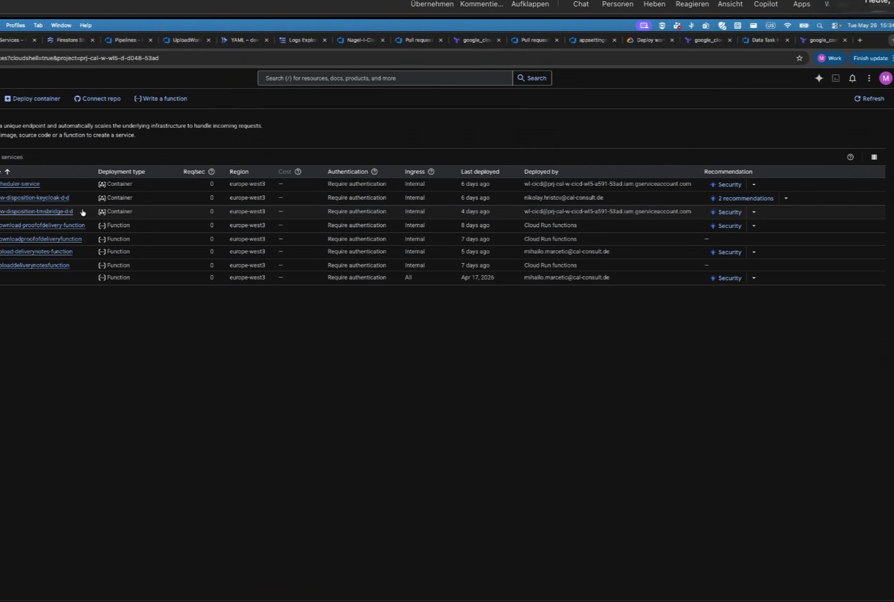
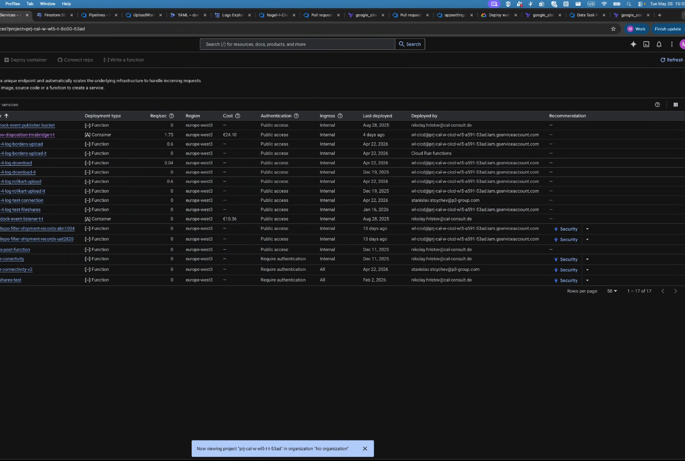
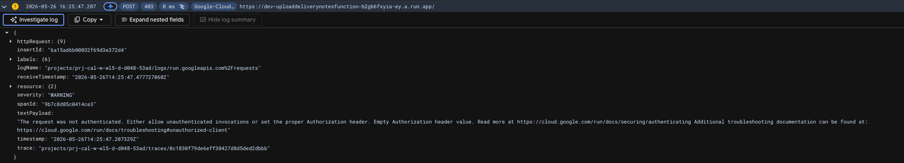

# GCP Cloud Run: Public Access vs Require Authentication

**Date:** 2026-05-26
**Status:** Exploration
**Trigger:** Observed during meeting (Martin, Mihailo, Matthias) that environments have inconsistent authentication settings on Cloud Run services, blocking Cloud4Log development on dev.

---

<internal>

## Original User Input

Screenshots from a meeting (2026-05-26) comparing two GCP projects in the Cloud Run services console. One project (WL5-dev) has services configured with **"Allow unauthenticated invocations"** (public), while another project has services set to **"Require authentication"**.

</internal>

---

## Status Quo

**WL5-dev project — services set to "Allow unauthenticated" (public):**



**Other project — services set to "Require authentication":**



---

## Summary

GCP Cloud Run has an **Authentication** setting per service that controls whether the GCP infrastructure gate checks caller identity before forwarding requests to the container. The two options are:

| Setting | Meaning | Risk |
|---------|---------|------|
| **Allow unauthenticated** | Anyone on the internet can call the service URL. No identity token needed. | Endpoint is publicly accessible. |
| **Require authentication** | Caller must present a valid Google OIDC token with `roles/run.invoker` permission. Unauthenticated requests get **403 Forbidden**. | Access controlled via IAM. |

## Analysis

### What "Public" Actually Means

When a Cloud Run service is set to "Allow unauthenticated invocations":
- GCP removes the IAM check at the ingress layer
- The service URL (e.g., `https://my-service-xyz.run.app`) is reachable by anyone
- No credentials, tokens, or identity proof is required
- The request hits your container code directly

This is appropriate for **public-facing endpoints** (websites, public APIs, webhook receivers) but **not for internal services**.

### What "Require Authentication" Means

- Every HTTP request must include an `Authorization: Bearer <ID_TOKEN>` header
- The token must be a valid Google OIDC identity token
- The caller's service account must have `roles/run.invoker` on the target service
- GCP rejects unauthorized requests **before** they reach the container

### Service-to-Service Authentication (e.g., Cloud Function calling Cloud Run)

Configuring a Cloud Function to call a "Require authentication" service is **minimal effort**:

**Step 1 — IAM binding (one-time, per caller-target pair):**

Via `gcloud`:

```bash
gcloud run services add-iam-policy-binding TARGET_SERVICE \
  --member="serviceAccount:CALLING_SERVICE_SA@PROJECT.iam.gserviceaccount.com" \
  --role="roles/run.invoker" \
  --region=REGION
```

Via Terraform:

```hcl
# Ensure the target Cloud Run service requires authentication
resource "google_cloud_run_v2_service" "target_service" {
  name     = "target-service"
  location = "europe-west1"

  template {
    containers {
      image = "gcr.io/my-project/target-service:latest"
    }
    service_account = google_service_account.target_sa.email
  }
}

# Service account for the calling Cloud Function
resource "google_service_account" "calling_function_sa" {
  account_id   = "calling-function-sa"
  display_name = "Calling Cloud Function Service Account"
}

# Grant the calling function's SA the invoker role on the target service
resource "google_cloud_run_v2_service_iam_member" "invoker" {
  name     = google_cloud_run_v2_service.target_service.name
  location = google_cloud_run_v2_service.target_service.location
  role     = "roles/run.invoker"
  member   = "serviceAccount:${google_service_account.calling_function_sa.email}"
}
```

**Step 2 — Code change (fetch and attach ID token):**

```csharp
var targetUrl = "https://my-service-xyz.run.app/api/something";

var credential = await GoogleCredential.GetApplicationDefaultAsync();
var oidcToken = await credential
    .GetOidcTokenProvider()
    .GetOidcTokenAsync(OidcTokenOptions.FromTargetAudience(targetUrl));

var httpClient = new HttpClient();
httpClient.DefaultRequestHeaders.Authorization =
    new AuthenticationHeaderValue("Bearer", await oidcToken.GetAccessTokenAsync());

var response = await httpClient.GetAsync(targetUrl);
```

The Google SDK handles **token refresh** automatically. If a shared `HttpClient` wrapper is used, this logic is written once.

### Effort Assessment

| Task | Effort |
|------|--------|
| IAM binding per service pair | ~1 `gcloud` command or 1 Terraform resource |
| Code: fetch + attach ID token | ~5-10 lines, done once in a shared HTTP client |
| Overall | Low — no reason to leave internal services public to avoid this |

## Key Takeaway

The "Allow unauthenticated" shortcut saves a few lines of code but exposes the endpoint to the entire internet. For internal services (Cloud Functions calling each other, backend services), **always use "Require authentication"** — the effort is trivial.

## Caller Authentication Code Analysis

Code analysis of all three components that call the TMS Bridge reveals a critical distinction: **all existing authentication is Keycloak-based (application-level), not GCP OIDC-based (infrastructure-level)**. These are two independent layers.

### Authentication per Caller

| Caller | Calls TMS Bridge? | Auth Mechanism | Token Type |
|--------|-------------------|---------------|------------|
| **New Dispo Backend** | Yes (GraphQL) | Keycloak JWT | Application-level Bearer token |
| **Cloud4Log** | Yes (GraphQL) | Keycloak OAuth2 client_credentials | Application-level Bearer token |
| **New Dispo Cloud Functions** | No | N/A — communicates via Pub/Sub, not HTTP | N/A |

### New Dispo Backend

The Backend attaches Keycloak JWT tokens to every TMS Bridge request via `GraphQLQueryService.cs`. Two token sources:

- **Primary:** Pass-through of the `Authorization` header from the incoming Frontend request
- **Fallback** (for PubSub background jobs): Fresh token from Keycloak via `client_credentials` grant (`KeycloakTokenProvider.cs`)

```
GraphQLQueryService.cs:
  var token = _httpContextAccessor.HttpContext?.Request.Headers["Authorization"].FirstOrDefault();
  if (string.IsNullOrEmpty(token))
      token = await keycloakTokenService.GetAccessTokenAsync();  // client_credentials
  _client.HttpClient.DefaultRequestHeaders.Authorization =
      new AuthenticationHeaderValue("Bearer", token.Replace("Bearer ", ""));
```

No Google OIDC tokens are used. The Backend does not call `GoogleCredential.GetApplicationDefaultAsync()` for TMS Bridge communication.

### Cloud4Log

Cloud4Log fetches a Keycloak token via OAuth2 `client_credentials` grant. Credentials are stored in **Google Secret Manager** (secret: `keyCloakConfig`).

```
KeycloakHttpClient.cs → GetAccessTokenAsync():
  1. Fetch keyCloakConfig from Secret Manager
  2. POST to Keycloak token endpoint with client_id + client_secret
  3. Return access_token

GraphQlRequestService.cs → EnsureDefaultHeadersSet():
  var token = await keycloakClient.GetAccessTokenAsync();
  client.HttpClient.DefaultRequestHeaders.Authorization =
      new AuthenticationHeaderValue("Bearer", token.Replace("Bearer ", ""));
```

Thread-safe single initialization via `SemaphoreSlim`. No Google OIDC tokens are used.

### New Dispo Cloud Functions

These functions do **not** call the TMS Bridge directly. They read shipment data from GCS buckets and publish filtered events to Pub/Sub topics. Authentication is only to GCP services via Application Default Credentials (ADC). The downstream consumer of the Pub/Sub messages handles TMS Bridge communication.

### Implication for "Require Authentication" on Cloud Run

The two authentication layers are **independent and cumulative**:

| Layer | Purpose | Currently used? |
|-------|---------|----------------|
| **GCP IAM (infrastructure)** | Google OIDC token proves caller SA has `roles/run.invoker` — checked by Cloud Run *before* request reaches container | **No** — no caller sends OIDC tokens |
| **Keycloak (application)** | JWT proves application-level access — checked by TMS Bridge code *inside* the container | **Yes** — Backend and Cloud4Log both send Keycloak tokens |

Enabling Cloud Run "Require authentication" on the TMS Bridge would **reject all requests** even from callers that already send Keycloak tokens, because GCP checks for a Google OIDC token *before* the request reaches the container. The Keycloak JWT is irrelevant at the infrastructure layer.

To enable "Require authentication," each caller needs an additional ~5-10 lines to fetch and attach a Google OIDC token (see code example above), plus an IAM binding granting `roles/run.invoker` to each caller's service account.

## Official GCP Documentation

- [Authenticating service-to-service | Cloud Run](https://docs.cloud.google.com/run/docs/authenticating/service-to-service) — primary guide
- [Authenticate for invocation | Cloud Run Functions](https://docs.cloud.google.com/functions/docs/securing/authenticating) — Cloud Functions specific
- [Authentication overview | Cloud Run](https://docs.cloud.google.com/run/docs/authenticating/overview)
- [Service Identity | Cloud Run](https://docs.cloud.google.com/run/docs/securing/service-identity)

## Current Blocker (from meeting + chat 2026-05-26)

### Two separate layers at play

The follow-up chat (Matthias, Yosif, Mihailo) revealed that the blocker involves **two distinct layers**, not one:

| Layer | What it controls | Dev status |
|-------|-----------------|------------|
| **1. Network / Ingress** | Can the caller's HTTP request even *reach* the service URL? | **Blocked** — services not publicly accessible, no private DNS |
| **2. GCP IAM (infrastructure)** | Does the caller present a valid Google OIDC token with `run.invoker`? | **Not implemented** — no caller sends OIDC tokens (see [Caller Authentication Code Analysis](#caller-authentication-code-analysis)) |
| **3. Keycloak (application)** | Does the caller present a valid Keycloak JWT? | **Already handled** — Backend and Cloud4Log send Keycloak Bearer tokens |

**Yosif's key insight:** *"This is not about authentication and authorization but rather about component visibility and accessibility."*

Cloud4Log and the Backend **already implement Keycloak token-based auth** when calling the TMS Bridge. The actual blocker is **network reachability** — the Cloud Functions simply can't reach the TMS Bridge or Keycloak endpoints on dev.

### Error evidence from dev

Mihailo shared a Cloud Run log entry showing the actual failure:



```
POST 403 0ms → https://dev-uploaddeliverynotesfunction-...run.app/
"The request was not authenticated. Either allow unauthenticated invocations or set the
proper Authorization header. Empty Authorization header value."
```

This confirms that on dev, **"Require authentication" is active on the Cloud Functions themselves** — and the trigger (Pub/Sub push or GCS event) fails to invoke the function with a valid Google OIDC token. The function never executes at all. This is Layer 2 (GCP IAM) blocking before Layer 3 (Keycloak) even comes into play.

### Three legs that must work

For Cloud4Log to function, three communication legs must all succeed:

```
[Trigger: Pub/Sub / GCS event]           [Keycloak]           [TMS Bridge]
           │                                  │                      │
           │  Leg 1: invoke function          │                      │
           ├─────────────► [Cloud Function] ──┤                      │
           │               (Cloud Run)        │  Leg 2: get token    │
           │                                  │◄─────────────────────┤
           │                                  │  (client_credentials)│
           │                                  │                      │
           │                                  │  Leg 3: GraphQL call │
           │                                  ├─────────────────────►│
           │                                  │  (Bearer: KC token)  │
```

| Leg | From → To | Purpose | Blocked on dev? |
|-----|-----------|---------|----------------|
| **1** | Trigger → Cloud Function | Invoke the function | **Yes** — 403, missing OIDC token |
| **2** | Cloud Function → Keycloak | Get Keycloak access token | **Yes** — network unreachable |
| **3** | Cloud Function → TMS Bridge | GraphQL query with Keycloak token | **Yes** — network unreachable |

### Environment comparison

| Environment | Ingress / Visibility | Authentication | Result |
|-------------|---------------------|---------------|--------|
| **Test** | Public (reachable from internet) | Allow unauthenticated | Cloud Functions can call TMS Bridge |
| **Prod** | Public (reachable from internet) | Allow unauthenticated | Cloud Functions can call TMS Bridge |
| **Dev** | **Not publicly accessible** | **Require authentication** | Cloud Functions **cannot reach** TMS Bridge — blocked |

### Why the team can't fix it themselves

- They lack **DevOps permissions** on the shared VPC project for the dev environment
- They **cannot create a private DNS zone** to enable internal communication
- Load balancers were created for Keycloak and TMS Bridge on dev, but **don't work** because the services aren't reachable
- Nikolay said the **TMS Bridge was created to work with public access**

### Private DNS zone is NOT required

Mihailo suggested creating a private DNS zone for internal communication. After research: **this is not the right approach**. GCP provides two built-in mechanisms for Cloud Function → Cloud Run communication without public access:

| Approach | How it works | Overhead |
|----------|-------------|----------|
| **Direct VPC egress** (recommended) | Cloud Function routes egress through VPC. Traffic is recognized as "internal" by Cloud Run. | Config-only, no extra infra, scales to zero cost |
| **Serverless VPC Access Connector** | Dedicated connector attaches function to VPC | Runs Compute Engine VMs (always-on cost) |

**How it works:** When a Cloud Function's egress routes through a VPC in the same project, Cloud Run recognizes the traffic as "internal" — even when using the standard `*.run.app` URL. No private DNS, no special URLs, no load balancers needed.

**Setup (Direct VPC egress):**

```hcl
resource "google_cloud_run_v2_service" "tms_bridge" {
  name     = "tms-bridge"
  location = "europe-west1"
  ingress  = "INGRESS_TRAFFIC_INTERNAL_ONLY"
  # ... rest of config
}

resource "google_cloudfunctions2_function" "my_function" {
  name     = "my-function"
  location = "europe-west1"

  service_config {
    vpc_connector_egress_settings = "ALL_TRAFFIC"
    # Direct VPC egress — no connector needed
    vpc_connector = null
  }
  # ... rest of config
}
```

**Critical detail:** The Cloud Function's egress must be set to **`ALL_TRAFFIC`** (not just private IPs), otherwise the request to the `*.run.app` URL goes via the internet and gets rejected as non-internal.

**Shared VPC caveat:** The dev environment uses a shared VPC where the team lacks permissions. Mihailo stated: *"we don't have permissions to create anything on that project where shared VPC is for Dev environment."* However, Direct VPC egress does **not** require creating infrastructure in the host project. It only needs the host project admin to:
1. Share a specific subnet with the service project (WL5-dev)
2. Grant `compute.networkUser` on that subnet to the Cloud Run service agent

Both are one-time IAM grants. The actual Direct VPC egress configuration happens entirely in WL5-dev where the team **does** have permissions. This is a much lighter ask than creating and managing DNS zones in the host project.

### The `Authorization` header conflict — why "Require authentication" + Keycloak is not straightforward

The mid-term plan originally said: "enable GCP IAM `Require authentication` on TMS Bridge + keep Keycloak auth." Code analysis reveals a **fundamental conflict** that makes this harder than expected:

**Problem:** HTTP has one `Authorization` header. Cloud Run "Require authentication" and Keycloak both use it.

| Step | Who checks | What's in `Authorization` header | What happens |
|------|-----------|--------------------------------|--------------|
| 1. GCP infrastructure gate | Cloud Run IAM | Must be Google OIDC token | 403 if missing/invalid — request never reaches container |
| 2. Application code | TMS Bridge (Keycloak validation) | Must be Keycloak JWT | Rejected if missing/invalid |

If the caller sends a **Google OIDC token** in `Authorization`: GCP gate passes, but TMS Bridge rejects it (not a Keycloak JWT).
If the caller sends a **Keycloak token** in `Authorization`: GCP gate rejects it (not a Google OIDC token). Request never reaches container.

**You cannot satisfy both layers with a single `Authorization` header.**

### Protection options for TMS Bridge

Given the three protection layers (network, GCP IAM, Keycloak) and the header conflict, four realistic options exist:

---

#### Option 1: Internal network + Keycloak only (recommended)

| Layer | Setting | Status |
|-------|---------|--------|
| Network | `INGRESS_TRAFFIC_INTERNAL_ONLY` | Change needed (currently public on test/prod) |
| GCP IAM | Allow unauthenticated | No change |
| Application | Keycloak JWT validation | Already implemented |

**How it works:**
- TMS Bridge ingress set to "Internal only" — blocks all internet traffic
- Cloud Functions use Direct VPC egress (`ALL_TRAFFIC`) — traffic routed through VPC, recognized as "internal"
- Backend (also Cloud Run in same VPC) reaches TMS Bridge internally
- Keycloak token flow continues unchanged — no code changes needed

**What's protected:**
- TMS Bridge URL is unreachable from outside the VPC
- Within the VPC, Keycloak JWT validation ensures only authorized callers succeed
- Attack surface: VPC-internal only (not the entire internet)

**Effort:**
- Terraform/config: Set ingress to internal on TMS Bridge + Keycloak
- Terraform/config: Enable Direct VPC egress on Cloud Functions (+ Backend if not already)
- Shared VPC: One-time subnet share + `compute.networkUser` grant from host project admin
- Code: **None**

**Applies to all three legs:**

| Leg | Solution |
|-----|----------|
| Trigger → Cloud Function | Set Cloud Function to "Allow unauthenticated" (trigger is internal via Pub/Sub/Eventarc) OR grant trigger SA `run.invoker` |
| Cloud Function → Keycloak | Internal via VPC egress (Keycloak must also be internal or reachable) |
| Cloud Function → TMS Bridge | Internal via VPC egress + Keycloak Bearer token |

---

#### Option 2: Internal network + GCP IAM + custom header for Keycloak

| Layer | Setting | Status |
|-------|---------|--------|
| Network | `INGRESS_TRAFFIC_INTERNAL_ONLY` | Change needed |
| GCP IAM | Require authentication | Change needed |
| Application | Keycloak JWT via **custom header** | Code change in all callers + TMS Bridge |

**How it works:**
- Caller sends **Google OIDC token** in `Authorization` header (GCP gate validates this)
- Caller sends **Keycloak token** in a custom header, e.g., `X-Keycloak-Authorization`
- GCP gate passes the request (OIDC is valid)
- TMS Bridge reads Keycloak token from `X-Keycloak-Authorization` instead of `Authorization`

**What's protected:**
- Network isolation (internal only)
- Infrastructure-level identity verification (only SAs with `run.invoker` can call)
- Application-level authorization (Keycloak JWT)
- Strongest protection — defense in depth

**Effort:**
- Everything from Option 1, PLUS:
- IAM: Grant `run.invoker` to Backend SA and Cloud4Log SA per environment
- **Code change — TMS Bridge:** Read Keycloak token from `X-Keycloak-Authorization` header (fallback to `Authorization` for backwards compatibility during migration)
- **Code change — Cloud4Log:** Add `DelegatingHandler` to GraphQL HttpClient that fetches OIDC token via `GoogleCredential.GetApplicationDefaultAsync()` and sets `Authorization` header. Move Keycloak token to `X-Keycloak-Authorization`. Cloud4Log already has the DelegatingHandler pattern (used by Markant integration in `MarkantAuthHeaderHandler`)
- **Code change — Backend:** Same OIDC + custom header logic. Backend currently creates `GraphQLHttpClient` directly (no `IHttpClientFactory` pipeline) — would need refactoring or inline logic in `GraphQLQueryService.cs`

**Cloud4Log DelegatingHandler sketch:**

```csharp
public class GoogleOidcHandler : DelegatingHandler
{
    protected override async Task<HttpResponseMessage> SendAsync(
        HttpRequestMessage request, CancellationToken ct)
    {
        // Move existing Keycloak token to custom header
        if (request.Headers.Authorization is { Scheme: "Bearer" } keycloak)
            request.Headers.Add("X-Keycloak-Authorization", $"Bearer {keycloak.Parameter}");

        // Set Google OIDC token for Cloud Run gate
        var credential = await GoogleCredential.GetApplicationDefaultAsync();
        var oidc = await credential.GetOidcTokenProvider()
            .GetOidcTokenAsync(OidcTokenOptions.FromTargetAudience(
                request.RequestUri!.GetLeftPart(UriPartial.Authority)));
        request.Headers.Authorization =
            new AuthenticationHeaderValue("Bearer", await oidc.GetAccessTokenAsync());

        return await base.SendAsync(request, ct);
    }
}
```

Registration in `TMSBridgeSetupExtensions.cs`:
```csharp
.AddHttpMessageHandler<GoogleOidcHandler>()  // insert before retry policy
```

---

#### Option 3: Internal network + GCP IAM, drop Keycloak for service-to-service

| Layer | Setting | Status |
|-------|---------|--------|
| Network | `INGRESS_TRAFFIC_INTERNAL_ONLY` | Change needed |
| GCP IAM | Require authentication | Change needed |
| Application | OIDC identity replaces Keycloak for S2S | Significant refactor |

**How it works:**
- Service-to-service calls use Google OIDC only — no Keycloak roundtrip
- TMS Bridge validates OIDC token issuer + caller SA identity
- Keycloak is kept **only** for user-facing auth (Frontend → Backend)
- Backend still needs Keycloak for user context, but uses OIDC for TMS Bridge infra auth

**What's protected:**
- Same as Option 2

**Effort:**
- **High** — TMS Bridge authorization model needs redesign
- Must handle two auth models (user-context via Keycloak, service-context via OIDC)
- Cloud4Log simplifies (remove Keycloak dependency, just use ADC)
- Backend complicates (must still convey user identity somehow)

---

#### Option 4: Public access + Keycloak only (current test/prod)

| Layer | Setting | Status |
|-------|---------|--------|
| Network | `INGRESS_TRAFFIC_ALL` | Current state on test/prod |
| GCP IAM | Allow unauthenticated | Current state |
| Application | Keycloak JWT validation | Already implemented |

**What's protected:**
- Only Keycloak JWT validation — nothing at network or infrastructure level
- TMS Bridge URL is reachable from the entire internet
- Protection relies entirely on application-level token validation

**Effort:**
- **None** — this is the status quo on test/prod
- Only needs replication to dev (the short-term unblock)

---

### Option comparison

| | Network | GCP IAM | Keycloak | Code changes | Effort | Security |
|---|---------|---------|----------|-------------|--------|----------|
| **Option 1** | Internal | — | Existing | None | Low | Good |
| **Option 2** | Internal | OIDC | Custom header | All callers + TMS Bridge | Medium | Best |
| **Option 3** | Internal | OIDC | Dropped for S2S | TMS Bridge redesign | High | Best |
| **Option 4** | Public | — | Existing | None | None | Weak |

### Recommendation

**Option 1 (Internal network + Keycloak)** is the right target for all environments:

- It closes the biggest gap (public internet exposure) with **zero code changes**
- Keycloak auth is already proven and working — no reason to disrupt it
- The marginal security gain of Option 2 (GCP IAM on top) does not justify the code changes across three codebases plus the `Authorization` header workaround
- Option 2 remains available as a future hardening step if requirements change

**Phased approach:**

| Phase | What | Effort | Timeline |
|-------|------|--------|----------|
| **0. Unblock dev** | Align dev with test/prod: set ingress to "All", IAM to "Allow unauthenticated" | Config only (Christian/DevOps) | Immediate |
| **1. Network hardening** | All environments: ingress → "Internal only", Cloud Functions + Backend → Direct VPC egress | Terraform config + one-time shared VPC grants | Mid-term |
| **2. Optional: GCP IAM** | Add "Require authentication" + OIDC handler + custom header (Option 2) | Code changes in TMS Bridge, Backend, Cloud4Log | Only if security audit requires it |

### GCP Documentation — Private Networking

- [Private networking and Cloud Run](https://docs.cloud.google.com/run/docs/securing/private-networking) — overview of internal communication
- [Restrict ingress for Cloud Run](https://docs.cloud.google.com/run/docs/securing/ingress) — ingress settings explained
- [Direct VPC egress](https://docs.cloud.google.com/run/docs/configuring/vpc-direct-vpc) — recommended approach (no connector)
- [Compare Direct VPC egress and VPC connectors](https://cloud.google.com/run/docs/configuring/connecting-vpc)
- [Direct VPC egress with Shared VPC](https://docs.cloud.google.com/run/docs/configuring/shared-vpc-direct-vpc)

### Action items

- [ ] Matthias: Escalate to Christian — align dev with test/prod (Phase 0 unblock)
- [ ] Check with Mihailo + Nikolay (2026-05-27): Clarify exact setup needed for TMS Bridge and Keycloak on dev — raise Direct VPC egress as the target (not private DNS)
- [ ] Mid-term (Phase 1): Plan migration of all environments to internal ingress + Direct VPC egress
- [ ] Yosif is the right contact for mock data / database topics on dev (not Mihailo)

## Questions/Open Items

- [ ] **Nikolay follow-up (2026-05-27):** What exactly does "TMS Bridge is created to work with public access" mean? Is it a code-level assumption or just the current deployment config?
- [ ] What is the ingress setting on dev vs test/prod? Is it "Internal" vs "All"?
- [ ] Is VPC connector configured for the Cloud Functions on dev?
- [ ] For Phase 1: Confirm that Keycloak is also reachable internally (same VPC) or determine its deployment model
- [ ] For Phase 1: Verify that the Backend Cloud Run service can use Direct VPC egress to reach TMS Bridge (both are Cloud Run — may already be internal by default if in same project)
- [ ] If Phase 2 (GCP IAM) is ever pursued: the following callers need `run.invoker` on the TMS Bridge — **New Dispo Backend** SA and **Cloud4Log** SA. Confirm exact service account emails per environment.

## Related Files

- Screenshots: `00_Meetings/2026-05-26_WL5-dev-public-setting/`
- Meeting transcript: `00_Meetings/2026-05-26_Martin und Mihailo DevOps Cloud4Log GCP Topics.vtt`
- Clarification chat: `02_Explorations/2026-05-26_GCP_Cloud_Run_Public_Access_vs_Require_Authentication/chat.md`
