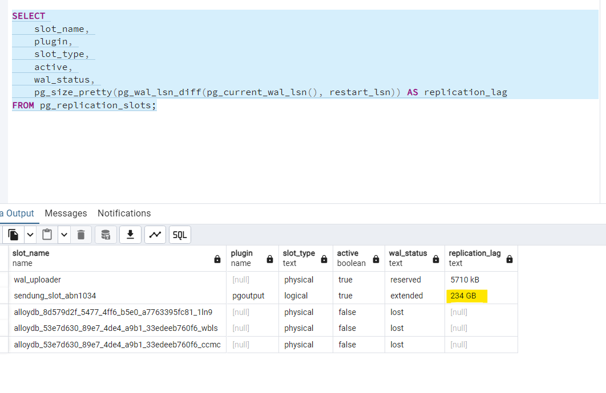

# GCP Datastream Stall Investigation - sendung_slot_abn1034 234GB WAL Lag

**Date:** 2026-06-08
**Status:** Action Required (email sent to Nagel GCP team)

---

## Summary

The Datastream instance `new-dispo-cdc-datastream-sendung-abn1034` in project `prj-cal-w-wl5-t-6c00-53ad` is silently stalled. It reports as RUNNING but hasn't consumed WAL since 11:38 UTC. The replication slot `sendung_slot_abn1034` on AlloyDB has accumulated **234 GB of WAL lag**, putting disk pressure on the database.

## Trigger

Reported via AlloyDB replication slot monitoring. The `sendung_slot_abn1034` slot showed 234 GB replication lag with `wal_status: extended`.



## Investigation

### Replication Slot State (AlloyDB)

| slot_name | plugin | slot_type | active | wal_status | replication_lag |
|---|---|---|---|---|---|
| wal_uploader | [null] | physical | true | reserved | 5710 kB |
| **sendung_slot_abn1034** | **pgoutput** | **logical** | **true** | **extended** | **234 GB** |
| alloydb_8d579d2f... | [null] | physical | false | lost | [null] |
| alloydb_53e7d630..._wbls | [null] | physical | false | lost | [null] |
| alloydb_53e7d630..._ccmc | [null] | physical | false | lost | [null] |

### Datastream Instance Details

- **Stream:** `new-dispo-cdc-datastream-sendung-abn1034`
- **Project:** `prj-cal-w-wl5-t-6c00-53ad`
- **Region:** europe-west3
- **State:** RUNNING (but stalled)
- **Created:** 2026-02-16
- **Source:** AlloyDB via `sendung_slot_abn1034`, publication `sendung_pub`
- **Source table:** `tms1034.sendung`
- **Destination bucket:** `gs://abn1043-sendung-bucket-1`
- **File format:** JSON, 50MB rotation, 60s interval, no compression

### CDC Checkpoint Analysis (gcloud logging)

The stream logs `POSTGRES_CDC_FETCH_CHECKPOINT` every minute, but the LSN and event timestamp are **frozen**:

```
Latest fetched log sequence number: 8511439237608
Latest fetched event timestamp: 2026-06-08T11:38:29.971047Z
```

This value repeated unchanged from 12:24 UTC through at least 12:33 UTC, confirming the consumer is stuck.

### GCS Writes Timeline

Last writes to `gs://abn1043-sendung-bucket-1/tms1034_sendung/`:

| Time (UTC) | Activity |
|---|---|
| 11:14-11:18 | Active writes, 1-36 records per batch |
| 11:30 | Single write (1 file) |
| 11:35 | Last write (1 file) |
| 11:38 | CDC fetch started (last event) |
| After 11:38 | **No more writes** |

### Error Logs

**No errors logged** for this stream in the past 7 days. The stall is silent - Datastream does not report it as an error condition.

The only warnings in the Datastream project are from the separate Oracle CDC stream (`orauat-1060-bucket`) about oversized redo log files exceeding 1GB.

## Diagnosis

The stream is in a **silent stall state**. This is a known Datastream behavior where the PostgreSQL CDC consumer stops advancing without logging any errors. The stream status remains RUNNING, making it invisible to basic health checks.

The replication slot continues to hold WAL, preventing PostgreSQL from reclaiming disk space. At 234 GB and growing, this creates **database disk pressure risk**.

## Recommended Fix

1. **Pause and resume the stream** (requires `datastream.streams.update` permission):
   ```bash
   gcloud datastream streams update new-dispo-cdc-datastream-sendung-abn1034 \
     --location=europe-west3 \
     --project=prj-cal-w-wl5-t-6c00-53ad \
     --state=PAUSED
   # Wait for pause to complete, then:
   gcloud datastream streams update new-dispo-cdc-datastream-sendung-abn1034 \
     --location=europe-west3 \
     --project=prj-cal-w-wl5-t-6c00-53ad \
     --state=RUNNING
   ```

2. After restart, the stream will **resume from the held checkpoint** and process the 234 GB backlog. This may take hours depending on throughput.

3. If pause/resume doesn't resolve it, the replication slot may need to be recreated on the AlloyDB side.

## Action Taken

- Email sent to Nagel GCP team requesting pause/resume of the stream
- Also requested `datastream.streams.update` permission for self-service in the future (our account `x_matthias.max@nagel-group.com` currently lacks this permission)

## Open Items

- Monitor WAL lag after restart to confirm it's decreasing
- Consider setting up an alert on replication slot lag to catch silent stalls earlier
- Evaluate whether `datastream.streams.update` permission is granted for future self-service

## Related Resources

- **Datastream project:** `prj-cal-w-wl5-t-6c00-53ad`
- **GCS destination:** `gs://abn1043-sendung-bucket-1`
- **Source connection profile:** `new-dispo-cdc-postgres-connection-abn1034-1`
- **Destination connection profile:** `new-dispo-cdc-cloud-storage-connection-abn1034-1`
- **ADR-007:** Datastream PSC Proxy Retention
- **Oracle CDC PoC:** `02_Explorations/2026-04-15_Oracle-CDC-PoC-Analysis/`
