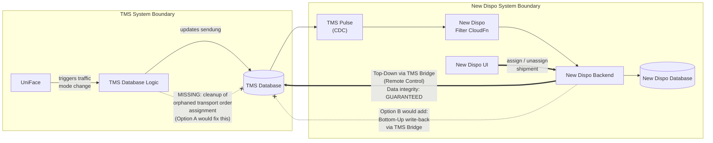

# Traffic Mode Change Data Integrity - TMS System Boundary Decision

**Date:** 2026-06-08
**Status:** Decision Required
**Decision Owner:** Christian Lang (Nagel Architect), Matthias Max (P3 Architect)
**Stakeholders:** Maximilian Beisheim (Business Owner Nagel), Maximilian Kehder (ProxyPO P3), Joachim Schreiner (TMS Database), Boyan Valchev (Lead Developer New Dispo)

---

## Problem Statement

When a shipment's traffic mode is changed in the TMS (UniFace UI) while the shipment's pickup leg is already assigned to a transport order in New Dispo and in the TMS database, the TMS database retains stale assignment data. New Dispo correctly handles the change by removing the old leg and creating a new one of the correct type, but the TMS database does not clean up the orphaned transport order assignment. This results in data inconsistency between the two systems and incorrect display in the New Dispo drive instructions.

**The core question:** Who is responsible for maintaining data integrity within the TMS database when external operations (traffic mode changes via TMS) create inconsistent state?

---

## Technical Background

### Traffic Mode Mapping (OMS/TMS/DIS)

| TMS Traffic Mode | New Dispo Traffic Mode | Pickup Leg Type |
|---|---|---|
| 34 | 1 | VL (Vorholung) |
| 30 | 2 | VL (Vorholung) |
| 3 + ohne Vorlauf | 3 | HL (Hauptlauf-Relationsverladung) |
| 3 / 31 / 32 | 4 | HL (Hauptlauf) |

**Critical boundary:** Switching between traffic modes 1/2 (VL leg) and 3/4 (HL leg) requires a fundamentally different pickup leg type. Switching within the same group (e.g., 1 to 2, or 3 to 4) is harmless because the leg type remains the same.

### The Data Flow

1. User changes traffic mode in TMS (e.g., from TMS 34 to TMS 31 -- i.e., DIS 1 to DIS 4)
2. UniFace triggers internal TMS database logic, which processes the change and modifies the shipment record (Sendung table) *(assumption -- not grounded in code analysis)*
3. CDC (Change Data Capture) detects the change and forwards it to New Dispo
4. New Dispo correctly: removes the old VL leg, creates a new HL leg, removes the shipment from the transport order assignment internally
5. **Problem:** The TMS database `sendung` table still shows the old leg as assigned to the transport order. The internal TMS database logic that processes the traffic mode change does not clean up the transport order assignment for the now-deleted leg type.

### What This Looks Like in Practice

- Drive instructions in New Dispo show a transport order with tour points that reference a leg that no longer exists
- The old UniFace UI does not display the stale assignment (it queries differently), masking the problem
- New Dispo reads the transport order view from TMS database and faithfully displays the stale data
- The result is confusing for users: they see a transport order with ghost assignments

---

## Meeting Evidence Timeline

### Meeting 1: Internal with Joachim (2026-06-05, morning)

**Participants:** Boyan Valchev, Maximilian Kehder, Joachim Schreiner
**Source:** `00_Meetings/2026-06-05_Changing Traffic mode/2026-06-05_Changing Traffic mode internal with joachim .vtt`

**Key statements by Joachim Schreiner:**
- Confirmed that switching traffic modes which cause the leg type to change while assigned is "not implemented from TMS database point of view"
- Acknowledged: "not to be able to change traffic mode if it's assigned to a transport order"
- Confirmed "this suggestion is also implemented, I think, for long haul" (precedent exists for blocking such changes)

**Boyan's summary to the group:** "this morning, you confirmed that this is a TMS bug" -- Joachim did not dispute this characterization in Meeting 1.

**Meeting 1 position (Joachim):** TMS should either prevent the traffic mode change or clean up the data. This is a TMS database concern.

### Meeting 2: Broader discussion (2026-06-05, afternoon)

**Participants:** Boyan Valchev, Maximilian Beisheim, Maximilian Kehder, Joachim Schreiner, Anna Kaupmann
**Source:** `00_Meetings/2026-06-05_Changing Traffic mode/2026-06-05_Changing Traffic mode (0).vtt` + `(1).vtt`

**Joachim's shifted position:**
- "This solution would mean that on TMS side, nothing is to do" -- suggesting New Dispo should handle cleanup
- "it's not a problem to do the change on TMS side, but it would result in implementing twice" -- framing it as duplication if TMS also handles it
- "you also could invoke TMS function to clean up the previous pickup legs, it's the same I would do in TMS" -- proposing New Dispo calls TMS cleanup functions from CDC handlers
- "Discussion would be whether the dispatch has to keep a consistent state of the transport order" -- reframing ownership

**Boyan's counter-arguments (consistent across both meetings):**
- "We are reacting to a change. This change is introduced from the TMS database. We are not doing any changes inside the CDC mechanism."
- "if we do additional actions to the TMS database, this introduces additional synchronization issues"
- "there is absolutely no guarantee that those two systems will remain in sync afterwards, because if [the TMS call] succeeds and our insert fails... we are stuck with data which is wrong"
- "the actual handler of this traffic mode change is not behaving as expected. It's not something which New Dispo has access to change."

**Maximilian Kehder's argument:**
- "Why would we even allow this operation if it is not allowed?" -- questioning why TMS permits the change at all
- "the statement you've made that we have to do it twice on TMS side is not 100% correct, because on TMS side this change needs to happen anyways" -- at some point TMS must implement the blocking/cleanup regardless
- "this is a change which is inside TMS... reacting to its own change and reacting to a change triggered from a different system is a totally different kind of reaction"

**Maximilian Beisheim's position:**
- Acknowledges the problem exists and must be solved
- Initially suggests blocking traffic mode changes when shipment is on drive instructions
- Wants Matthias and Christian to decide who implements the fix
- Became frustrated with the discussion dynamic, feeling P3 was assigning work to Nagel personnel

**Meeting 2 outcome:** Escalate to Matthias Max (P3 Architect) and Christian Lang (Nagel Architect) for decision by Tuesday.

### Exchange: Kehder - Joachim (Teams Chat)

**Source:** `00_Meetings/2026-06-05_Changing Traffic mode/2026-06-xx_Max-Kehder-Joachim-Traffic-Mode.md`

Separate issue surfaced: Traffic mode 3 "Relationsverladung" cannot yet be directly mapped in TMS. Joachim admitted "da hab ich wohl nicht richtig zugehoert" (I probably didn't listen properly). This adds uncertainty about whether the traffic mode mapping itself is fully understood on TMS side.

### Meeting 3: PO/Architect Sync (2026-06-08)

**Participants:** Matthias Max, Maximilian Kehder
**Source:** `00_Meetings/2026-06-08_Intern_ PO _ ARCH - Post Vacation Sync on topics and prios.vtt`

Matthias and Maximilian aligned on:
- This is a TMS-internal data consistency issue (system boundary question)
- Matthias will prepare a decision framing for Christian Lang
- The approach should be: present the problem with enough architectural arguments to establish TMS ownership
- If overruled, the alternative (New Dispo handles TMS data integrity) has significant architectural implications that need explicit acceptance

### Meeting 4: Lead Developer Sync (2026-06-08)

**Participants:** Matthias Max, Boyan Valchev
**Source:** `00_Meetings/2026-06-08_Quick Sync - Boyan Matthias Post Vacation.vtt`

**Matthias Max stated:**
- "I'm aligned there with Max Kehder. I think it's a system boundary. We shouldn't be the ones who have to care about TMS data integrity."
- "If this becomes an integral part of TMS data integrity... it changes the whole direction, like it's just not something you do quickly."
- "You now have a dependency on New Dispo. In all branches, basically, where you rule this out, this needs to be accepted and discussed on a higher level first."

**Boyan confirmed:**
- Joachim "first told me and Max that this is a TMS bug and it should be fixed in TMS, then of course totally switched his statement" in the larger meeting
- New Dispo could technically call the TMS unassign function, "but there is absolutely no guarantee that those two systems will remain in sync afterwards"
- The TMS operations "are not idempotent" -- making retry/recovery much harder if New Dispo takes ownership

---

## Decision Framing for Nagel Architect

### The Fundamental Question

The TMS database currently allows traffic mode changes that create internally inconsistent state (orphaned transport order assignments). The question is **not** whether this must be fixed -- all parties agree it must. The question is **where** the fix belongs architecturally.

### Synchronization Direction: Top-Down vs. Bottom-Up

New Dispo acts as a **remote control** to the TMS system. All activities triggered from New Dispo are assured to be in sync with TMS -- data integrity is guaranteed in this top-down direction.

The reverse direction -- **bottom-up synchronization**, where New Dispo reacts to changes originating in TMS and writes back corrections into TMS -- was explicitly **de-scoped for this release**. Bottom-up sync is complex, heavy, and requires a proper concept before implementation.

The traffic mode change scenario is exactly this: a change originates in TMS, and the proposal is for New Dispo to react by writing corrections back into TMS. This falls squarely into the de-scoped bottom-up synchronization category.

### Data Integrity Responsibility by Trigger Source

**Reading the diagram:**
- **Solid thick arrow (Top-Down):** When New Dispo triggers a change, it writes through the TMS Bridge into TMS. Both systems stay in sync. Data integrity is guaranteed.
- **Solid arrows (CDC chain):** TMS database changes flow through TMS Pulse (CDC), New Dispo Filter CloudFn, and into the New Dispo Backend. This is a one-way, read-only data flow -- New Dispo observes and reflects, it does not write back.
- **Dashed arrow with X (New Dispo Backend → TMS Database):** Does not exist today. Option B proposes adding this: New Dispo Backend would write corrections back into TMS via TMS Bridge when it detects integrity issues through CDC. This is the bottom-up write-back path that was de-scoped.
- **Crossed dashed line (TMS internal):** When UniFace triggers a traffic mode change, the internal TMS database logic does not clean up the orphaned transport order assignment. This is the data integrity gap that must be closed within TMS.

### Option A: TMS Owns Its Data Integrity (Recommended)

**Description:** The internal TMS database logic that processes traffic mode changes is extended to also clean up transport order assignments when the leg type changes. Alternatively, TMS blocks traffic mode changes that would change the leg type while the shipment is assigned. This is consistent with the existing precedent for long-haul transport orders, where traffic mode changes are already blocked.

**Architectural rationale:**
- **System boundary principle:** Each system is responsible for its own data consistency. The TMS database is the source of truth for transport order assignments. When an internal TMS operation (traffic mode change) creates inconsistency in TMS data, it is TMS's responsibility to resolve it.
- **Self-introduced changes:** The traffic mode change is triggered within TMS itself. TMS must enforce data integrity for changes it introduces -- this has never been delegated to an external system.
- **Isolation test:** If New Dispo were stripped away entirely and TMS ran standalone, the traffic mode change would still produce orphaned assignments. TMS would have to clean this up regardless. New Dispo's existence does not change TMS's responsibility for its own consistency.
- **Bottom-up sync is de-scoped:** Reacting to TMS changes by writing back into TMS is out of scope for this release. Implementing it for this single case without the proper concept creates an ad-hoc precedent.
- **Existing precedent:** Long-haul transport orders already block traffic mode changes. TMS already enforces data integrity in isolation for this exact pattern -- just for a different leg type.
- **No cross-system dependency:** New Dispo remains a consumer of TMS data via CDC, not a corrective actor. This preserves the clean data flow direction.
- **Simpler error handling:** All changes stay within TMS's transactional boundary. No distributed transaction concerns.

**Implementation options within TMS:**
1. **Block the change:** Prevent traffic mode changes that cross the VL/HL boundary when the shipment is assigned to a transport order (same as long-haul behavior)
2. **Handle the change:** Extend the internal TMS database logic to also unassign the old leg from the transport order before creating the new leg type

**Effort estimate (per Joachim):** "Normally, it's not a problem to do the change on TMS side" -- stated in Meeting 2.

### Option B: New Dispo Takes Responsibility for TMS Data Integrity

**Description:** When New Dispo detects a traffic mode change via CDC that requires a leg type switch, it calls TMS Bridge functions to unassign the old leg from the transport order before creating the new leg.

**Architectural implications (must be explicitly accepted if chosen):**
1. **TMS data integrity depends on New Dispo availability.** If New Dispo is down, unavailable, or its CDC pipeline is delayed, TMS data remains inconsistent. TMS can no longer guarantee its own data integrity independently.
2. **Distributed transaction problem.** The unassign call to TMS and the New Dispo internal state change are not atomic. If the TMS call succeeds but the New Dispo operation fails (or vice versa), the systems are in an inconsistent state that requires manual intervention. TMS operations are not idempotent, making automatic recovery unreliable.
3. **Precedent for scope creep.** Every future TMS data integrity issue discovered during CDC processing becomes a candidate for "New Dispo should fix it." This shifts the architectural contract from "New Dispo reflects TMS state" to "New Dispo maintains TMS state."
4. **Performance impact.** Every traffic mode change that crosses the VL/HL boundary would require additional round-trip requests from New Dispo Backend through TMS Bridge back into the TMS database. This adds latency to CDC event processing and increases the failure surface of the entire CDC pipeline.
5. **All deployment branches affected.** Every branch/environment where New Dispo is deployed must handle this correctly. New Dispo becomes a hard runtime dependency for TMS data integrity -- not just for disposition functionality.

**This is not a bug fix -- it is an architectural direction change.**

### Recommendation

**Option A** preserves the established system boundary: TMS is responsible for its own data integrity, New Dispo reflects TMS state via CDC. This is consistent with the existing long-haul precedent, has lower implementation risk, and avoids creating a hard dependency between TMS runtime integrity and New Dispo availability.

If Option A is not feasible due to timeline or resource constraints, Option B can be implemented as a **temporary workaround** with explicit acknowledgment that:
- It is not the long-term architectural direction
- TMS must eventually own this responsibility
- The synchronization risks are accepted for the interim period

---

## Observed Pattern: Statement Reversal

A recurring dynamic observed in the meetings: Joachim Schreiner acknowledges issues as TMS bugs in smaller internal discussions but reframes ownership when the broader Nagel stakeholder group is present. This pattern was explicitly noted by Boyan: "I can point exactly how he described this as a bug, and when it comes to the actual discussion with Max [Beisheim], his statement was totally switched."

This is relevant for the decision process because it means verbal agreements in internal meetings may not hold when escalated. **The decision framing must be written, architectural, and principle-based** -- not dependent on verbal confirmations.

Additionally, Joachim's position is self-contradictory: the existing long-haul blocking solution proves that TMS already cares about data consistency and integrity in isolation within the TMS space. To argue that this does not apply to other leg types contradicts what TMS has already implemented.

---

## Action Items

| # | Action | Owner | Due |
|---|--------|-------|-----|
| 1 | Prepare written decision framing document for Christian Lang | Matthias Max | 2026-06-10 |
| 2 | Schedule decision meeting with Christian, Matthias, Joachim | Matthias Max | 2026-06-10 |
| 3 | Ensure meeting transcripts are preserved as evidence of the contradictory positions | Boyan / Maximilian Kehder | Done |
| 4 | Clarify traffic mode 3 "Relationsverladung" mapping (Joachim admitted uncertainty) | Joachim Schreiner | 2026-06-10 |

---

## Related Sources

| Source | Location |
|--------|----------|
| Meeting 1: Internal with Joachim (morning) | `00_Meetings/2026-06-05_Changing Traffic mode/2026-06-05_Changing Traffic mode internal with joachim .vtt` |
| Meeting 2: Broader group discussion (afternoon, part 1) | `00_Meetings/2026-06-05_Changing Traffic mode/2026-06-05_Changing Traffic mode (0).vtt` |
| Meeting 2: Broader group discussion (afternoon, part 2) | `00_Meetings/2026-06-05_Changing Traffic mode/2026-06-05_Changing Traffic mode (1).vtt` |
| Exchange: Kehder - Joachim (Teams) | `00_Meetings/2026-06-05_Changing Traffic mode/2026-06-xx_Max-Kehder-Joachim-Traffic-Mode.md` |
| Traffic mode mapping table | `00_Meetings/2026-06-05_Changing Traffic mode/image.png` |
| Meeting 3: PO/Architect Sync | `00_Meetings/2026-06-08_Intern_ PO _ ARCH - Post Vacation Sync on topics and prios.vtt` |
| Meeting 4: Lead Developer Sync | `00_Meetings/2026-06-08_Quick Sync - Boyan Matthias Post Vacation.vtt` |

---

  Created and maintained by <strong>Virtual Architect</strong>

