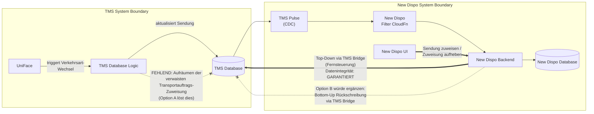

# Verkehrsart-Wechsel: Systemgrenzenfrage TMS / New Dispo

**Datum:** 2026-06-08 (aktualisiert 2026-06-12)
**Status:** Entschieden - Option C (Go-Live Interim)
**Entscheider:** Christian Lang (Entscheider), Matthias Max (P3 Architect)
**Abgestimmt mit:** Patrick Uschmann, Maximilian Kehder, Joachim Schreiner

---

## Problem

Wird in UniFace die Verkehrsart einer Sendung geändert und es kommt zu einer Änderung des Pickup-Legs (z.B. von Vorlauf zu Hauptlauf), während die Sendung in New Dispo und in der TMS-Datenbank bereits einem Transportauftrag zugewiesen ist, entsteht ein inkonsistenter Zustand in der TMS-Datenbank: Die alte Transportauftragszuweisung bleibt als verwaister Datensatz bestehen.

New Dispo reagiert korrekt. Das alte New Dispo-Leg wird entfernt, ein neues New Dispo-Leg des richtigen Typs wird angelegt und dem Fahrauftrag hinzugefügt. Aber die TMS-Datenbank räumt die verwaiste Zuweisung nicht auf. Dadurch erscheinen in der Fahranweisung Tourpunkte, die auf das fehlerhaft verwaiste Leg (in TMS) zeigen, welches in New Dispo nicht mehr existiert.

**Kernfrage:** Wer ist verantwortlich für Datenintegrität innerhalb der TMS-Datenbank, wenn TMS-interne Operationen inkonsistenten Zustand erzeugen?

---

## Technischer Hintergrund

| TMS Verkehrsart           | New Dispo Traffic Mode | Pickup-Leg-Typ                    |
| ------------------------- | ---------------------- | --------------------------------- |
| 34                        | 1                      | HL (Hauptlauf)                    |
| 30                        | 2                      | VL (Vorholung)                    |
| 3 + ohne Vorlauf          | 3                      | HL (Hauptlauf-Relationsverladung) |
| 3 + mit Vorlauf / 31 / 32 | 4                      | VL (Vorholung)                    |

> **Umgang mit TMS Verkehrsart 31 -- Geklärt (2026-06-11):** Verkehrsart 31 ist normales Sammelgut, wie Verkehrsart 3. Keine Relationsverladung. Abgestimmt zwischen Joachim und Reinhard.

**Kritische Grenze:** Ein Wechsel zwischen HL (Verkehrsart 1/3) und VL (Verkehrsart 2/4) erfordert einen komplett anderen Leg-Typ.

---

## Synchronisationsrichtung: Top-Down vs. Bottom-Up

New Dispo agiert als **Fernsteuerung** für das TMS. Alle von New Dispo ausgelösten Aktionen sind synchron mit TMS. Datenintegrität ist in dieser Top-Down-Richtung garantiert.

Die umgekehrte Richtung, **Bottom-Up-Synchronisation**, bei der New Dispo auf TMS-Änderungen reagiert und Korrekturen in TMS zurückschreibt, wurde für dieses Release **bewusst ausgeklammert**. Bottom-Up-Sync ist komplex und erfordert ein sauberes Konzept.

Der Verkehrsart-Wechsel fällt genau in diese Kategorie: Eine Änderung entsteht im TMS, und der Vorschlag wäre, dass New Dispo korrigierend in TMS zurückschreibt.

---

## Go-Live-Kontext: Datenintegrität auf PROD

Für den Go-Live auf PROD müssen **alle bekannten Fehlerquellen, die die Datenintegrität gefährden, unterbunden werden**. Der Verkehrsart-Wechsel ist eine solche Fehlerquelle.

**Machbarkeit der Optionen A und B:**

- **Option A (TMS-Fix):** Das TMS-Team hat derzeit keine Kapazität, dies kurzfristig umzusetzen.
- **Option B (New Dispo korrigiert):** Dies ist keine kleine Anpassung, sondern eine Architekturänderung größeren Ausmaßes mit allen unter Option B genannten Konsequenzen.

Daher wurde eine dritte Option erarbeitet.

---

## Entscheidung: Option C - Blockierung bei Disposition (Go-Live Interim)

Am 2026-06-11 im Dispo-Blocker-Meeting wurde Option C einstimmig beschlossen.

**Beschreibung:** Der bestehende Sperrmechanismus im Fernverkehr (Verkehrsart-Wechsel gesperrt, wenn Hauptlauf disponiert) wird auf den Vorlauf ausgedehnt. Wenn eine Sendung ein disponiertes Leg hat, werden Verkehrsart-Wechsel blockiert, die den Leg-Typ ändern würden.

**Sperrregeln:**

| Disponiertes Leg           | Erlaubte Wechsel | Gesperrt                      | Grund                                                                              |
| -------------------------- | ---------------- | ----------------------------- | ---------------------------------------------------------------------------------- |
| Hauptlauf-Leg disponiert   | Keine            | Alle Wechsel gesperrt         | Hauptlauf ist primäre Dispositionseinheit                                          |
| Nur Vorlauf-Leg disponiert | 2 <> 4           | 2/4 nach 1/3 und 1/3 nach 2/4 | Wechsel 2 <> 4 betrifft Vorlauf nicht. Wechsel zu 1/3 würde Vorlauf-Leg entfernen. |
| Kein Leg disponiert        | Alle             | Keine                         | Keine Disposition, kein Risiko                                                     |

**Arbeitsablauf für Disponenten:** Will ein Disponent die Verkehrsart einer zugewiesenen Sendung ändern:
1. Leg von einem Fahrauftrag in New Dispo entfernen.
2. Verkehrsart in TMS/OMS ändern
3. Neuerstelltes Leg der Sendung mit neuem Leg-Typ erneut planen

**Umsetzung:** Joachim Schreiner (TMS Database). Sperren werden an den relevanten Stellen eingebaut.

**Wichtig:** Dies ist eine **Interimslösung** für den Go-Live. Die architektonische Grundsatzentscheidung (Option A vs. Option B) steht noch aus.

---

## Option A: TMS verantwortet eigene Datenintegrität

Die interne TMS-Logik wird erweitert, sodass bei einem Verkehrsart-Wechsel über die VL/HL-Grenze die verwaiste Transportauftragszuweisung bereinigt wird. Alternativ: TMS blockiert den Wechsel, wenn die Sendung zugewiesen ist (Präzedenz: Hauptlauf-TAs blockieren dies bereits).

**Eigenschaften:**
- **Systemgrenze:** Jedes System ist für die eigene Datenkonsistenz verantwortlich. Die Änderung entsteht im TMS, TMS muss sie sauber abschließen.
- **Isolationstest:** Ohne New Dispo würde der Verkehrsart-Wechsel dieselbe verwaiste Zuweisung erzeugen. TMS müsste das Problem unabhängig lösen.
- **Präzedenz existiert:** Hauptlauf-TAs blockieren Verkehrsart-Wechsel bereits. Das gleiche Prinzip gilt für Vorholung.
- **Kein verteiltes Transaktionsproblem:** Alles bleibt innerhalb der TMS-Transaktionsgrenze.
- **Bottom-Up-Sync ist de-scoped:** Für dieses Release gibt es bewusst kein Zurückschreiben von New Dispo nach TMS.

**Kapazität:** TMS-Team hat derzeit keine Kapazität für die Umsetzung.

---

## Option B: New Dispo korrigiert TMS-Daten

New Dispo würde bei Erkennung eines Verkehrsart-Wechsels via CDC die TMS Bridge aufrufen, um die alte Zuweisung in TMS aufzuräumen.

**Konsequenzen bei Wahl von Option B (müssen explizit akzeptiert werden):**

1. **TMS-Datenintegrität hängt von New Dispo ab.** Wenn New Dispo nicht verfügbar ist, bleibt TMS inkonsistent.
2. **Verteiltes Transaktionsproblem.** TMS-Aufruf und New-Dispo-Statusänderung sind nicht atomar. Die TMS-Operationen sind nicht idempotent, automatische Recovery ist unzuverlässig.
3. **Präzedenzwirkung.** Jedes zukünftige TMS-Integritätsproblem wird zum Kandidaten für "New Dispo soll es fixen". Der Vertrag verschiebt sich von "New Dispo bildet TMS-Zustand ab" zu "New Dispo pflegt TMS-Zustand".
4. **Performance-Auswirkung.** Jeder Verkehrsart-Wechsel über die VL/HL-Grenze erfordert zusätzliche Roundtrip-Requests von New Dispo Backend über die TMS Bridge zurück in die TMS-Datenbank. Das erhöht die Latenz der CDC-Eventverarbeitung und vergrößert die Fehleroberfläche der gesamten CDC-Pipeline.
5. **Alle Deployment-Branches betroffen.** New Dispo wird harte Runtime-Abhängigkeit für TMS-Datenintegrität.

**Dies ist kein Bugfix, es ist eine architektonische Richtungsentscheidung.** Wir würden erstmalig Richtung verteilte Systeme offiziell gehen. Dieser Pfad hat Vor- und Nachteile, muss aber bewusst eingeschlagen werden.

---

## Nächste Schritte

| #   | Aktion                                                                      | Verantwortlich    | Status                 |
| --- | --------------------------------------------------------------------------- | ----------------- | ---------------------- |
| 1   | Option C in TMS-Datenbanklogik umsetzen (Sperren)                           | Joachim Schreiner | In Arbeit              |
| 2   | Hauptlauf-Disposition (Traffic Mode 1 und 3) End-to-End in New Dispo testen | Joachim + Patrick | Offen, No-Go ohne Test |
| 3   | Nach Go-Live: Entscheidung Option A vs. B mit Christian Lang                | Matthias Max      | Nach Go-Live           |

---

  Created and maintained by <strong>Virtual Architect</strong>

