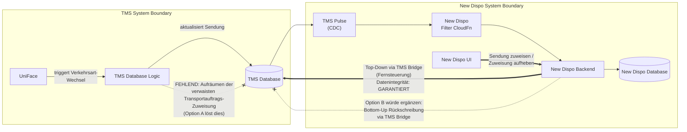

# Verkehrsart-Wechsel: Systemgrenzenfrage TMS / New Dispo

**Datum:** 2026-06-08
**Status:** Entscheidung erforderlich
**Entscheider:** Christian Lang (Entscheider), Matthias Max (P3 Architect)

---

## Problem

Wird in UniFace die Verkehrsart einer Sendung geändert (z.B. von Vorholung auf Hauptlauf), während die Sendung in New Dispo und in der TMS-Datenbank bereits einem Transportauftrag zugewiesen ist, entsteht inkonsistenter Zustand in der TMS-Datenbank: Die alte Transportauftragszuweisung bleibt als verwaister Datensatz bestehen.

New Dispo reagiert korrekt -- das alte Leg wird entfernt, ein neues Leg des richtigen Typs wird angelegt. Aber die TMS-Datenbank räumt die verwaiste Zuweisung nicht auf. In den Fahranweisungen erscheinen dadurch Tourpunkte, die auf ein nicht mehr existierendes Leg verweisen.

**Kernfrage:** Wer ist verantwortlich für Datenintegrität innerhalb der TMS-Datenbank, wenn TMS-interne Operationen inkonsistenten Zustand erzeugen?

---

## Technischer Hintergrund

| TMS Verkehrsart | New Dispo Verkehrsart | Pickup-Leg-Typ |
|---|---|---|
| 34 | 1 | HL (Hauptlauf) |
| 30 | 2 | VL (Vorholung) |
| 3 + ohne Vorlauf | 3 | HL (Hauptlauf-Relationsverladung) |
| 3 / 31 / 32 | 4 | VL (Vorholung) |

> **Hinweis:** Umgang mit TMS Verkehrsart 31 derzeit in Klärung -- hier gibt es eine Änderung.

**Kritische Grenze:** Ein Wechsel zwischen HL (Verkehrsart 1/3) und VL (Verkehrsart 2/4) erfordert einen komplett anderen Leg-Typ.

---

## Synchronisationsrichtung: Top-Down vs. Bottom-Up

New Dispo agiert als **Fernsteuerung** für das TMS. Alle von New Dispo ausgelösten Aktionen sind synchron mit TMS -- die Datenintegrität ist in dieser Top-Down-Richtung garantiert.

Die umgekehrte Richtung -- **Bottom-Up-Synchronisation**, bei der New Dispo auf TMS-Änderungen reagiert und Korrekturen in TMS zurückschreibt -- wurde für dieses Release **bewusst ausgeklammert**. Bottom-Up-Sync ist komplex und erfordert ein sauberes Konzept.

Der Verkehrsart-Wechsel fällt genau in diese Kategorie: Eine Änderung entsteht im TMS, und der Vorschlag wäre, dass New Dispo korrigierend in TMS zurückschreibt.

---

## Option A: TMS verantwortet eigene Datenintegrität

Die interne TMS-Logik wird erweitert, sodass bei einem Verkehrsart-Wechsel über die VL/HL-Grenze die verwaiste Transportauftragszuweisung bereinigt wird. Alternativ: TMS blockiert den Wechsel, wenn die Sendung zugewiesen ist (Präzedenz: Hauptlauf-TAs blockieren dies bereits).

**Eigenschaften:**
- **Systemgrenze:** Jedes System ist für die eigene Datenkonsistenz verantwortlich. Die Änderung entsteht im TMS -- TMS muss sie sauber abschließen.
- **Isolationstest:** Ohne New Dispo würde der Verkehrsart-Wechsel dieselbe verwaiste Zuweisung erzeugen. TMS müsste das Problem unabhängig lösen.
- **Präzedenz existiert:** Hauptlauf-TAs blockieren Verkehrsart-Wechsel bereits. Das gleiche Prinzip gilt für Vorholung.
- **Kein verteiltes Transaktionsproblem:** Alles bleibt innerhalb der TMS-Transaktionsgrenze.
- **Bottom-Up-Sync ist de-scoped:** Für dieses Release gibt es bewusst kein Zurückschreiben von New Dispo nach TMS.

---

## Option B: New Dispo korrigiert TMS-Daten

New Dispo würde bei Erkennung eines Verkehrsart-Wechsels via CDC die TMS Bridge aufrufen, um die alte Zuweisung in TMS aufzuräumen.

**Konsequenzen bei Wahl von Option B (müssen explizit akzeptiert werden):**

1. **TMS-Datenintegrität hängt von New Dispo ab.** Wenn New Dispo nicht verfügbar ist, bleibt TMS inkonsistent.
2. **Verteiltes Transaktionsproblem.** TMS-Aufruf und New-Dispo-Statusänderung sind nicht atomar. Die TMS-Operationen sind nicht idempotent -- automatische Recovery ist unzuverlässig.
3. **Präzedenzwirkung.** Jedes zukünftige TMS-Integritätsproblem, das via CDC sichtbar wird, wird zum Kandidaten für "New Dispo soll es fixen". Der architektonische Vertrag verschiebt sich von "New Dispo bildet TMS-Zustand ab" zu "New Dispo pflegt TMS-Zustand".
4. **Performance-Auswirkung.** Jeder Verkehrsart-Wechsel über die VL/HL-Grenze erfordert zusätzliche Roundtrip-Requests von New Dispo Backend über die TMS Bridge zurück in die TMS-Datenbank. Das erhöht die Latenz der CDC-Eventverarbeitung und vergrößert die Fehleroberfläche der gesamten CDC-Pipeline.
5. **Alle Deployment-Branches betroffen.** New Dispo wird harte Runtime-Abhängigkeit für TMS-Datenintegrität.

**Dies ist kein Bugfix -- es ist eine architektonische Richtungsentscheidung.**

---

## Go-Live-Kontext: Datenintegrität auf PROD

Für den Go-Live auf PROD müssen **alle bekannten Fehlerquellen, die die Datenintegrität gefährden, unterbunden werden**. Der Verkehrsart-Wechsel ist eine solche Fehlerquelle.

**Machbarkeit beider Optionen:**

- **Option A (TMS-Fix):** Das TMS-Team hat derzeit keine Kapazität, dies kurzfristig umzusetzen.
- **Option B (New Dispo korrigiert):** Dies ist keine kleine Anpassung, sondern eine Architekturänderung größeren Ausmaßes -- mit allen unter Option B genannten Konsequenzen.

---

## Empfehlung

**Für den Go-Live:** Weder Option A noch Option B sind vor dem Go-Live realisierbar. Der Verkehrsart-Wechsel über die VL/HL-Grenze muss daher für zugewiesene Sendungen **operativ unterbunden** werden, bis eine technische Lösung vorliegt.

**Nach dem Go-Live:** Die Entscheidung zwischen Option A und Option B wird in einer nachgelagerten Konzeptphase analysiert und getroffen.

---

  Created and maintained by <strong>Virtual Architect</strong>

