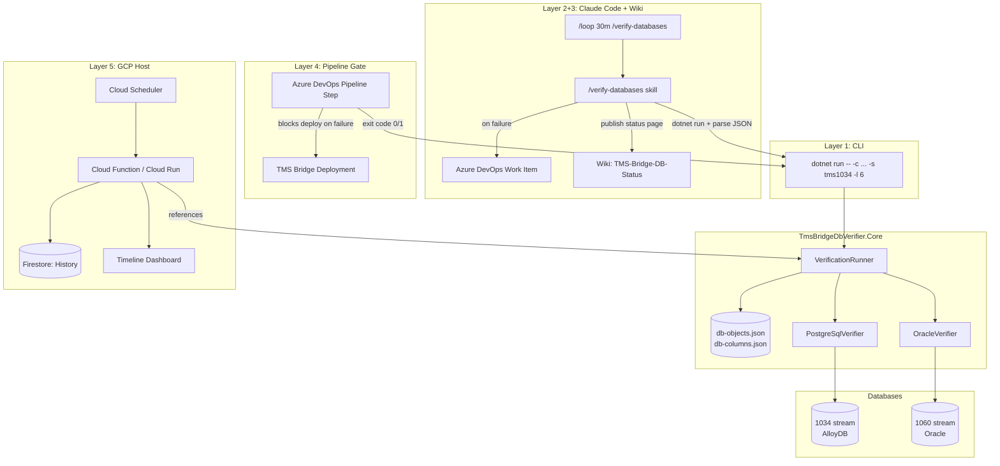

# Advanced TMS Verifier - Continuous Database Monitoring Service in GCP

**Date:** 2026-06-11
**Status:** Exploration / Brainstorm

---

## Original User Input

> I need an advanced version of the TMS verifier in the sense that we track/monitor a given set of databases constantly (e.g. via some schedule) and have the result shared in maybe a dashboard or md file or whatever. It could be a small full stack app running in GCP because I need it to run even when my laptop is off. Let's brainstorm and include all tools we have available already here in the repo (skills, agents, tools).

---

## Context: What We Already Have

### TmsBridgeDbVerifier (Current Tool)

A .NET 9 CLI tool in `Code/Disposition-Rollout-Tools/TmsBridgeDbVerifier/` (branch: `feat/tms-bridge-verifier`) that verifies all **77 database objects** the TMS Bridge depends on.

**4 Verification Levels (current):**

| Level | What It Checks | Oracle Catalog | PostgreSQL Catalog |
|-------|---------------|----------------|-------------------|
| 1 - Existence | Object exists in DB | `ALL_OBJECTS` | `pg_class`, `pg_proc` |
| 2 - Type | TABLE vs VIEW vs FUNCTION correct | `ALL_OBJECTS.OBJECT_TYPE` | `pg_class.relkind` |
| 3 - Signature | Routine parameter count matches | `ALL_ARGUMENTS` | `pg_proc.pronargs` |
| 4 - Permissions | User has required GRANTs | `ALL_TAB_PRIVS` | `has_table_privilege()` |

**Object Coverage:** 11 tables, 20 views, 11 functions, 35 procedures, 1 custom type

**Exit Codes:** 0 = pass, 1 = failures, 2 = connection error

### Critical Gap: No Column-Level Verification

The current verifier checks that tables and views **exist** and have the right **type**, but never checks whether they have the **correct columns** (name and data type). For routines, Level 3 verifies parameter signatures — but there is no equivalent for tables/views.

**This gap caused BUG-124918** ([full analysis](../../../20_Bug-Analysis/2026-05-28_BUG-124918_Email-Cannot-Be-Sent.md)):

| What happened | Verifier would have said | Reality |
|---------------|--------------------------|---------|
| Phase 1a: View `v_dis_tp_client_comm` missing entirely | Level 1 FAIL: object does not exist | Correct — would catch this |
| Phase 1b: View exists but missing `trucklicenseplate` column | Level 1 PASS, Level 2 PASS, Level 4 PASS | **False positive** — all levels pass, but TMS Bridge crashes at runtime |

The TMS Bridge EF Core entity `TourpointClientCommunicationEntity` maps 88 columns. When the deployed view only had 87 (missing `trucklicenseplate`), the TMS Bridge generated `SELECT trucklicenseplate FROM tms1034.v_dis_tp_client_comm` and received PostgreSQL error `42703: column does not exist`. The verifier would have reported all green.

**This is the most important new verification level for the advanced verifier.** The column registry must be derived from the TMS Bridge EF entity configurations — the same source the `tms-bridge-db-extractor` agent uses.

### GCP Infrastructure Already Deployed

| Component | Used By | Pattern |
|-----------|---------|---------|
| Cloud Functions (.NET 8, Gen2) | FilterShipments, Cloud4Log, CrossDockEventPublisher | HTTP + Bucket triggers |
| Cloud Scheduler | Cloud4Log | Cron every 5/15 min |
| Cloud Workflows | Cloud4Log | Orchestrates parallel HTTP calls to functions |
| Secret Manager | TMS Bridge | Connection strings per database identifier |
| VPC + VPN | All | Access to Oracle on-premises + AlloyDB |
| Artifact Registry | All | Container images (europe-west3) |
| Azure DevOps CI/CD | All | Pipelines with Workload Identity Federation |

### Database Environments to Monitor

Two depot streams with different database backends:

**1034 stream — AlloyDB (PostgreSQL), GCP-hosted:**

| Environment | Identifier | DB Type | Access |
|-------------|------------|---------|--------|
| ABN Test | `D-10-34` | AlloyDB (PostgreSQL) | VPC |
| UAT | `D-28-20` | AlloyDB (PostgreSQL) | VPC |
| PROD | `D-10-34` (prod) | AlloyDB (PostgreSQL) | VPC |

**1060 stream — Oracle, on-premises:**

| Environment | Identifier | DB Type | Access |
|-------------|------------|---------|--------|
| ABN Test | `O-10-60` | Oracle | VPC + VPN |
| UAT | `O-10-60` (uat) | Oracle | VPC + VPN |
| PROD | `O-10-60` | Oracle | VPC + VPN |

Connection strings for all of these are already stored in GCP Secret Manager. The `D-` prefix denotes PostgreSQL/AlloyDB, `O-` denotes Oracle — matched by the TMS Bridge `ProviderDetector`.

### Available Claude Code Toolbox

| Category | Tools | Relevance |
|----------|-------|-----------|
| MCP: Azure DevOps | Work item CRUD, pipeline queries | Could create/update tickets on failures |
| MCP: GCP CLI | Cloud Run, Logging, Datastream | Deploy, query logs, monitor |
| Skill: `/analyze-bug` | End-to-end bug analysis | Could be triggered when verifier finds issues |
| Skill: `/wiki-connector` | Publish to wiki | Publish monitoring reports to wiki |
| Skill: `/send-status-update-mail` | Status emails | Alert stakeholders on failures |
| Agent: `tms-bridge-db-extractor` | Extract DB object inventory | Keep db-objects.json up to date |
| Agent: `transactional-state-verifier` | Generate verification queries | Extend checks beyond schema to data state |

---

## Advanced Verification Levels

The advanced verifier extends the current 4 levels with column-level verification for tables and views — the gap that caused BUG-124918.

### Proposed 6-Level Verification Model

| Level | Scope | What It Checks | PostgreSQL Catalog | Oracle Catalog | Catches |
|-------|-------|---------------|-------------------|----------------|---------|
| 1 - Existence | All objects | Object exists in DB catalog | `pg_class`, `pg_proc`, `pg_type` | `ALL_OBJECTS`, `ALL_PROCEDURES` | Missing views/tables after schema creation (Phase 1a of BUG-124918) |
| 2 - Type | All objects | Catalog type matches registry (TABLE, VIEW, FUNCTION, PROCEDURE) | `pg_class.relkind`, `pg_proc.prokind` | `ALL_OBJECTS.OBJECT_TYPE` | Wrong object type (e.g. TABLE where VIEW expected) |
| **3 - Columns** | **Tables + Views** | **Every expected column exists with correct name and compatible data type** | **`information_schema.columns`** | **`ALL_TAB_COLUMNS`** | **Missing/renamed columns (Phase 1b of BUG-124918: `trucklicenseplate` missing)** |
| 4 - Signature | Routines | Parameter count and types match | `pg_proc.pronargs`, `pg_proc.proargtypes` | `ALL_ARGUMENTS` | Changed routine signatures after DB migration |
| 5 - Permissions | All objects | User has required GRANTs (SELECT/EXECUTE/USAGE) | `has_table_privilege()`, `has_function_privilege()` | `ALL_TAB_PRIVS`, `ROLE_TAB_PRIVS` | Permission regressions after grant changes |
| **6 - Drift** | **Tables + Views** | **Detect extra/orphaned columns not in registry (advisory)** | **`information_schema.columns` LEFT JOIN** | **`ALL_TAB_COLUMNS` LEFT JOIN** | **Orphaned columns from old migrations, schema divergence between environments** |

### Level 3 Detail: Column Verification

**Registry source:** The column expectations are derived from TMS Bridge EF Core entity configurations:

```
TourpointClientCommunicationEntityConfiguration.cs
    .HasColumnName("trucklicenseplate")     → column: trucklicenseplate, type: text/varchar
    .HasColumnName("comment_")              → column: comment_, type: text/varchar
    ... (88 columns total for this entity)
```

**PostgreSQL verification query:**
```sql
SELECT column_name, data_type, is_nullable
FROM information_schema.columns
WHERE table_schema = 'tms1034'
  AND table_name = 'v_dis_tp_client_comm'
ORDER BY ordinal_position;
```

**Oracle verification query:**
```sql
SELECT column_name, data_type, nullable
FROM ALL_TAB_COLUMNS
WHERE owner = 'TMS1060'
  AND table_name = 'V_DIS_TP_CLIENT_COMM'
ORDER BY column_id;
```

**Check logic per table/view (two-stage: catalog + live probe):**

**Stage A — Catalog check** (bulk, structured):
1. Fetch actual columns from DB catalog in one query per object
2. For each expected column in registry: verify name exists (case-insensitive match)
3. For each expected column: verify data type is compatible (e.g. `varchar` ↔ `character varying`, `int4` ↔ `integer`)
4. Report: missing columns, type mismatches, extra columns (Level 6 advisory)

**Stage B — Live SELECT probe** (confirmation, catches catalog-lies):
```sql
-- PostgreSQL: zero-cost query plan resolution, no data read
SELECT col1, col2, col3, ... FROM tms1034.v_dis_tp_client_comm WHERE FALSE;

-- Oracle: same pattern, also forces view recompilation if INVALID
SELECT col1, col2, col3, ... FROM TMS1060.V_DIS_TP_CLIENT_COMM WHERE 1=0;
```

The probe lists all expected columns explicitly — if any column is missing or inaccessible, the DB returns an error naming the exact column. `WHERE FALSE` / `WHERE 1=0` means zero rows are read; the query planner resolves column references and returns immediately.

**Why both stages?**

| Scenario | Catalog alone | Live probe alone | Both |
|----------|:---:|:---:|:---:|
| Column missing from view definition | Catches it | Catches it | Catches it |
| Column exists but wrong data type | Catches it | Misses it (SELECT succeeds with implicit cast) | Catches it |
| Oracle view INVALID, catalog stale from last valid compilation | **Misses it** — catalog reports old columns | Catches it (recompilation fails) | Catches it |
| Oracle view-over-view chain, intermediate view changed | **Misses it** — outer view catalog not updated | Catches it | Catches it |
| Permission revoked on underlying table column | Misses it | Catches it | Catches it |
| Extra/orphaned columns (drift) | Catches it (Level 6) | Misses it (only checks expected cols) | Catches it |

The catalog gives structured data (types, nullability, ordinal position) that a live probe can't. The live probe catches runtime failures that the catalog can't. Together they cover all cases.

**Cost:** Minimal. One `information_schema.columns` query + one `SELECT ... WHERE FALSE` per table/view. For 31 tables+views across 6 database environments = ~372 lightweight queries total per verification run.

### Level 6 Detail: Drift Detection (Advisory)

Level 6 is the inverse of Level 3 — it checks for columns that exist in the database but are **not** in the registry. This catches:
- Orphaned columns from old migrations that were never cleaned up
- Schema divergence between environments (one env has columns another doesn't)
- Manual ad-hoc changes that bypassed the schema repo

This is advisory (warning, not failure) because extra columns don't break the TMS Bridge — EF Core ignores unmapped columns. But it signals schema drift that may cause confusion.

### Column Registry: `db-columns.json`

Extend the existing `db-objects.json` with a columns section for each table/view:

```json
{
  "name": "v_dis_tp_client_comm",
  "schema": "tms",
  "type": "View",
  "columns": [
    { "name": "shipmentid", "type": "bigint" },
    { "name": "pickuptourpointid", "type": "bigint" },
    { "name": "trucklicenseplate", "type": "character varying" },
    { "name": "comment_", "type": "character varying" }
  ],
  "permissions": ["SELECT"]
}
```

**Generating the registry:** The `tms-bridge-db-extractor` agent already extracts all EF entity mappings from the TMS Bridge source code. Extending it to also extract `.HasColumnName()` and `.HasColumnType()` calls from the `EntityConfiguration` classes gives us the complete column registry. This could be automated as part of the CI pipeline — any TMS Bridge PR that adds/renames a column automatically updates `db-columns.json`.

### What BUG-124918 Would Look Like With Level 3

If the advanced verifier had been running with column verification against `tms1034` (ABN) during the week of 2026-06-05:

```
VIEWS (20)
[+] tms1034.v_dis_tp_client_comm    EXISTS   type OK (View)
    COLUMNS (88 expected):
    [+] shipmentid              bigint                  OK
    [+] pickuptourpointid       bigint                  OK
    [+] comment_                character varying       OK
    [X] trucklicenseplate       character varying       MISSING ← would have flagged this
    ... (84 more columns OK)
    COLUMN RESULT: 87/88 present — 1 MISSING
[+] tms1034.v_dis_tp_client_comm    SELECT granted

Result: FAILURES DETECTED
  - v_dis_tp_client_comm: missing column 'trucklicenseplate' (expected: character varying)
```

This would have been caught **before** the TMS Bridge deployment that added the `TruckLicensePlate` entity mapping, preventing the runtime crash entirely.

---

## Core Requirement: Historical Result Collection

Views have been observed appearing and disappearing across environments — seemingly random, likely caused by uncoordinated manual DDL, deployments, or schema creation reruns. A single point-in-time check is not enough. We need a **full checkpoint history** so we can see how the database schema breathes over time.

### What "schema breathing" looks like without history

| Time | v_dis_tp_client_comm | v_dis_leg | v_dis_to_filter |
|------|:---:|:---:|:---:|
| Mon 06:00 | present | present | present |
| Mon 12:00 | present | **MISSING** | present |
| Mon 18:00 | present | present | present |
| Tue 06:00 | **MISSING** | present | present |
| Tue 12:00 | present | present | **MISSING** |

Without history, each check just says "all green" or "1 failure." With history, you see the pattern — maybe someone's cron job is recreating schemas, maybe a deployment overwrites views, maybe there's a race condition in the schema creation pipeline. The history makes the invisible visible.

### What we store per checkpoint

Each verification run produces a `VerificationResult` — this is what gets stored:

```json
{
  "timestamp": "2026-06-11T14:30:00Z",
  "database": "D-10-34",
  "schema": "tms1034",
  "provider": "PostgreSQL",
  "level": 6,
  "duration_ms": 1250,
  "summary": { "pass": 74, "fail": 2, "warn": 1, "total": 77 },
  "objects": [
    {
      "name": "v_dis_tp_client_comm",
      "type": "View",
      "existence": "PASS",
      "type_check": "PASS",
      "columns": {
        "expected": 88,
        "present": 87,
        "missing": ["trucklicenseplate"],
        "type_mismatches": [],
        "extra": ["legacy_col_xyz"]
      },
      "permissions": "PASS",
      "live_probe": "FAIL: column \"trucklicenseplate\" does not exist"
    }
  ]
}
```

### Storage strategy

History needs to be **queryable** (filter by database, time range, object name) and **cheap** (thousands of small JSON documents over months). Options:

| Storage | Query capability | Cost | Complexity | Fits |
|---------|:---:|:---:|:---:|:---:|
| Cloud Storage (timestamped JSON files) | Poor — must scan files | Very low | Very low | Only for raw archive |
| **Firestore** | Good — indexed queries by collection/field | Very low at this volume | Low (SDK) | Good fit for document-per-checkpoint |
| **CloudSQL PostgreSQL (tiny)** | Excellent — full SQL | ~$7/mo (db-f1-micro) | Medium (schema, migrations) | Best for complex queries and trends |
| AlloyDB | Overkill | High | High | No |

**Recommendation: Firestore** for the GCP host. It's serverless (no instance to manage), the document model maps directly to `VerificationResult`, and the query patterns are simple:
- "All checkpoints for D-10-34 in the last 7 days" → collection query with filter
- "All checkpoints where v_dis_tp_client_comm was FAIL" → indexed field query
- "Latest checkpoint per database" → ordered query with limit 1

For the Claude Code local host, results accumulate as JSON files in a local folder (e.g. `02_Explorations/.../results/`). The skill can query them with `jq` or simple file scanning.

### Dashboard: Timeline View

The dashboard (Cloud Run or local) renders history as a timeline grid — each row is a database object, each column is a checkpoint, cells are colored pass/fail/warn:

```
                 06:00  06:30  07:00  07:30  08:00  08:30  09:00
v_dis_tp_client   ✅     ✅     ✅     ❌     ❌     ✅     ✅
v_dis_leg         ✅     ✅     ✅     ✅     ✅     ✅     ✅
v_dis_to_filter   ✅     ❌     ✅     ✅     ✅     ✅     ✅
sendung           ✅     ✅     ✅     ✅     ✅     ✅     ✅
bordero           ✅     ✅     ✅     ✅     ✅     ✅     ✅
```

This makes schema breathing immediately visible — you can see transient failures, patterns, and recovery times at a glance.

---

## Core Principle: One Library, Multiple Hosts

The verifier has **four distinct use cases** — not one app that needs to be copy-pasted:

| Use Case | When | Where | Who triggers it |
|----------|------|-------|-----------------|
| **Continuous monitoring** | Every 30 min, laptop off | GCP (Cloud Function / Cloud Run) | Cloud Scheduler |
| **Deployment gate** | Before every TMS Bridge / DB deployment | Azure DevOps pipeline | CI/CD pipeline |
| **Local ad-hoc check** | During development / troubleshooting | Developer laptop (VPN on) | Claude Code `/loop` or manual |
| **On-demand skill** | When investigating an issue | Developer laptop | Claude Code `/verify-databases` |

All four must run the **exact same verification logic**. The architecture is therefore:

```
┌─────────────────────────────────────────────────┐
│  TmsBridgeDbVerifier.Core  (shared .NET library) │
│                                                   │
│  - DbObjectRegistry (db-objects.json)             │
│  - ColumnRegistry (db-columns.json)               │
│  - IDbVerifier (PostgreSQL + Oracle impls)        │
│  - SchemaResolver, ProviderDetector               │
│  - VerificationRunner (orchestrates L1-L6)        │
│  - VerificationResult (structured JSON output)    │
└──────────────┬──────────────┬─────────────────────┘
               │              │
    ┌──────────┼──────────────┼──────────────┐
    │          │              │              │
    ▼          ▼              ▼              ▼
┌────────┐ ┌────────────┐ ┌──────────┐ ┌──────────────┐
│ CLI    │ │ Cloud Host │ │ Pipeline │ │ Claude Code  │
│ (dotnet│ │ (CF or     │ │ Task     │ │ Skill        │
│  run)  │ │  Cloud Run)│ │ (dotnet  │ │ (invokes CLI │
│        │ │            │ │  test or │ │  via Bash)   │
│ Manual │ │ Scheduled  │ │  custom) │ │ /loop, ad-hoc│
└────────┘ └────────────┘ └──────────┘ └──────────────┘
```

### What lives where

| Component | Project | References |
|-----------|---------|------------|
| `TmsBridgeDbVerifier.Core` | `Code/Disposition-Rollout-Tools/TmsBridgeDbVerifier.Core/` | db-objects.json, db-columns.json, verifiers, schema resolver |
| `TmsBridgeDbVerifier.Cli` | `Code/Disposition-Rollout-Tools/TmsBridgeDbVerifier/` | References `.Core`, adds CLI argument parsing + console output |
| `TmsBridgeDbVerifier.CloudHost` | `Code/Nagel-GCP/TmsBridgeDbVerifier.CloudHost/` | References `.Core`, adds HTTP trigger + Secret Manager |
| Pipeline task | `Code/Disposition-Rollout-Tools/TmsBridgeDbVerifier.Cli` or `.Core` as `dotnet test` | Same binary as CLI, different exit code handling |
| Claude Code skill | `.claude/skills/verify-databases/` | Invokes CLI via `dotnet run`, parses JSON output |

The `.Core` library is the single source of truth. Hosts are thin wrappers for connectivity + I/O.

### Connection string resolution per host

| Host | How it gets the connection string |
|------|-----------------------------------|
| CLI (local) | `-c` flag with connection string, or `--secret D-10-34` to read from Secret Manager via gcloud |
| Cloud Function | Secret Manager API (same as TMS Bridge itself) |
| Pipeline task | Pipeline variable or Secret Manager via Workload Identity |
| Claude Code | `.pgpass` for PostgreSQL (already configured), Oracle via TNS or connection string |

---

## Architecture Options (Host Strategy)

The question is **which host(s) to build** — the core library is shared regardless.

### Option A: Cloud Function + Cloud Scheduler + Cloud Storage

**The Cloud4Log Pattern** — minimal new infrastructure, proven in this project.

```
Cloud Scheduler (every 30 min)
    │
    ▼
Cloud Workflow
    │
    ├──▶ Cloud Function: verify-db(D-10-34)
    ├──▶ Cloud Function: verify-db(O-10-34)
    ├──▶ Cloud Function: verify-db(D-28-20)
    ├──▶ Cloud Function: verify-db(O-10-60)
    │
    ▼
Cloud Function: aggregate-results
    │
    ├──▶ Cloud Storage (JSON results)
    ├──▶ Cloud Logging (structured logs)
    └──▶ (optional) Alerting Policy → Email/Slack
```

**Host wrapper:** ~100 lines — HTTP trigger that reads database identifier from request, calls `VerificationRunner.RunAsync()`, returns `VerificationResult` as JSON.

**Effort:** ~2-3 days (host only, assumes core library exists)

**Pros:**
- Follows exact same pattern as Cloud4Log (proven, team knows it)
- Minimal infrastructure (no database needed for results)
- Each DB check runs in parallel via Workflow
- Runs when laptop is off

**Cons:**
- No historical trending out of the box (just latest + timestamped files)
- Dashboard is basic (static HTML reading JSON) unless combined with Option B
- No interactive features (can't trigger re-check from UI)

---

### Option B: Cloud Run Full-Stack Service

**A small ASP.NET application with built-in scheduler and web dashboard.**

```
Cloud Run Service: tms-db-monitor
    │
    ├── ASP.NET Minimal API
    │   ├── /dashboard          → Razor/Blazor SSR dashboard
    │   ├── /api/results        → JSON API for results
    │   ├── /api/trigger/{db}   → Manual re-check trigger
    │   └── /health             → Health check
    │
    ├── Background Hosted Service
    │   └── Quartz.NET or IHostedService timer
    │       └── Calls VerificationRunner on schedule
    │
    └── Storage
        └── CloudSQL PostgreSQL (tiny) or Cloud Storage JSON
```

**Host wrapper:** ASP.NET Minimal API + Blazor SSR, references `.Core` directly.

**Effort:** ~4-6 days (host only, assumes core library exists)

**Pros:**
- Single deployable unit — everything in one place
- Interactive dashboard (trigger re-checks, filter by env, view history)
- Cloud Run min-instances=1 keeps it always warm
- Familiar .NET stack

**Cons:**
- More infrastructure (Cloud Run service + possibly CloudSQL)
- Slightly higher running cost (always-on Cloud Run vs serverless functions)
- More code to maintain

---

### Option C: Claude Code Local Execution

**Run checks locally via Claude Code skills, with VPN providing database access.**

```
Developer Laptop (VPN on)
    │
    ├── /verify-databases skill (ad-hoc)
    │   └── dotnet run --project TmsBridgeDbVerifier.Cli -- -c ... -s tms1034 -l 6
    │       └── Outputs JSON → skill parses, reports, creates work items
    │
    └── /loop 30m /verify-databases (continuous)
        └── Runs the same skill every 30 min
            └── On failure: Azure DevOps work item via MCP
            └── On success: silent or publish to wiki
```

**Host wrapper:** None needed — the existing CLI is the host. The Claude Code skill is a thin script that:
1. Invokes `dotnet run` with the right connection args (reads from `.pgpass` / env)
2. Parses the JSON output
3. On failure: creates Azure DevOps work item via MCP, optionally publishes markdown to wiki
4. Can be used standalone (`/verify-databases`) or on a schedule (`/loop 30m /verify-databases`)

**Effort:** ~1 day (skill only, assumes CLI + core library exist)

**Pros:**
- Zero GCP infrastructure needed
- Leverages existing VPN access + `.pgpass` credentials
- Full Claude Code toolbox available for reactions (MCP work items, wiki publish, `/analyze-bug`)
- `/loop` provides continuous monitoring without any cloud deployment
- Fastest to get running — just needs the CLI + a skill wrapper

**Cons:**
- Stops when laptop is off or VPN disconnects
- Only Matthias sees the results unless published somewhere
- Not suitable as a team-shared dashboard
- `/loop` ties up a Claude Code session

---

### Option D: Markdown Report + Wiki

**Run checks (locally or in GCP), output a markdown report published to the wiki.**

```
Any host (CLI, Cloud Function, Claude Code)
    │
    ▼
VerificationRunner.RunAsync()
    │
    ▼
MarkdownReporter (in .Core library)
    │
    ├──▶ Generate TMS-Bridge-DB-Status.md
    └──▶ Publish via wiki-connector or Azure DevOps API
```

**Not a separate host** — this is an **output format** that any host can use. The `.Core` library includes a `MarkdownReporter` alongside the `ConsoleReporter` and JSON output.

**Effort:** ~0.5 day (reporter in .Core, wiki integration in skill or Cloud Function)

---

### Pipeline Gate (Cross-Cutting — Works With Any Host)

**The verifier runs as a deployment gate in Azure DevOps before TMS Bridge and TMS Database deployments.**

```
Azure DevOps Pipeline: cal-new-dispo-tms-bridge-t-t-cloudrun
    │
    ├── Build TMS Bridge
    ├── Deploy TMS Bridge to Cloud Run
    │
    ├── ★ Gate: TMS DB Verification ★
    │   └── dotnet run --project TmsBridgeDbVerifier.Cli
    │       -- --secret D-10-34 -s tms1034 -l 5
    │   └── Exit code 0 → continue
    │   └── Exit code 1 → BLOCK deployment, log failures
    │
    └── (deployment continues only if gate passes)
```

**Implementation options:**
1. **CLI in pipeline:** Add a pipeline step that runs the CLI tool. Simplest — the CLI already returns exit code 1 on failure. Connection string from pipeline variable or Secret Manager via Workload Identity.
2. **dotnet test wrapper:** Write a thin MSTest project that calls `VerificationRunner` — pipeline runs it as a test step, failures show as test failures in Azure DevOps UI.
3. **Two-phase gate:** Run verification BEFORE deployment (against current DB state + new TMS Bridge entity expectations). If the DB is behind, block and log exactly which columns/objects need updating first.

**The two-phase gate is the BUG-124918 killer:**
- Phase A: Check that the **currently deployed DB** has all objects/columns that the **about-to-be-deployed TMS Bridge** expects
- Phase B (post-deploy): Re-verify to confirm nothing broke during deployment

This would have caught the `trucklicenseplate` gap: the pipeline would have seen that `tms1034.v_dis_tp_client_comm` lacks the column that the new TMS Bridge entity maps, and blocked the deployment.

**Effort:** ~1-2 days (pipeline YAML + connection setup)

---

## Comparison Matrix

| Criterion | A: CF+Scheduler | B: Cloud Run | C: Local Claude Code | Pipeline Gate |
|-----------|:-:|:-:|:-:|:-:|
| **Host effort** | 2-3 days | 4-6 days | 1 day | 1-2 days |
| **Runs when laptop off** | Yes | Yes | No | Yes (CI trigger) |
| **Running cost** | Very low | Low-Medium | Zero | Zero (pipeline) |
| **Real-time monitoring** | Yes (30 min) | Yes (configurable) | Yes (`/loop`) | No (on deploy) |
| **History storage** | Firestore | Built-in DB or Firestore | Local JSON files | Pipeline artifacts |
| **Schema breathing visible** | Yes (timeline dashboard) | Yes (full dashboard) | Yes (local query/wiki) | Partial (per-deploy) |
| **Interactive dashboard** | Basic + timeline grid | Full | Terminal output | Azure DevOps UI |
| **Alerting** | Cloud Monitoring | Built-in | MCP work items | Pipeline failure |
| **Team visibility** | Dashboard URL | Dashboard URL | Wiki publish | Pipeline logs |
| **Blocks bad deploys** | No | No | No | **Yes** |
| **New infrastructure** | Workflow + Scheduler + Firestore | Cloud Run + Firestore | None | Pipeline step |

All options share `TmsBridgeDbVerifier.Core`. They are **not mutually exclusive** — the recommended approach is to build multiple hosts.

---

## Recommended Approach: Core Library + Layered Hosts

Build the hosts incrementally, each adding value on top of the shared core:

### Layer 1: Core Library + CLI Upgrade (foundation for everything)
Extract `.Core` from the existing CLI tool. Add column verification (Level 3), drift detection (Level 6), and `IResultStore`/`IResultQuery` for history. The CLI remains the primary interface — every other host delegates to it or references `.Core`.

### Layer 2: Claude Code Skill + `/loop` (fastest path to results)
Build `/verify-databases` skill that invokes the CLI locally (VPN on). Immediate value — running checks within a day of completing the core. Use `/loop 30m /verify-databases` for continuous monitoring during work hours. Reactions via MCP (work items).

### Layer 3: Wiki Status Page (team visibility without infrastructure)
`MarkdownReporter` in `.Core` generates a status page with current state + checkpoint history. Published to wiki via `/wiki-connector` after each skill run. Team can bookmark and see schema breathing — no dashboard needed yet.

### Layer 4: Pipeline Gate (deployment safety)
Add a pipeline step to the TMS Bridge deployment pipeline. This is the BUG-124918 class of failures eliminated. Low effort because it just invokes the CLI.

### Layer 5: Cloud Host (team-shared, always-on, 24/7)
Deploy to GCP for monitoring when laptop is off. Choice of Cloud Function (Option A) or Cloud Run (Option B) — the host wrapper is thin either way because all logic is in `.Core`. Firestore for history, timeline dashboard for visualization.

### Architecture Diagram



---

## Implementation Plan

### Phase 0: Column Registry (1-2 days)
1. Extend the `tms-bridge-db-extractor` agent to also extract `.HasColumnName()` / `.HasColumnType()` from all `EntityConfiguration` classes
2. Extend `db-objects.json` with a `columns` array per table/view entry
3. Validate against a live database (e.g. `tms1034`) to confirm completeness
4. Consider: automate registry regeneration in CI (TMS Bridge PRs that change entity configs trigger a registry update)

### Phase 1: Core Library Extraction + Level 3/6 + History (3-4 days)
1. Extract `TmsBridgeDbVerifier.Core` from existing CLI — move verifiers, registry, schema resolver, models into a class library
2. Slim down CLI to thin wrapper: argument parsing + `VerificationRunner.RunAsync()` + output formatting
3. **Add Level 3 (Column Verification):** query `information_schema.columns` / `ALL_TAB_COLUMNS`, compare against column registry — name existence + type compatibility + live `SELECT ... WHERE FALSE` probe
4. **Add Level 6 (Drift Detection):** reverse join to detect extra columns not in registry (advisory warnings)
5. Add JSON output mode to CLI (`--output json`) for machine-readable results — needed by pipeline gate and Claude Code skill
6. **Add `IResultStore` interface** in `.Core` with implementations:
   - `FileResultStore` — writes `VerificationResult` as timestamped JSON files to a directory (used by CLI and Claude Code skill)
   - `FirestoreResultStore` — writes to Firestore collection (used by GCP host)
   - `NullResultStore` — no persistence (used by pipeline gate, which only cares about exit code)
7. **Add `IResultQuery` interface** — read history by database, time range, object name. Same implementations.
8. CLI gets `--store-dir ./results` flag for local history accumulation
9. Verify: `dotnet run -- -c "..." -s tms1034 -l 6 --output json --store-dir ./results` works end-to-end

### Phase 2: Claude Code Skill (1 day)
Fastest path to real results — runs locally with VPN, no GCP deployment needed.
1. Create `/verify-databases` skill in `.claude/skills/verify-databases/`
2. Invokes CLI via `dotnet run`, parses JSON output
3. Stores results locally via `FileResultStore` (`--store-dir ./results`)
4. On failure: creates Azure DevOps work item via MCP
5. On success: brief summary to console
6. Usable standalone or via `/loop 30m /verify-databases` for continuous local monitoring

### Phase 3: Wiki Status Page (0.5-1 day)
Make results visible to the team without any dashboard infrastructure.
1. Add `MarkdownReporter` to `.Core` — generates a status page from latest + historical results
2. Wiki page `TMS-Bridge-DB-Verification-Status.md` with:
   - Current status per database (traffic-light)
   - Last N checkpoints as timeline table (schema breathing visible)
   - Failure details with column-level drill-down
3. Publish via `/wiki-connector` (skill triggers this automatically after each run)
4. Team can bookmark the wiki page — updated every time the skill runs

### Phase 4: Pipeline Gate (1-2 days)
1. Add pipeline step to `cal-new-dispo-tms-bridge-t-t-cloudrun` (Azure DevOps)
2. Step runs CLI with target database identifier from pipeline variable
3. Connection string from pipeline variable group or Secret Manager via Workload Identity
4. Exit code 1 = pipeline fails with structured error in logs
5. Two-phase: pre-deploy check (current DB vs incoming TMS Bridge expectations) + post-deploy re-verify
6. Repeat for prod pipeline `cal-new-dispo-tms-bridge-p-p-cloudrun`

### Phase 5: GCP Cloud Host + History + Dashboard (3-5 days)
1. Create `TmsBridgeDbVerifier.CloudHost` in `Code/Nagel-GCP/`
2. References `.Core` directly (NuGet project reference, not copy-paste)
3. HTTP trigger: `POST /verify?database=D-10-34&level=6` calls `VerificationRunner`, returns JSON
4. Uses `FirestoreResultStore` — each checkpoint stored as a Firestore document in `verifier-results/{database}/checkpoints/{timestamp}`
5. Cloud Workflow YAML: parallel calls to all configured databases
6. Cloud Scheduler: every 30 min
7. Cloud Monitoring alerting policy for Level 3 column mismatches
8. **Timeline dashboard** (Cloud Run, Blazor SSR or static + JS):
   - Reads checkpoint history from Firestore via `IResultQuery`
   - Timeline grid: rows = objects, columns = checkpoints, cells = pass/fail/warn
   - Filterable by database, time range, object type
   - Makes schema breathing visible — transient failures, patterns, recovery times
   - "Re-check Now" button triggers Cloud Workflow

---

## Decisions

| # | Question | Decision |
|---|----------|----------|
| 1 | Which databases to monitor? | **ABN 1034 (AlloyDB) + ABN 1060 (Oracle)** — both test environments, expand to UAT/PROD later |
| 2 | Check frequency? | **Every 60 min** via `/loop` during work hours |
| 3 | Alerting on failure? | **Console + wiki only** — no auto-created work items, review manually via wiki status page |
| 4 | Data-level checks? | **Schema (L1-L6) + replication lag** — add Datastream replication slot health check for AlloyDB |
| 5 | Column registry automation? | **Agent on demand first, CI auto-generation later.** CI does NOT require AI — the extraction (`HasColumnName` calls in EntityConfiguration classes) is deterministic and can be a simple Roslyn script or regex-based `dotnet tool`. The agent does the initial discovery; CI keeps it in sync long-term. |
| 6 | GCP dashboard style? | **Decide later** — wiki status page from Phase 3 may be enough for a while |
| 7 | Pipeline gate timing? | **Decide later** — focus on Phases 0-3 first |

## Remaining Open Questions

1. **Oracle access from Cloud Functions?** The Cloud4Log functions already connect to Oracle — need to verify VPN routing works for the verifier function too. (Relevant for Phase 5 only.)
2. **Authentication for dashboard?** IAP (Identity-Aware Proxy) or public with simple auth? (Relevant for Phase 5 only.)
3. **Type compatibility mapping:** PostgreSQL and Oracle use different type names (`character varying` vs `VARCHAR2`, `bigint` vs `NUMBER`). Need a compatibility map for cross-vendor column type checks. The TMS Bridge EF configurations may use `.HasColumnType()` — need to check coverage.

---

## Related Files

- `Code/Disposition-Rollout-Tools/TmsBridgeDbVerifier/` — current CLI verifier
- `Code/Disposition-Rollout-Tools/TmsBridgeDbVerifier/Registry/db-objects.json` — 77 objects registry
- `02_Explorations/2026-04-29_TMS_Bridge_Database_Object_Inventory/` — source of truth for DB objects
- `02_Explorations/2026-05-07_TMS_Bridge_DB_Access_Test_Automation/` — verification query patterns
- `Code/Nagel-GCP/Cloud4Log/devops/` — reference Cloud Scheduler + Workflow patterns
- `00_Meetings/2026-05-21_daily-tmsverifier-topic.md` — meeting notes on verifier + performance KPIs
