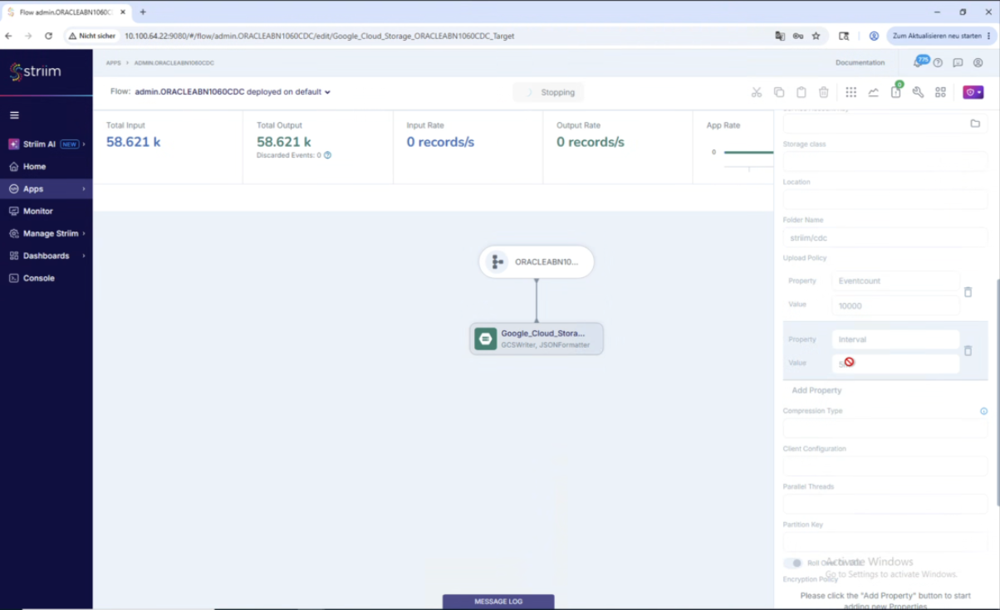

# Striim CDC latency between abn1060 (Oracle) and GCP bucket

**Date:** 2026-06-24
**Status:** Exploration — root cause identified from live bucket evidence

---

<internal>

## Original User Input

> I need to analyze the latency we experience for the Striim CDC solution between abn1060 and the GCP bucket.
> Quote from lead dev: *"I still experience around 2 min delay from changes to the abn1060 until the event comes in the bucket."*
>
> Goals: a) find any potentials to speed up Striim via config, b) database-side optimizations, c) a local investigation end to end (from sendung record's `u_time` to bucket JSON object time).

Two clarifications added during the session:

> - *"Striim runs on WL3 which I'm not sure I have access to."*
> - *"Did anyone ever measure end-to-end table → bucket?"*

</internal>

---

## TL;DR

**The ~2 min delay is the Striim GCS Writer's file rollover interval, not Striim's redo reading, not the database, and not the network.**

Striim writes CDC events to the bucket as objects that roll over on a **fixed 5-minute time interval** (the event-count/file-size trigger is never reached at ABN's low volume). A change committed mid-window therefore waits, on average, **~2.5 min** (uniformly 0–5 min) for the next flush boundary before its object appears in the bucket. "~2 min" is exactly what a human perceives as the average of a 5-minute grid.

This was **proven empirically from the live bucket** `gs://wl5-cdc-bucket-abn1060/striim/cdc/`:

- 364 of 558 inter-object gaps are **exactly 300 s**; **the minimum gap is exactly 300 s** — never less. All other gaps are integer multiples of 5 min (quiet windows with no events).
- CDC objects are tiny (median **116 KB**, max 24 MB) versus the **~45 MB** initial-load files that *did* trigger the event-count rollover → at CDC volume the **interval always wins**.
- Measured end-to-end latency on the newest object (commit → object): **~3.0 min** (see method below).

**Highest-impact fix (Goal a):** lower the GCS Writer `uploadpolicy` interval from `5m` to e.g. `30s` or `15s`. Mean latency drops from ~2.5 min to ~15–8 s. This is a one-line config change **on the Striim side, which runs in WL3 (no P3 access) — it must be requested from Nagel/Striim admin (Matt Wilkinson).**

**Goal b (database):** the classic Oracle CDC lever — redo-log archival frequency — is **irrelevant here**. Striim reads the *online* redo log in sub-second time; it does not wait for archival (that was the *Datastream* problem). The only real DB-side latency contributor is the **operation→commit gap** for long-running transactions (Striim emits on commit). It is small relative to the 5-min interval.

**Goal c (was it ever measured?):** **No** — no prior document measured the true Striim *table → bucket* latency (ADR006's "sub-second" is redo-*capture* only; the ~42–66 min figure was the rejected *Datastream* PoC). **Measured here for the first time, including a live run against a real change:** a shipment created via the New Dispo app (`SENDUNG_N 839941`, 2026-06-25) committed **09:19:07** and appeared in the bucket **09:22:51** = **3 min 44 s**, of which **222 s was pure flush-wait** (full detail §5.5 · passive distribution §5.2 · repeatable procedure §5.3). A **critical timezone gotcha** (below) makes naive measurements read as **−2 hours**.

> ⚠️ **Timezone trap (essential for any measurement):** the CDC event timestamps (`COMMIT_TIMESTAMP`, `DBCommitTimestamp`, `U_TIME`, …) are emitted in **DB-local time (Europe/Berlin = CEST, UTC+2 in summer)** but carry a misleading `Z`/UTC label. GCS object `timeCreated` is true UTC. You **must subtract the DB offset (−2h in summer / −1h in winter)** from the event timestamps or every latency comes out ~2h negative. This may also be a latent data-correctness issue for any downstream consumer that trusts the `Z`.

---

## 1. What is actually deployed (architecture & data flow)

```
  abn1060 Oracle (on-prem, CAL0025.cal-consult.int / d60.tmsabn)
        │   TMS1060.SENDUNG  — changes from batch/copy jobs (e.g. program J008)
        │
        ▼  online redo log  (sub-second, ALM/LogMiner-based Oracle Reader)
  ┌─────────────────────────────────────────────┐
  │  STRIIM  — runs in WL3   ← NO P3 ACCESS       │
  │  Oracle Reader → (transform) → GCS Writer     │
  │  GCS Writer uploadpolicy: Eventcount 10000 + Interval 5 min ◄── DOMINANT LATENCY (confirmed 2026-06-25)
  └─────────────────────────────────────────────┘
        │   HTTPS (object finalize every rollover)
        ▼
  gs://wl5-cdc-bucket-abn1060/             (WL5-T-T, prj-cal-w-wl5-t-6c00-53ad)
     ├── striim/wl5-cdc-bucket-abn1060.NN          ← 150 × ~45 MB  INITIAL LOAD (2026-05-29, 11-min burst)
     └── striim/cdc/wl5-cdc-bucket-abn1060.NN      ← 559 objects   ONGOING CDC (2026-05-29 … now)
        │   object finalize → Pub/Sub
        ▼
  filter-shipment-function (Cloud Function) → publishes whitelisted shipments downstream
```

**Key environment facts**

| Fact | Value | Source |
|---|---|---|
| CDC engine | **Striim** (selected in ADR006, 2026-04-28) | `02_Explorations/2026-01-16-Oracle-CDC/02_Communication/2026-05-11-adr006-decision-striim-selected.md` |
| Striim location | **WL3** — not in the 3 WL5 projects we can see (`gcloud projects list` → only `wl5-t/-d/-p`). **No P3 access to the engine/TQL.** | live `gcloud` |
| Oracle source | `CAL0025.cal-consult.int` / service `d60.tmsabn`, user `TMSBR1060`, table `TMS1060.SENDUNG` | event metadata + `02_Explorations/2026-06-18_Oracle_CLI_Tools_macOS/` |
| ABN bucket | `gs://wl5-cdc-bucket-abn1060/` (also `wl5-cdc-bucket-uat1060`, prod `wl5-cdc-bucket-1060`) | live `gsutil ls`, golive doc §3.6 |
| Object layout | `striim/…NN` = initial load; `striim/cdc/…NN` = CDC. Name = `objectname` + incrementing counter, **no date, no timestamp in name** | live `gsutil ls` |
| Consumer | `filter-shipment-function`, triggered per object finalize | golive doc |

> The Striim engine lives in WL3 (no P3 access), so the analysis below was **reverse-engineered from the bucket output** — then **confirmed directly** on a screen-share call with Matt Wilkinson (Striim owner) on 2026-06-25 (next section). Any config change must still be made by the Striim/Nagel side.

---

## 1b. Confirmed configuration & decided fix — call with Matt Wilkinson (2026-06-25)

On a screen-share with Matt Wilkinson (Nagel, Striim owner), the live Striim config for the abn1060 stream was confirmed — matching the reverse-engineered inference exactly:

| Setting | Value (confirmed) |
|---|---|
| Striim app / flow | `admin.ORACLEABN1060CDC` (deployed on `default`) |
| Target | `Google_Cloud_Storage_ORACLEABN1060CDC_Target` — **GCSWriter + JSONFormatter** |
| Folder name | `striim/cdc` (matches the bucket prefix) |
| **Upload Policy** | **`Eventcount: 10000` + `Interval: 5m`** ← the 5-min interval is the latency |
| Throughput (lifetime) | 58.62 M records in / out, **0 discarded** |
| Capture freshness | running app **lag 3 ms**, **Max LEE 0.033 s** → sub-second capture; the wait is entirely the writer interval |

At ABN volume the **`Eventcount: 10000`** threshold is never reached between flushes (10 000 events ≈ the ~45 MB rollover seen in the initial load), so the **`Interval: 5m`** fires every time — exactly the 5-minute grid proven in §2.



**Decided fix:** Matt is changing the **`Interval` from `5m` to `10s`** (Eventcount stays 10 000) and will confirm in the group chat once applied. Expected effect: mean commit→bucket latency **~2.5 min → ~5 s**, worst case **5 min → 10 s** — comfortably inside the bug's "within 1 m" target, leaving headroom for downstream New Dispo processing.

**Supporting screenshots from the call** (in `00_Meetings/2026-06-25_Striim GCS Writer Config with Matt/`):

- [Striim Monitor / cluster overview](../../00_Meetings/2026-06-25_Striim%20GCS%20Writer%20Config%20with%20Matt/Bildschirmfoto%202026-06-25%20um%2010.09.46.png) — system status, memory 43 %, CPU 8.5 %
- [Apps list](../../00_Meetings/2026-06-25_Striim%20GCS%20Writer%20Config%20with%20Matt/Bildschirmfoto%202026-06-25%20um%2010.09.56.png) — `ORACLEABN1060CDC` RUNNING, 58.62k read/writes, **lag 3 ms**
- [Flow: Oracle Reader → GCS Writer](../../00_Meetings/2026-06-25_Striim%20GCS%20Writer%20Config%20with%20Matt/Bildschirmfoto%202026-06-25%20um%2010.10.05.png) — Running, **Max LEE 0.033 s** (sub-second capture)
- [App settings](../../00_Meetings/2026-06-25_Striim%20GCS%20Writer%20Config%20with%20Matt/Bildschirmfoto%202026-06-25%20um%2010.10.44.png) — recovery interval, exception handling
- [GCS Writer config panel — during the call (1)](../../00_Meetings/2026-06-25_Striim%20GCS%20Writer%20Config%20with%20Matt/Bildschirmfoto%202026-06-25%20um%2010.12.33.png) and [(2)](../../00_Meetings/2026-06-25_Striim%20GCS%20Writer%20Config%20with%20Matt/Bildschirmfoto%202026-06-25%20um%2010.12.47.png) — upload-policy edit in progress

---

## 2. Evidence: the bucket proves a 5-minute rollover grid

`gs://wl5-cdc-bucket-abn1060/striim/cdc/` — 559 objects, 2026-05-29 → 2026-06-24 (live & current).

**Inter-object gaps today (2026-06-24), active hours:**

```
07:22:44 … 07:27:44 (+300s) … 07:32:44 (+300s) … 07:37:44 (+300s) … 07:42:45 (+301s) …
07:47:45 (+300s) … 07:52:45 (+300s) … 08:02:45 (+600s) … 08:07:45 (+300s) … 08:12:45 (+300s) …
```

**Distribution of all 558 gaps (rounded to minutes):**

| Gap (min) | Count | Interpretation |
|---:|---:|---|
| **5** | **364** | flush fired, events present in that window |
| 10 | 63 | 1 empty 5-min slot |
| 15 | 20 | 2 empty slots |
| 20 | 25 | 3 empty slots |
| 25–60 | ~30 | quiet windows |
| 75–6050 | ~25 | nights / weekends |

- **min gap = 300 s, median gap = 300 s.** There is **never** a gap below 5 min → the rollover is time-driven at a 5-minute period.
- Every gap is an integer multiple of 5 min → confirms a fixed grid (boundaries at `:?2`, `:?7` seconds ≈ HH:00/05/10…), with objects skipped only when no event occurred.

**Object sizes confirm the event-count trigger is never reached:**

| | Initial load (`striim/…`) | CDC (`striim/cdc/…`) |
|---|---|---|
| count | 150 | 559 |
| size each | **~45 MB** (uniform) | median **116 KB**, mean 894 KB, **max 24 MB** |
| written | 150 files in **11 min** (10:16:48→10:27:46), ~4–5 s apart | 1 file per active 5-min window |
| rollover driver | **event-count / file-size** (~45 MB) | **5-min interval** (largest CDC object is only ~53 % of 45 MB) |

→ The initial load shows the event-count/file-size threshold sits around **~45 MB**. CDC objects never get close, so for CDC the **interval is the sole rollover trigger 100 % of the time**.

---

## 3. Goal (a): Striim config potentials to speed up

All changes are **on the Striim side (WL3)** → must be requested from Nagel/Striim admin (Matt Wilkinson). Ordered by impact:

| # | Lever | Change | Effect | Trade-off |
|---|---|---|---|---|
| **1** | **GCS Writer `uploadpolicy` interval** ⭐ | `interval:5m` → **`interval:30s`** (or `15s`/`10s`) | Mean latency **~2.5 min → ~15 s** (or ~8 s/5 s). Worst case = the interval. | More, smaller objects → more GCS writes + more `filter-shipment-function` invocations. Cheap at ABN volume; see risk note. |
| 2 | Keep an event-count ceiling | `uploadpolicy:eventcount:50000,interval:30s` | Big bursts still flush promptly on count; quiet periods flush on the short interval. | None meaningful. |
| 3 | Confirm reader = Oracle Reader (ALM) or OJet | (already sub-second) | Capture is **not** the bottleneck — no change needed for this symptom. | — |
| 4 | Compression | events are plain JSON today | Lower egress/storage, not latency. | Slightly more CPU; downstream must gunzip. Optional. |
| 5 | `Parallel Threads` on GCS Writer | leave default | Only helps under backpressure (not present at ABN volume). | Don't enable speculatively. |

**Why this is the whole story:** Striim's own docs state the writer rolls over "whenever one of the limits is reached … `eventcount:10000,interval:1h` starts a new file after one hour **or** after 10,000 events, whichever happens first." At ABN volume the count limit is never hit, so the file (and the bucket object, and the Cloud Function trigger) only appears at each interval boundary. Lowering the interval is the single highest-impact lever and is a one-line property change.

> **Latent config risk (not the cause, but worth flagging):** object names are `…/cdc/<name>.<counter>` with **no timestamp** in the name. Striim's docs warn this can overwrite/lose data if the counter is ever reused (e.g. on a writer restart that resets the counter). Currently the counter is monotonic (oldest objects still date to 2026-05-29, newest to today → no wraparound observed), so no loss today — but if the interval is lowered, far more objects are produced and a future restart/counter-reset becomes more consequential. Recommend adding a timestamp to the object name (`sequence`/nanosecond per Striim docs) **and** a GCS lifecycle policy (see §7 risk #10 in the golive doc — none exists today).

---

## 4. Goal (b): Database-side optimizations

**The big Oracle CDC lever does NOT apply to Striim.** Datastream's ~42–66 min latency (PoC) came from waiting for **archived** redo logs (`ARCHIVE_LAG_TARGET=0`, 1 GB log files). **Striim reads the *online* redo log directly (sub-second)** — it does not wait for archival. So `ARCHIVE_LAG_TARGET` / redo-log-size tuning is **moot for the Striim latency symptom**. (See the contrast in `02_Explorations/2026-04-15_Oracle-CDC-PoC-Analysis/consolidated_report.md`.)

What *does* matter on the DB side, and how much:

| DB-side factor | Latency impact on Striim | Notes |
|---|---|---|
| **Operation → commit gap** (Striim emits on commit; `CommittedTransactions`/`FilterTransactionBoundaries`) | **Real but small.** A change is invisible until its transaction commits. The sample initial event showed an 18 s op→commit gap; ABN batch jobs can be longer. | Reduce long-running/open transactions in the upstream app. This is the *only* DB lever that moves the needle, and it's dwarfed by the 5-min interval. |
| Long-running open transactions | Can stall the reader checkpoint / quiesce (30 s flush timeout) | Monitor via Striim `MON <OracleReader>` → "Oldest Open Transactions". Operational hygiene, not the current symptom. |
| `streams_pool_size`, redo log sizing | **Throughput**, not latency | Matters only at 80–150 GB/hr (OJet). ABN volume is negligible. |
| Supplemental logging | Write amplification on source | Already required for CDC; not a latency factor. |

**Conclusion for (b):** there is **no database change that meaningfully reduces the observed latency** while the GCS Writer interval is 5 min. Fix the interval first; revisit op→commit only if sub-30 s latency is later required.

---

## 5. Goal (c): End-to-end measurement — table → bucket

### 5.1 The timestamp chain (per CDC event, confirmed from a live object)

Each bucket object is a JSON array of events: `{ "metadata": {…}, "data": {…}, "before": …, "userdata": … }`.

| Anchor | Field | Meaning | Timezone |
|---|---|---|---|
| Business edit | `data.U_TIME` | app-set "last updated" on the SENDUNG row | **DB-local, labeled `Z`** |
| Operation | `metadata.OPERATION_TS` / `TimeStamp` / `DBTimeStamp` | when the DML hit the redo | **DB-local, labeled `Z`** |
| **Commit** | `metadata.COMMIT_TIMESTAMP` / `DBCommitTimestamp` (epoch ms) | **when Oracle committed** — the correct CDC anchor | **DB-local, labeled `Z`** |
| Bucket arrival | GCS object `timeCreated` (`gsutil stat`) | when the object landed = "event in the bucket" | **true UTC** |

**End-to-end (pipeline) latency = `object.timeCreated(UTC) − ( COMMIT_TIMESTAMP − DB_offset )`** where `DB_offset = 2h` (CEST, summer) / `1h` (CET, winter).

> **Use `COMMIT_TIMESTAMP`, not `U_TIME`, for pipeline latency.** Example from object `.552`: `U_TIME` = 13:14:38, but the redo `COMMIT_TIMESTAMP` = 13:23:57 — a later batch UPDATE changed the row *without* touching `U_TIME`. `U_TIME→bucket` measures *business-edit-to-bucket* (conflates app behaviour); `COMMIT→bucket` measures the *CDC pipeline*.

### 5.2 Measured results (passive, from live objects — no DB writes)

Measured commit→bucket latency across the **last 12 CDC objects of 2026-06-24** (per object: `timeCreated_UTC − (COMMIT_TIMESTAMP − 2h)`; "oldest" = first event in the object = max wait, "newest" = last event = min wait):

| obj | created (UTC) | #ev | oldest-ev lat | newest-ev lat |
|---|---|---:|---:|---:|
| .547 | 10:52:47 | 6 | 1.4 m | 0.2 m |
| .548 | 11:02:47 | 12 | 2.8 m | 2.8 m |
| .549 | 11:07:47 | 22 | 2.5 m | 0.3 m |
| .550 | 11:12:47 | 38 | 4.6 m | 3.4 m |
| .551 | 11:17:47 | 13 | 4.2 m | 3.1 m |
| .552 | 11:27:47 | 1 | 3.8 m | 3.8 m |
| .553 | 11:32:48 | 9 | 4.3 m | 4.3 m |
| .554 | 13:47:48 | 16 | 2.5 m | 2.5 m |
| .555 | 14:22:48 | 5 | 2.4 m | 2.4 m |
| .556 | 14:42:48 | 3 | 0.8 m | 0.7 m |
| .557 | 14:57:48 | 3 | 3.0 m | 3.0 m |
| .558 | 15:22:48 | 4 | 3.1 m | 3.0 m |

**Newest-event latency (per object): min 10 s · median 171 s (2.9 m) · mean 148 s (2.5 m) · max 256 s (4.3 m).**

Every value falls inside the structural bound **[0, 5 min]**, mean ≈ 2.5 min — matching the lead dev's "~2 min". The 10 s minimum is a change that committed just before a flush boundary; the ~4.3 min maxima are changes that committed just after one. Without the −2h correction the formula yields **≈ −117 min** (the timezone trap).

### 5.3 Repeatable procedure

**Passive (recommended, zero DB impact)** — sample the newest object and compute latency with the tz correction:

```bash
gcloud config set project prj-cal-w-wl5-t-6c00-53ad
B="gs://wl5-cdc-bucket-abn1060/striim/cdc"
gsutil ls -l "$B/" > /tmp/cdc.txt 2>&1
NEW=$(awk '/gs:\/\//{print $2, $3}' /tmp/cdc.txt | sort | tail -1 | awk '{print $2}')
gsutil stat "$NEW" | awk '/Creation time/'            # object arrival (true UTC)
gsutil cat "$NEW" | python3 -c "import sys,json;d=json.load(sys.stdin);print('commit(Z-labeled):',d[0]['metadata']['COMMIT_TIMESTAMP'])"
# latency = creation_UTC - (commit - 2h summer / 1h winter)
```

**Active (gold-standard table→bucket).** Requires VPN + a write to ABN `SENDUNG`. **`TMSBR1060` is SELECT-only on the table** (raw `UPDATE` → ORA-01031): the app writes via **definer's-rights wrapper packages** (the DIS-wrappers, owned by the table-owner schema), not direct DML. So to run the write-probe a DB admin must do one of: **(i)** grant a temporary `UPDATE` on `TMS1060.SENDUNG` to a probe user, **(ii)** run Script B as the table owner / a privileged account, or **(iii)** drive the change through an authorized wrapper proc or the New Dispo app UI. Use a disposable/test shipment and coordinate first (shared ABN). Connect per `2026-06-18_Oracle_CLI_Tools_macOS`: `sql <user>@ABN1060`, then `@<script>`.

**Script A — read-only: pin the offset + confirm the chain** (`/tmp/probe_readonly.sql`):

```sql
SET SQLFORMAT ANSICONSOLE
SET FEEDBACK OFF
ALTER SESSION SET NLS_DATE_FORMAT         = 'YYYY-MM-DD HH24:MI:SS';
ALTER SESSION SET NLS_TIMESTAMP_FORMAT    = 'YYYY-MM-DD HH24:MI:SS.FF3';
ALTER SESSION SET NLS_TIMESTAMP_TZ_FORMAT = 'YYYY-MM-DD HH24:MI:SS.FF3 TZH:TZM';

PROMPT ===== 1) DB clock: local vs UTC (the offset to subtract) =====
SELECT systimestamp AS db_now_local, sys_extract_utc(systimestamp) AS db_now_utc,
       dbtimezone AS db_tz, sessiontimezone AS session_tz FROM dual;

PROMPT ===== 2) Recent SENDUNG business activity (sanity) =====
SELECT MAX(U_TIME) AS max_u_time, SYSDATE AS sysdate_local FROM TMS1060.SENDUNG;

PROMPT ===== 3) Chain confirmation: a SENDUNG_N also seen in the bucket =====
SELECT SENDUNG_N, NIEDERLASSUNG, U_TIME, C_TIME, STATUS_DIS
FROM TMS1060.SENDUNG WHERE SENDUNG_N = 839939;
EXIT
```

**Script B — controlled write-probe** (`/tmp/probe_write.sql`; needs the UPDATE path from the note above). Prompts for a `SENDUNG_N`, bumps its `U_TIME`, commits, and prints the exact commit instant in **true UTC** (`sys_extract_utc`) + the key to find in the bucket:

```sql
SET SQLFORMAT ANSICONSOLE
SET VERIFY OFF
SET FEEDBACK ON
ALTER SESSION SET NLS_DATE_FORMAT      = 'YYYY-MM-DD HH24:MI:SS';
ALTER SESSION SET NLS_TIMESTAMP_FORMAT = 'YYYY-MM-DD HH24:MI:SS.FF3';

PROMPT ===== Row BEFORE (verify the target) =====
SELECT SENDUNG_N, NIEDERLASSUNG, U_TIME, STATUS_DIS
FROM TMS1060.SENDUNG WHERE SENDUNG_N = &&test_id;

PROMPT ===== PROBE: bump U_TIME and COMMIT =====
UPDATE TMS1060.SENDUNG SET U_TIME = SYSDATE WHERE SENDUNG_N = &test_id;
COMMIT;

PROMPT ===== >>> REPORT THESE TWO VALUES <<< =====
SELECT &test_id AS sendung_n_to_find, sys_extract_utc(systimestamp) AS commit_utc FROM dual;
EXIT
```

> Note: as `TMSBR1060`, Script A runs fine; Script B's `UPDATE` returns **ORA-01031** (read-only on SENDUNG) — see §5.4. A real disposition change via the **app UI** is the simplest authorized way to generate the probe event without DBA grants.

**Bucket side — find the object and compute latency** (run after the next 5-min flush mark; `COMMIT_UTC` from Script B is already true UTC, so no offset is applied here):

```bash
SID=839939; COMMIT_UTC="2026-06-25 07:09:26"      # <- from Script B output
B="gs://wl5-cdc-bucket-abn1060/striim/cdc"
gsutil ls -l "$B/" > /tmp/cdc.txt 2>&1
python3 - "$SID" "$COMMIT_UTC" <<'PY'
import sys, subprocess, json, datetime
sid, commit = sys.argv[1], sys.argv[2].replace('Z','').strip()
commit = datetime.datetime.fromisoformat(commit).replace(tzinfo=datetime.timezone.utc)
objs=[]
for line in open('/tmp/cdc.txt'):
    if 'gs://' not in line: continue
    p=line.split(); objs.append((datetime.datetime.fromisoformat(p[1].replace('Z','+00:00')), p[2]))
for ts,path in sorted(o for o in objs if o[0] >= commit - datetime.timedelta(minutes=1)):
    data=json.loads(subprocess.run(['gsutil','cat',path],capture_output=True,text=True).stdout)
    if any(str(e.get('data',{}).get('SENDUNG_N'))==str(sid) for e in data):
        lat=(ts-commit).total_seconds()
        print(f'FOUND {sid} in {path}')
        print(f'  object timeCreated (UTC): {ts.isoformat()}')
        print(f'  commit (UTC)            : {commit.isoformat()}')
        print(f'  latency                 : {lat:.0f}s ({lat/60:.1f} min)')
        break
else:
    print('not found yet — wait for the next 5-min flush mark and re-run')
PY
```

> Tip: derive `DB_offset` from the DB itself (`SELECT systimestamp FROM dual;` vs `date -u`) rather than hardcoding, to stay correct across the DST boundary (CEST↔CET, 2026-10-25).

### 5.4 Verification log (2026-06-25, against live ABN1060)

- **Offset confirmed = +02:00 (Europe/Berlin).** `SELECT systimestamp, sys_extract_utc(systimestamp), dbtimezone, sessiontimezone` → local `09:05:19 +02:00` = UTC `07:05:19`; `DBTIMEZONE=+02:00`, `SESSIONTIMEZONE=Europe/Berlin`.
- **Mislabel proven at the source.** Row `SENDUNG_N=839939` has Oracle-local `U_TIME = 2026-06-24 13:14:38`, identical to the bucket's emitted `"U_TIME":"2026-06-24T13:14:38.000Z"`. The pipeline stamps **local wall-clock with a `Z`**, no UTC conversion → `true UTC = bucket value − 2h`.
- **Active write-probe NOT possible with our account.** `UPDATE TMS1060.SENDUNG …` as `TMSBR1060` → **ORA-01031 (insufficient privileges)**; `TMSBR1060` is SELECT-only on SENDUNG (writes go via definer's-rights DIS-wrapper packages). A controlled single-change measurement therefore requires a DBA grant or the authorized app/TMS write path — which is what §5.5 uses.

### 5.5 Gold-standard active measurement — app-driven shipment create (2026-06-25)

A new shipment was created through the **New Dispo app** (the authorized DIS-wrapper write path), and the resulting object was captured from the bucket:

| | value |
|---|---|
| `SENDUNG_N` / `SENDUNG_TIX` | 839941 / 10600644782659 |
| Events for this shipment | **8 in one transaction** (1 `INSERT` + 7 `UPDATE`s) — the DIS-wrapper atomic write |
| Oracle commit (true UTC) | 2026-06-25 **07:19:07** (09:19:07 CEST) |
| Bucket object | `.566`, `timeCreated` **07:22:51 UTC** (09:22:51 CEST) |
| **commit → bucket latency** | **224 s = 3 min 44 s** |

**Decomposition:** the commit at 07:19:07 waited for the next 5-min flush mark (07:22:49) = **222 s of pure wait**, + ~2 s write. **The 5-minute interval is ~100 % of the latency.** This single controlled point sits squarely inside the passive distribution (§5.2), re-confirms the write path (one atomic DIS-wrapper transaction → 8 row-versions sharing the same commit SCN/timestamp), and re-confirms the −2h offset (`U_TIME` 09:18:54 CEST, set ~13 s before commit). Had the interval been 30 s, this change would have surfaced in **~30 s instead of 3¾ min**.

---

## 6. Did anyone ever measure end-to-end table → bucket? (direct answer)

**No prior measurement of the true Striim table→bucket latency exists in our material.** What exists:

- **ADR006 "sub-second latency confirmed in PoC"** — this is redo **capture** latency (Oracle change → Striim reads it), *not* table→bucket. It excludes the GCS Writer flush interval, which is where the minutes are.
- **`consolidated_report.md` ~42–66 min** — that is the **Datastream** PoC (`total_latencies` metric), a *different* CDC engine that was rejected. Not Striim, not this bucket.
- The 2026-03-18 `striim-gcp-requirements.md` proposed a `batch.interval=10s` target ("latency < 5 s"), but there is no record that the deployed WL3 Striim uses that — and the bucket proves it does **not** (it's 5 min).

So the lead dev's "~2 min" was the only "measurement", and it's anecdotal. **This exploration provides the first concrete table→bucket numbers (§5.2) and a repeatable method (§5.3).** The gap between the "sub-second" claim and reality is fully explained by the GCS Writer 5-min rollover.

---

## 7. Findings

1. **Root cause:** GCS Writer rolls over on a **fixed 5-minute interval** (`uploadpolicy Eventcount:10000 + Interval:5m`); event-count is never reached at ABN volume → mean latency ~2.5 min, worst ~5 min. *(Confirmed 2026-06-25 with Matt Wilkinson — see §1b.)*
2. **Not the cause:** Striim redo capture (sub-second), the on-prem→GCP network, Oracle archive-log frequency (Striim reads online redo), or DB sizing.
3. **No P3 access to Striim (WL3):** the fix is a one-line `uploadpolicy` change that must be requested from Nagel/Striim admin (Matt Wilkinson). We can only observe the output bucket.
4. **Timezone mislabel:** CDC event timestamps are **DB-local (CEST, +2h) labeled `Z`**; object `timeCreated` is true UTC. Naive latency math is off by −2h. Possible downstream data-correctness issue.
5. **Highest-impact fix:** `interval:5m → 30s` (keep an `eventcount` ceiling) → ~15 s mean latency. Pair with a **timestamped object name** and a **GCS lifecycle policy** (neither exists today).
6. **Volume dependence:** ABN (sporadic batch jobs, many quiet windows) always hits the 5-min ceiling; busy PROD may sometimes flush sooner on event-count, but quiet periods everywhere are bounded by the interval.

## 8. Open Questions

- ✅ **Resolved (2026-06-25):** the `uploadpolicy` is `Eventcount:10000 + Interval:5m` (confirmed with Matt Wilkinson — §1b); Matt is changing `Interval` to `10s` and will confirm in the group chat.
- Is the same 5-min interval configured for **UAT (`wl5-cdc-bucket-uat1060`)** and **PROD (`wl5-cdc-bucket-1060`)**? PROD latency target for go-live?
- Does any consumer (`filter-shipment-function` or downstream) parse `COMMIT_TIMESTAMP`/`U_TIME` as real UTC? If so the **+2h mislabel is a data bug** — needs confirmation.
- Is there a business latency SLA for "change → visible in New Dispo"? That determines the target interval (30 s vs 10 s vs 5 s).
- Counter-reuse safety: does the WL3 Striim writer ever reset the counter on restart? (Would risk overwrite if interval is lowered.)

## 9. Related Files

- `02_Explorations/2026-01-16-Oracle-CDC/02_Communication/2026-05-11-adr006-decision-striim-selected.md` — Striim selected; "sub-second" claim
- `02_Explorations/2026-01-16-Oracle-CDC/02_Communication/2026-03-18_Striim_Config/striim-gcp-requirements.md` — early GCS Writer config draft (`batch.interval=10s`, target <5 s)
- `02_Explorations/2026-04-15_Oracle-CDC-PoC-Analysis/consolidated_report.md` — Datastream PoC latency (the ~66 min figure; redo-archival contrast)
- `02_Explorations/2026-03-11_Nagel_P3_Oracle_CDC_Kick_Off/2026-03-18_first_striim_cdc_event.json` — event/metadata schema
- `02_Explorations/2026-06-18_Oracle_CLI_Tools_macOS/oracle-cli-tools-macos.md` — SQLcl access to ABN1060
- `02_Explorations/2026-04-17_New_Dispo_GoLive_1060_Oracle/new-dispo-golive-1060-oracle.md` — bucket names per stage, `filter-shipment-function`, CDC-bucket-explosion risk

## 10. References (Striim docs)

- [Setting output names and rollover / upload policies](https://striim.com/docs/platform/en/setting-output-names-and-rollover---upload-policies.html) — `eventcount`/`interval`/`filesize`, counter naming, overwrite warning
- [GCS Writer](https://www.striim.com/docs/en/gcs-writer.html) — properties & monitoring metrics
- [Oracle Database CDC readers](https://striim.com/docs/platform/en/oracle-database-cdc.html) — Oracle Reader vs OJet, sub-second online-redo reading
- [Oracle Reader and OJet programmer's reference](https://striim.com/docs/platform/en/oracle-reader-and-ojet-programmer-s-reference.html) — `CommittedTransactions`, `FilterTransactionBoundaries`, buffers
- [Oracle Database troubleshooting](https://www.striim.com/docs/en/oracle-database-troubleshooting.html) — long-running open transactions, `MON` command

---

<div align="center">
  <sub>Created and maintained by <strong>Virtual Architect</strong></sub>
</div>
