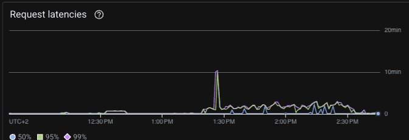

# TMS Bridge test latency spike — Oracle connectivity outage (ORA-50201) on 2026-06-30

**Date:** 2026-06-30
**Status:** Exploration

---

<internal>

## Original User Input

> "we face slower latency on the TMS Bridge test" — accompanied by a Cloud Run **Request latencies** chart (UTC+2) showing a single spike to ~10 min at ~13:28 CEST, followed by sustained jitter (p95/p99 riding 1–3 min) versus flat-near-zero before.
>
> Follow-up: "Had a high time for the last hour roughly." (second chart, same shape, extending to ~14:35 CEST)
>
> Service identified by user: **`cal-new-disposition-tmsbridge-t-t`**
>
> Follow-up request: "check the database identifier of these requests. this tells us if its oracle or postgres"

</internal>



All times in this document are given as **CEST (UTC+2, matching the user's chart)** with the **UTC** equivalent in parentheses (matching Cloud Logging).

---

## Summary (TL;DR)

The TMS Bridge **test** Cloud Run service (`cal-new-disposition-tmsbridge-t-t`, project `prj-cal-w-wl5-t-6c00-53ad`, region `europe-west3`) experienced a latency/error spike caused by an **Oracle connectivity outage**, not by the TMS Bridge itself, a deployment, or Cloud Run resources.

- **Vendor: Oracle.** All errors are Oracle (`ORA-…` codes, `Oracle.ManagedDataAccess.Client` stack). **Zero** PostgreSQL/Npgsql errors; the Cloud SQL Postgres instance was idle/healthy. Note: the `databaseIdentifier` itself is **not in the logs** (it travels as a GraphQL variable / `DatabaseIdentifier` header, neither logged; SQL tracing is off). The only resolved schema visible in logs is **`TMS7777`** — and only in the `ORA-00904` entries — which maps to secret/identifier **`O-77-77`** (verified: the alternative parse `O-7-777` does not exist in Secret Manager). The `ORA-50201` connect failures carry **no** schema (they fail before any SQL), so they cannot be attributed to a specific identifier from logs.
- **Dominant error: `ORA-50201` "Oracle Communication: Failed to connect to server"** — a TCP connect failure. **263 of 277** logged exceptions (95%).
- **Latency mechanism:** with Oracle unreachable, each request blocks on opening the Oracle connection up to the configured **`Connection Timeout=120`** before failing → 60–120 s requests returning **HTTP 500**. The `RoutineExecutor` catch path issues a *second* Oracle call (`geterrormessage`) that also hangs, compounding the delay.
- **Peak window:** **14:30–14:40 CEST (12:30–12:40 UTC)** — the 263 connect failures land exactly here, matching 185+81 HTTP 500s in the request logs.
- **Recovery:** errors after ~14:44 CEST return in ~0.12 s (no more 120 s hangs); the incident was tailing off at time of investigation (~14:55 CEST).
- **Separate pre-existing bug (not the latency driver):** `ORA-00904 "TMS7777"."CAL_UNIFACE"."ITEM": invalid identifier` on `ItemMutation.GetItem` — sporadic, 14 occurrences.

---

## Analysis

### Hypotheses tested and eliminated

| Suspect | Verdict | Evidence |
|---|---|---|
| Deployment / bad release | ❌ Ruled out | Latest revision `00165` deployed **2026-06-29 14:39 UTC** (prior day). Nothing deployed at the spike. |
| Cloud Run CPU saturation | ❌ Ruled out | Container CPU during peak (12:25–12:40 UTC) = **0.01–0.03 (1–3 %)**. Essentially idle. |
| Autoscaling / instance overload | ❌ Ruled out | A **single** instance (`002f8ffd47cddfbd…`) served all 655 requests in the worst 15-min window despite `maxScale=100`. Overall concurrency stayed below the scale-up threshold. |
| Cloud SQL PostgreSQL slowness | ❌ Healthy | `cal-new-disposition-psql-t-t`: CPU 6–9 %, ~0–4 backends. Idle. Zero Npgsql errors. |
| **Oracle TMS connectivity** | ✅ **Root cause** | **263× `ORA-50201` connect failures**, concentrated at 12:30–12:40 UTC. |

The latency *shape* was the first tell: **p50 = 1.5 s (healthy), p95 = 21.5 s, max = 117 s**. A healthy median with a violent tail points to specific requests blocking on a dependency, not uniform compute slowness. CPU at 1–3 % then confirmed the threads were blocked on I/O (the Oracle connection attempt), not computing.

### Request-latency timeline (Cloud Run request logs, `run.googleapis.com/requests`)

| Bucket (UTC) | CEST | Requests | HTTP 500 | Slow >5 s | Max latency |
|---|---|---|---|---|---|
| 11:00–11:10 | 13:00–13:10 | 238 | 0 | 2 | 15.2 s |
| 11:10–11:20 | 13:10–13:20 | 352 | 6 | 22 | **600.0 s** (the visible 10-min spike — hit the Cloud Run hard timeout) |
| 11:20–11:30 | 13:20–13:30 | 313 | 39 | 63 | 110.4 s |
| 11:30–11:40 | 13:30–13:40 | 97 | 14 | 14 | 118.0 s |
| 12:20–12:30 | 14:20–14:30 | 29 | 9 | 11 | 99.6 s |
| **12:30–12:40** | **14:30–14:40** | **504** | **185** | **187** | 64.0 s |
| 12:40–12:50 | 14:40–14:50 | 365 | 81 | 72 | 21.8 s |
| 12:50–13:00 | 14:50–15:00 | 102 | 1 | 3 | 95.0 s (recovering) |

### Exception timeline (TMS Bridge app logs, `GraphQLErrorFilter`)

| Exception | 11:00 UTC | 12:00 UTC | **12:30 UTC** | **12:40 UTC** | Total |
|---|---|---|---|---|---|
| `ORA-50201` Oracle connect failed | 0 | 0 | **180** | **83** | **263** |
| `ORA-00904` invalid identifier | 7 | 7 | 0 | 0 | 14 |
| PostgreSQL / Npgsql | 0 | 0 | 0 | 0 | **0** |

Per-entry classification of all 277 `GraphQLErrorFilter` exceptions in 11:00–12:55 UTC: **263 ORA-50201 (95 %) + 14 ORA-00904 (5 %), zero Postgres.**

### Why latency = ~60–120 s

The Oracle data source is built with connection string suffix
`Pooling=true;Validate Connection=true;Connection Lifetime=60;Max Pool Size=300;Connection Timeout=120`.
With Oracle unreachable, `OracleConnection.Open` blocks up to **`Connection Timeout=120`** before raising `ORA-50201`. That is the 60–120 s the chart shows. The `RoutineExecutor` error path then attempts a second Oracle round-trip (`pdis_transportorder.geterrormessage`) to fetch a friendly message, which also hangs when Oracle is down — an additional amplifier.

---

## Database Schema / Identifier resolution

- **The `databaseIdentifier` is not logged.** It arrives as a GraphQL variable (request body) or `DatabaseIdentifier` HTTP header — neither is captured in Cloud Run request logs — and SQL tracing (which would print the schema in the SQL) is disabled in test. A log search for the identifier string returns nothing.
- **What logs do show:** the resolved Oracle schema **`TMS7777`**, visible only in the `ORA-00904` exception text. Reversing schema→identifier via `^[DO]-(\d{1,2})-(\d{1,3})$` is ambiguous (`7777` = `O-7-777` or `O-77-77`), but Secret Manager resolves it: **`O-77-77` exists, `O-7-777` does not** → the `ORA-00904` requests used **`O-77-77`**.
- **The `ORA-50201` connect failures carry no schema** (they fail before SQL). A host-level connect outage would affect whichever Oracle identifier(s) were in use, possibly several — so the incident is confirmed Oracle but **not** pinned to a single identifier from logs.
- **To capture the identifier per request:** enable SQL tracing (on in Staging/Dev), or correlate the failing trace id to the **caller's** logs (Backend / TMS Verifier / Cloud4Log), which know the `databaseIdentifier` they sent. Identifier definitions live in Secret Manager project `nagel-tms-bridge` / `nagel-new-disposition` (per environment config).
- **Vendor encoding convention:** `D-…` prefix → PostgreSQL secret; `O-…` prefix → Oracle secret. Vendor is detected from the connection-string shape (`Host=…;Port=…` → PostgreSQL; `User Id=…;Data Source=…` → Oracle). Schema-name **case** is the at-a-glance tell: lowercase `tms7777` (PostgreSQL) vs uppercase **`TMS7777`** (Oracle).
- The error string `"TMS7777"."CAL_UNIFACE"."ITEM"` (uppercase schema, Oracle `ORA-…` code, `docs.oracle.com` link) is unambiguously Oracle.
- See: `08_Documentation/tms-bridge-database-identifier-resolution.md`.

---

## Source Code Evidence

Repository: `Code/Disposition-Abstraction-Layer` (TMS Bridge).

- **`CALConsult.TMSBridge.API/Data/DbContexts/BranchDbContextFactory.cs`**
  - L20: Oracle connection settings — `…;Connection Lifetime=60;Max Pool Size=300;Connection Timeout=120` (the 120 s connect ceiling).
  - L47–48: `VendorName.POSTGRESQL => UseNpgsql(...)`, `VendorName.ORACLE_DATABASE => UseOracle(...)` — dual-vendor per branch.
- **`CALConsult.TMSBridge.API/Services/RoutineExecutor.cs`**
  - Catch path (≈L70–102): on failure, rolls back to savepoint and runs `pdis_transportorder.geterrormessage` via a second `ISqlCommandExecutor` call, then `throw new InvalidOperationException(errorMessage)` — the second Oracle round-trip that compounds latency during an outage.
- **`CALConsult.TMSBridge.API/Infrastructure/ErrorFilters/GraphQLErrorFilter`** — logs `"TMS Bridge error ocurred"` with the exception in the Serilog `@x` field. **Note:** these are *not* mapped to Cloud Run severity `ERROR`, so a `severity>=ERROR` filter misses them; query by `SourceContext` or `@x` instead.
- **`CALConsult.TMSBridge.API/Infrastructure/SqlTracing/TracingSqlCommandExecutor.cs`** — would log per-SQL `OperationType / Outcome / DurationMs / Sql`, but is **disabled** in this environment (`appsettings.Production.json: SqlTracing.Enabled = false`; enabled only in Development/Staging).

### Service configuration (Cloud Run)

- Service: `cal-new-disposition-tmsbridge-t-t`, region `europe-west3`, URL `https://test.tms-bridge.gcp.nagel-group.com/bridge/`.
- `timeoutSeconds: 600` (the 10-min ceiling seen in the chart), `containerConcurrency: 60`, CPU `1`, memory `1Gi`, `maxScale: 100`, `startup-cpu-boost: true`.
- Attached `cloudsql-instances: prj-cal-w-wl4-t-4c48-53ad:europe-west3:cal-new-disposition-psql-t-t`; VPC network tags include `oracle-user` (the Oracle egress path), `vpc-access-egress: all-traffic`.

### Sample exception (verbatim)

```
System.InvalidOperationException: ORA-00904: "TMS7777"."CAL_UNIFACE"."ITEM": invalid identifier
  → ItemMutation.GetItem → RoutineExecutor.ExecuteRoutineAsync   (pre-existing bug, 14×)

Oracle.ManagedDataAccess.Client.OracleException (0x80004005): ORA-50201: Oracle Communication: Failed to connect to server
 ---> OracleInternal.Network.NetworkException (0x80004005): ORA-50201 …
   at OracleInternal.Network.OracleCommunication.ConnectViaCO(...)
   at OracleInternal.Network.OracleCommunication.DoConnect(...)
   at OracleInternal.ServiceObjects.OracleConnectionImpl.Connect(...)
   at OracleInternal.ConnectionPool.PoolManager`3.Get(...)            (root cause, 263×)
```

---

## Findings

1. **Root cause: Oracle connectivity outage.** The TMS Bridge could not open TCP connections to the Oracle TMS server (schema `TMS7777`) during **14:30–14:40 CEST**, producing 263× `ORA-50201`. This is a network/connectivity event on the Oracle side, not a TMS Bridge defect.
2. **It is Oracle, not Postgres** (the user's direct question). All errors are Oracle `ORA-…` codes; zero Postgres errors; Postgres instance idle. The identifier isn't logged, but the schema `TMS7777` seen in the `ORA-00904` entries maps (verified via Secret Manager) to identifier `O-77-77`. The `ORA-50201` connect failures don't carry a schema, so they're confirmed Oracle but not pinned to one identifier.
3. **Latency is a connect-timeout artifact.** 60–120 s request durations equal the `Connection Timeout=120` blocking window; the 10-min spike equals the Cloud Run `timeoutSeconds=600` ceiling.
4. **TMS Bridge / GCP side was healthy throughout** — no deploy, CPU 1–3 %, single instance sufficient, Postgres idle.
5. **Observability gaps surfaced:**
   - App exceptions (`GraphQLErrorFilter`) are not mapped to Cloud Run `ERROR` severity → invisible to `severity>=ERROR` queries.
   - SQL tracing is disabled in test → no per-query timing/SQL text available during incidents.
   - The `RoutineExecutor` error path makes a second Oracle call during failures, worsening latency when Oracle is unreachable.
6. **Pre-existing, unrelated bug:** `ORA-00904 … "CAL_UNIFACE"."ITEM" invalid identifier` on `ItemMutation.GetItem` — a query references a column absent from `TMS7777`. Fast failures, sporadic (14×), independent of the latency incident.

---

## Questions / Open Items

> Framed as open diagnostic questions, not fixes (analysis-only posture).

- **Oracle-side cause (primary):** What happened to the Oracle TMS server / network path at **14:30–14:40 CEST**? Candidates: Oracle instance/listener restart or overload, VPC/firewall/NAT change on the `oracle-user` egress, VPN/Interconnect blip, or TNS/DNS resolution failure. Needs Oracle-side or network logs (outside this service's reach).
- **Earlier wave (13:10–13:30 CEST):** an initial set of slow requests / 500s and the 600 s spike occurred here but produced **no** classified `GraphQLErrorFilter` exceptions — exact cause not established from available logs (possible Oracle slowness or a smaller connect blip). Open.
- **Blast radius:** Did the New Dispo Backend / TMS Verifier hit the same `ORA-50201` in the same window (confirming a shared Oracle-path outage rather than a service-local issue)?
- **ORA-00904 bug:** Is `CAL_UNIFACE.ITEM` a schema-version drift in `TMS7777`, or an incorrect routine/column reference in `ItemMutation.GetItem`? Warrants its own ticket.
- **Hardening questions (for the team, not decided here):** should app-level errors be mapped to Cloud Run `ERROR` severity? Should the Oracle `Connection Timeout` be lowered for faster failure on test? Should the `geterrormessage` round-trip be skipped on connection-class failures?

---

## Investigation method (reproducible)

```bash
PROJECT=prj-cal-w-wl5-t-6c00-53ad ; SVC=cal-new-disposition-tmsbridge-t-t
# Deploy timeline
gcloud run revisions list --service=$SVC --project=$PROJECT --region=europe-west3
# Request latencies / status histogram
gcloud logging read 'resource.type=cloud_run_revision AND resource.labels.service_name='$SVC' AND logName=~"requests" AND timestamp>="…"' --project=$PROJECT --format='value(timestamp,httpRequest.status,httpRequest.latency)'
# App exceptions (NOT visible via severity>=ERROR — query by SourceContext)
gcloud logging read 'resource.labels.service_name='$SVC' AND jsonPayload.SourceContext="CALConsult.TMSBridge.API.Infrastructure.ErrorFilters.GraphQLErrorFilter"' --project=$PROJECT --format='value(jsonPayload.@x)'
# Cloud Run CPU + Cloud SQL CPU/connections via Monitoring REST API (gcloud monitoring time-series unavailable in this CLI)
curl -G "https://monitoring.googleapis.com/v3/projects/$PROJECT/timeSeries" -H "Authorization: Bearer $(gcloud auth print-access-token)" --data-urlencode 'filter=metric.type="run.googleapis.com/container/cpu/utilizations" AND resource.labels.service_name="'$SVC'"' …
```

---

## Related Files

- `08_Documentation/tms-bridge-database-identifier-resolution.md` — vendor/schema/credential resolution.
- `Code/Disposition-Abstraction-Layer/CALConsult.TMSBridge.API/Data/DbContexts/BranchDbContextFactory.cs`
- `Code/Disposition-Abstraction-Layer/CALConsult.TMSBridge.API/Services/RoutineExecutor.cs`
- `Code/Disposition-Abstraction-Layer/CALConsult.TMSBridge.API/Infrastructure/SqlTracing/TracingSqlCommandExecutor.cs`
- `Code/Disposition-Abstraction-Layer/CALConsult.TMSBridge.API/Infrastructure/ErrorFilters/GraphQLErrorFilter*`

## Related User Stories/Tasks

- _none linked yet_ — candidate follow-ups: (1) Oracle TMS connectivity / network investigation for 2026-06-30 14:30–14:40 CEST; (2) `ORA-00904 CAL_UNIFACE.ITEM` bug on `ItemMutation.GetItem`; (3) TMS Bridge observability hardening (error severity mapping, SQL tracing toggle).

---

<div align="center">
  <sub>Created and maintained by <strong>Virtual Architect</strong></sub>
</div>
