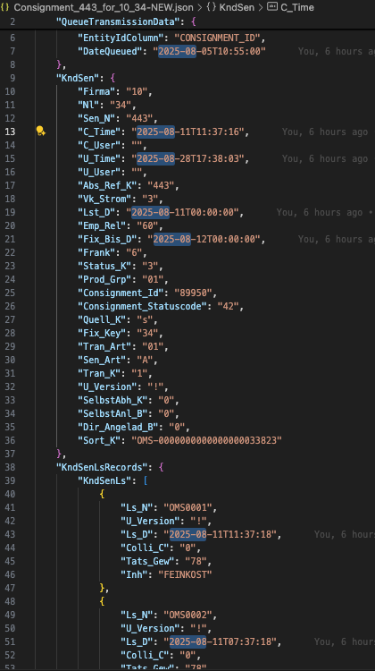

# Generating Test Data (Shipments) in TMS

For the development and testing of features on the `en1034` database, we need test data to verify our features work.

There are two ways of getting test data for Shipments:

1. Use existing un-dispatched Shipments that are already in the database dump
2. Import fake Shipments via the OMS import interface

Once you have Shipments, you can create Transport Orders from them, create legs, and so on.

Transport Orders should all have the current date, regardless of when the shipment was created. Additionally, you can set the delivery date in the tour point as another alternative to influence date values.

## 1. Using Existing Shipments Data

The challenge here is to find Shipments that are not dispatched yet. They can be found with this SQL:

```sql
SELECT * FROM sendung
WHERE sendungsart IN ('A') -- E & N = Local traffic, A = Long-distance traffic
--WHERE sendungsart IN ('A', 'E', 'N') -- E & N = Local traffic, A = Long-distance traffic
AND status_dis = 'F' -- Available for dispatch
AND leistungsdatum > localtimestamp - interval'125 days'
LIMIT 200
```

## 2. Importing New Fake Shipments

Shipments are imported into TMS via the following API (VPN required):

```
https://development-biztalk-to-oms-and-tms-branch.cal-consult.int/swagger/index.html
```

Endpoint:

```
/api/OmsMigration/DistributeConsignmentToTms
```

The tmskddfv service must be running for the affected company/branch. The company/branch and the Fix_Key in knd_sen must match the importing branch.

Requirements for importing from KND_SEN:
- The tmskddfv service must be running. This currently runs on CAL2110 and can be started by Thomas Paulus.
- It is a Windows service.

The body for the request must be in the shape of `Consignment_443_for_10_34.json`.

> Adjust the date values so that they match a future date (at least the `DateQueued`):



After running the request and receiving a successful HTTP 200 status, the record should be available in the table `knd_sen`, which acts as a staging environment. From there, it is picked up by the service and transformed into a record in the table `sendung`.

To find the resulting record in `sendung`, use this SQL with the same `sen_n` used in the JSON body:

```sql
SELECT *
  FROM sendung
  WHERE sendung_n = 443
  LIMIT 10
```

### Notes

> This triggers the creation of the shipment from OMS on ent1034. You must provide 1034 as the branch, otherwise it will end up in Oracle.

> The target is recognized via company branch. `Sen_N` and `AbsRef_K` correspond to the visible ConsignmentNumber in OMS. `Entity_Id` corresponds to the `Consignment_Id` from OMS. If the same `Entity_Id` is submitted again, DateQueued must be newer than the last import.

Note: There is a sync of live data from OMS for 1034 in UAT and ABN environments, as this is also relevant for Project G (thousands of shipments => floods the environment, not recommended for ENT).

### Contact Persons

- Reinhard Lechner
- Thomas Krause
- Thomas Paulus (to start the Import Service)
