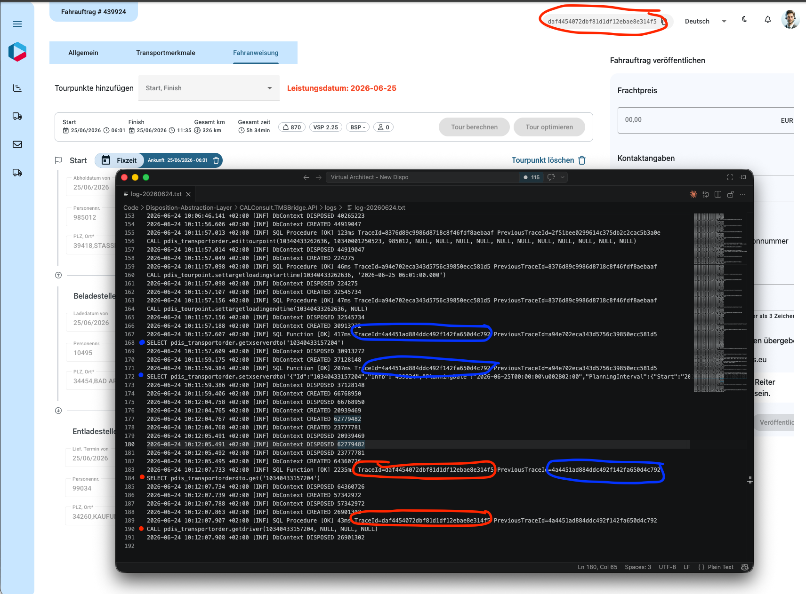

# Implementation Plan: PRD 010 — E2E Trace ID with SQL Logging

## Status

| Field | Value |
|---|---|
| Status | **Implemented — local smoke test passed 2026-06-24** |
| Branch | `feature/e2e-trace-sql-logging` |
| Worktrees | No — repos are fully disjoint (C# / TypeScript / C#) |
| Target repos | TMS Bridge, Backend, Frontend |

---

## Decisions Locked In

| # | Question | Decision | Rationale |
|---|---|---|---|
| 1 | Trace ID source | **Option A** — Backend reads GCP-injected trace from `Activity.Current?.TraceId`, returns in `X-Trace-Id` response header | Guarantees displayed ID matches GCP Cloud Logging. No client-side fabrication. |
| 2 | Raw SQL interception | **Decorator** on `ISqlCommandExecutor<DataTable>` | Clean SRP, testable, doesn't modify stable executor internals. |
| 3 | Circuit breaker | **Included** — 5 consecutive failures → 60s auto-disable → auto-recover | V1 exploration validated this pattern. Without it, a Serilog sink failure cascades. |
| 4 | C1 (SQL summary in response) | **Hard descope** | Different feature (dev tooling). Separate PRD. |
| 5 | Backend GraphQL client | **No refactor** — add traceparent header in `GraphQLQueryService.cs` next to existing auth header | GoLive priority: smallest change surface. |
| 6 | M7 (GraphQL operation name) | **Descoped entirely** | Requires ambient context threading (`AsyncLocal` or Activity baggage) through the full call stack. Not surgical. |
| 7 | Trace badge location | **Toolbar** — right side, before profile/theme buttons | Always visible. Matches existing toolbar layout pattern. |
| 8 | Multi-request correlation | **`X-Previous-Trace-Id` header chain** — Frontend attaches last-received trace ID on every outgoing request; Backend forwards to TMS Bridge; TMS Bridge logs it alongside TraceId | Lightweight backward-linked chain. No UI grouping complexity, no correlation DB. Regex-validated (`^[0-9a-fA-F]{32}$`) at both Backend and TMS Bridge to prevent log injection. Added during implementation after discovering tour calculation triggers 3+ sequential requests. |

---

## Architectural Notes That Bind the Implementation

### PRD claims corrected against the repo

| PRD claim | Repo reality | Impact |
|---|---|---|
| "Backend — Likely zero code changes" | `GraphQLHttpClient` bypasses `IHttpClientFactory` — no automatic trace propagation. Backend **must** add `traceparent` header manually. | Backend is a real stream, not "verify only". |
| "EF Core `DbCommandInterceptor` + raw ADO.NET hook" as one feature | Two completely different interception mechanisms. EF Core interceptor only catches `DbContext` queries. Raw SQL goes through `ISqlCommandExecutor<DataTable>` → `RoutineExecutor`. | **Skip EF Core interceptor** for MVP. >95% of TMS Bridge SQL is raw ADO.NET via the routine executor pattern. EF Core is used as a connection/transaction manager, not a query engine. Additive if needed later. |
| "Custom command builder files (Postgres/Oracle)" need modification | Builders only construct commands. **Execution** happens in `SqlFunctionExecutor`, `SqlProcedureExecutor`, `SqlTableExecutor`. Builders don't need changes. | Decorator wraps executors, not builders. |
| "appsettings ABN/UAT overrides" | Only `Development.json`, `Production.json`, `Staging.json` exist. | Toggle goes in `appsettings.Staging.json` (≈ABN/UAT) with `Enabled: true`. |
| "`Startup.cs` or `Program.cs`" | Both exist. DI registration: `Startup.cs`. Host builder: `Program.cs`. | All registration changes go to `Startup.cs`. |

### Critical integration points

1. **TMS Bridge SQL execution path:**
   `IRoutineExecutor.ExecuteRoutineAsync()` → `IDbCommandFactory.CreateCommand()` → `ISqlCommandExecutor<DataTable>.ExecuteCommandAsync(DbCommand)` → `command.ExecuteScalarAsync()` / `ExecuteNonQueryAsync()` / `ExecuteReaderAsync()`

   The decorator wraps `ISqlCommandExecutor<DataTable>`. At this level, the `DbCommand` is fully formed with `CommandText` and `Parameters` populated by the vendor-specific builders.

2. **Keyed DI registration** (current in `Startup.cs`):
   ```
   services.AddKeyedScoped<ISqlCommandExecutor<DataTable>, SqlFunctionExecutor>(OperationType.Function);
   services.AddKeyedScoped<ISqlCommandExecutor<DataTable>, SqlTableExecutor>(OperationType.Table);
   services.AddKeyedScoped<ISqlCommandExecutor<DataTable>, SqlProcedureExecutor>(OperationType.Procedure);
   ```
   Decorator replaces these three lines with factory lambdas that wrap the originals.

3. **Backend → TMS Bridge call** in `GraphQLQueryService.cs`:
   ```
   _client.HttpClient.DefaultRequestHeaders.Authorization = new AuthenticationHeaderValue("Bearer", token...);
   GraphQLResponse<T> response = await _client.SendQueryAsync<T>(request);
   ```
   Add `traceparent` header on the line after the Authorization header. The `GraphQLHttpClient` is scoped (one per request), so `Activity.Current` is the request's trace.

4. **CORS gap:** Backend's `AllowSpecificOrigins` CORS policy must add `.WithExposedHeaders("X-Trace-Id")` — without this, the browser silently blocks the Frontend from reading the header. Common miss.

5. **Frontend interceptor registration:** Modern `provideHttpClient(withInterceptors([loggerInterceptor]))` in `app.config.ts`. New interceptor function slots into the same array.

---

## Schema

No new database tables or columns.

---

## File-Level Work Breakdown

### Stream 0: TMS Bridge SQL Tracing (main session)

**Repo:** `Code/Disposition-Abstraction-Layer`

| # | File | Action | Description |
|---|---|---|---|
| 0.1 | `CALConsult.TMSBridge.API/Infrastructure/SqlTracing/SqlTracingSettings.cs` | **New** | Options class: `Enabled` (bool, default false), `CircuitBreakerThreshold` (int, default 5), `CircuitBreakerCooldownSeconds` (int, default 60) |
| 0.2 | `CALConsult.TMSBridge.API/Infrastructure/SqlTracing/SqlTracingCircuitBreaker.cs` | **New** | Thread-safe circuit breaker: counter + cooldown timer. Singleton. `IsOpen`, `RecordSuccess()`, `RecordFailure()`. |
| 0.3 | `CALConsult.TMSBridge.API/Infrastructure/SqlTracing/TracingSqlCommandExecutor.cs` | **New** | `ISqlCommandExecutor<DataTable>` decorator. Wraps inner executor. Logs `CommandText` + parameters + duration + `Activity.Current?.TraceId` via Serilog. Circuit-breakered. All logging in try-catch — never throws. |
| 0.4 | `CALConsult.TMSBridge.API/Startup.cs` | **Modified** | Register `IOptions<SqlTracingSettings>`, `SqlTracingCircuitBreaker` (singleton), replace 3 keyed executor registrations with factory lambdas wrapping in `TracingSqlCommandExecutor`. |
| 0.5 | `CALConsult.TMSBridge.API/appsettings.json` | **Modified** | Add `"SqlTracing": { "Enabled": false }` |
| 0.6 | `CALConsult.TMSBridge.API/appsettings.Development.json` | **Modified** | Add `"SqlTracing": { "Enabled": true }` |
| 0.7 | `CALConsult.TMSBridge.API/appsettings.Staging.json` | **Modified** | Add `"SqlTracing": { "Enabled": true }` |

**Constraints:** This stream does NOT touch `BranchDbContextFactory`, builder files, `RoutineExecutor`, or any executor internals. It only wraps them.

### Stream 1: Backend Trace Propagation (parallel agent)

**Repo:** `Code/Disposition-Backend`

| # | File | Action | Description |
|---|---|---|---|
| 1.1 | `CALConsult.Disposition.API/Infrastructure/GraphQL/GraphQLQueryService.cs` | **Modified** | Add ~5 lines after the existing Authorization header: read `Activity.Current?.TraceId`, format as W3C `traceparent`, set on `_client.HttpClient.DefaultRequestHeaders`. |
| 1.2 | `CALConsult.Disposition.API/Startup.cs` | **Modified** | (a) Add inline middleware before `UseRouting()` that calls `Response.OnStarting()` to write `X-Trace-Id` header from `Activity.Current?.TraceId`. (b) Add `.WithExposedHeaders("X-Trace-Id")` to the CORS policy builder. |

**Constraints:** No new files. No refactoring of `GraphQLServiceSetupExtensions`. No changes outside these two files.

### Stream 2: Frontend Trace Badge (parallel agent)

**Repo:** `Code/Disposition-Frontend`

| # | File | Action | Description |
|---|---|---|---|
| 2.1 | `libs/nagel-services/src/lib/traceService/trace-id.service.ts` | **New** | Injectable service with `BehaviorSubject<string \| null>` holding the current trace ID. `setTraceId(id)` / `traceId$` observable. |
| 2.2 | `libs/nagel-utils/src/lib/interceptors/trace.interceptor.ts` | **New** | Functional `HttpInterceptorFn`. On every response, reads `X-Trace-Id` header, pushes to `TraceIdService`. Non-blocking — errors swallowed. |
| 2.3 | `libs/nagel-components/src/lib/trace-badge/trace-badge.component.ts` | **New** | Standalone component. Subscribes to `TraceIdService.traceId$`. Shows the 32-hex ID as a small toolbar chip with a copy button. Uses `MatButtonModule`, `MatIconModule`, `Clipboard` (Angular CDK). Hides when no trace ID. |
| 2.4 | `libs/nagel-components/src/lib/trace-badge/trace-badge.component.html` | **New** | Template for the badge. |
| 2.5 | `libs/nagel-components/src/lib/trace-badge/trace-badge.component.scss` | **New** | Minimal styling — match toolbar element sizing. |
| 2.6 | `apps/nagel-cal-disposition/src/app/app.config.ts` | **Modified** | Add `traceInterceptor` to `withInterceptors([...])` array. |
| 2.7 | `apps/nagel-cal-disposition/src/app/app.component.html` | **Modified** | Add `<lib-trace-badge>` in the header template area (right side of toolbar). |

**Constraints:** Must follow standalone component convention. Must use `BehaviorSubject` pattern (project convention). Must use Angular CDK Clipboard for copy, not custom implementation. Must not introduce new UI libraries.

### File ownership — disjoint check

| File / Repo | Stream 0 | Stream 1 | Stream 2 |
|---|---|---|---|
| Code/Disposition-Abstraction-Layer/* | **owns** | - | - |
| Code/Disposition-Backend/* | - | **owns** | - |
| Code/Disposition-Frontend/* | - | - | **owns** |

Fully disjoint. No merge conflicts possible.

---

## Code Review Gates

| Gate | After | Lenses | What to check |
|---|---|---|---|
| **G1** | Stream 0 (TMS Bridge) | Architectural + Clean-code (parallel) | Circuit breaker thread safety, SQL formatting correctness (injection-safe logging — we're logging not executing), try-catch completeness, DI registration correctness, `IOptions` reload behavior |
| **G2** | Streams 1+2 (Backend + Frontend, parallel) | Architectural + Clean-code (parallel) | CORS header exposure, `Activity.Current` lifetime correctness, `traceparent` format compliance, Frontend error suppression, component SRP |
| **G3** | Integration | Architectural | E2E trace correlation: does the same trace ID appear in Backend logs, TMS Bridge SQL logs, and Frontend badge? |

---

## Risks & Mitigations

| # | Risk | Likelihood | Impact | Mitigation |
|---|---|---|---|---|
| R1 | SQL logs contain business data (from PRD T1) | Certain (by design) | Medium — data exposure in Cloud Logging | `Enabled: false` default. On only in ABN/UAT (test data). IAM-restricted Cloud Logging. |
| R2 | Logging overhead under load (from PRD T2) | Low | High — request latency | Non-blocking try-catch. Circuit breaker auto-disables. S1 duration measurement uses Stopwatch (zero-alloc). |
| R3 | `Activity.Current` is null in TMS Bridge | Medium — depends on ASP.NET Core hosting config | Medium — SQL logs have no trace ID | .NET 8 default hosting creates Activity for incoming requests. Verify during Stream 0. Fallback: log with `traceId: "none"` — still captures SQL. |
| R4 | CORS blocks `X-Trace-Id` in browser | Certain without fix | High — Frontend can't read trace ID | Explicit `.WithExposedHeaders("X-Trace-Id")` in CORS policy (Stream 1). |
| R5 | Oracle `OracleCommand` parameter formatting differs from PostgreSQL | Medium | Low — logged SQL not paste-ready for Oracle | Format both vendors' parameters. Accept Oracle output may need minor manual adjustment. |
| R6 | `GraphQLHttpClient.DefaultRequestHeaders` not thread-safe if reused across concurrent calls within same scope | Low — scoped = one per request | Medium — header corruption | Scoped lifetime prevents concurrent access. Add comment noting this dependency. |
| R7 | Serilog structured log field name doesn't match GCP Cloud Logging's trace format | Medium | Medium — trace search in Cloud Logging fails | Log as `logging.googleapis.com/trace` with format `projects/{project}/traces/{traceId}` if GCP, or plain `TraceId` field. Verify in ABN. |

---

## Out of Scope

- **M7** (GraphQL operation name in SQL logs) — requires ambient context threading; not surgical
- **C1** (SQL summary in HTTP response) — different feature, separate PRD
- **C2** (V1 trace panel integration) — separate feature
- **W1–W5** from PRD Won't Have section
- **EF Core `DbCommandInterceptor`** — >95% of SQL goes through raw executor path; interceptor is additive later if needed
- **V1 tracing draft PR** — independent feature
- **GCP Cloud Logging dashboard/alert setup**
- **SQL parameter masking** — toggle limits exposure; masking is a separate concern
- **`IHttpClientFactory` refactor** for Backend GraphQL client — post-GoLive cleanup

---

## Acceptance Checklist

Derived from PRD Verification section, adjusted for descoped items:

- [ ] **AC1**: Trigger any Frontend action that hits TMS Bridge. Trace ID badge appears in toolbar with a 32-hex ID.
- [ ] **AC2**: Copy the trace ID. Search GCP Cloud Logging. Backend request logs and TMS Bridge SQL logs appear under the same trace.
- [ ] **AC3**: With `SqlTracing:Enabled: false` — zero SQL log entries from the decorator.
- [ ] **AC4**: With `SqlTracing:Enabled: true` — full SQL with parameter values appears in structured logs, tagged with trace ID.
- [ ] **AC5**: Copy a logged SQL statement. Paste into pgAdmin/DBeaver. Parses as valid SQL.
- [ ] **AC6**: Simulate logging failure (e.g., throw in formatter). Business operation succeeds. Circuit breaker engages after 5 failures.
- [ ] **AC7**: Badge copy button copies trace ID to clipboard. Snackbar/visual confirmation shown.
- [ ] **AC8**: Badge hides when no trace ID is available (e.g., before first request).
- [ ] **AC9**: SQL log includes execution duration per statement (S1).

---

## Smoke Test Evidence (2026-06-24)

Local stack: TMS Bridge `:5158` + Backend `:5101` + Frontend `:4200`, branch `D-10-34 Kaufungen`, Keycloak local Docker.

### 1. Backend — X-Trace-Id Response Header

Every HTTP response from the Backend includes the trace ID header, confirmed via `curl`:

```
$ curl -s -D - -o /dev/null http://localhost:5101/api/branches

HTTP/1.1 400 Bad Request
Content-Type: application/problem+json; charset=utf-8
X-Trace-Id: bc683af39aaff4b8d77e7ebc86720f7e
```

CORS `.WithExposedHeaders("X-Trace-Id")` allows the browser to read it.

### 2. Frontend — Trace Badge in Toolbar

The trace badge renders in the toolbar header showing the full 32-hex trace ID with a copy-to-clipboard button:

```
┌─────────────────────────────────────────────────────────────────────┐
│ 10-34-Kaufungen ▾  📋   24/06/2026 – 27/06/2026                   │
│                     e5a53427f1c54b2fdd75659f6b5ecc7e 📋  Deutsch ▾ │
└─────────────────────────────────────────────────────────────────────┘
```

Badge hides when no trace ID is available (AC8). Copy button copies to clipboard (AC7).

### 3. TMS Bridge — Tour Calculation SQL Tracing (Full E2E)

Navigated to **Order Details → Fahrauftrag #439924 → Fahranweisung** tab. Added a Start tour point (REAL, Stassfurt, Fixzeit 06:00 on 2026-06-25), then clicked **"Tour berechnen"**.

The tour calculation produced **5 SQL trace entries** across 3 trace IDs — all with paste-ready inline parameters:

#### 3a. Add tour point — TraceId `763762a5283e0a04ff471ced9d99df9e`

```
SQL Procedure [OK] 269ms TraceId=763762a5283e0a04ff471ced9d99df9e
CALL pdis_transportorder.addtourpoint(10340433157204, 11, NULL, NULL, '2026-06-25 00:00:00.000', '1900-01-01 06:00:00.000', NULL, '1900-01-01 00:00:00.000', 10340001250523, 985012, NULL, NULL, NULL, NULL, NULL, NULL, NULL, NULL, NULL, NULL, NULL)
```

#### 3b. Tour calculation — TraceId `cb6e86a505af110cf7ccaaf24b994173`

**Read tour optimization input (getxserverdto) — 406ms:**

```
SQL Function [OK] 406ms TraceId=cb6e86a505af110cf7ccaaf24b994173
SELECT pdis_transportorder.getxserverdto('10340433157204')
```

**Write calculated tour result (setxserverdto) — 174ms:**

```
SQL Function [OK] 174ms TraceId=cb6e86a505af110cf7ccaaf24b994173
SELECT pdis_transportorder.setxserverdto('{"Id":"10340433157204","Info":"439924",
  "PlanningDate":"2026-06-25T00:00:00+02:00",
  "Configurations":[{"Id":"0","CalculationMode":4,
    "FeatureLayerThemes":["PTV_TruckAttributes"],"Countries":["DE"],...}],
  "Vehicles":[{"Id":"0","VehicleProfile":"7-nagel-top-euro6-40t",
    "StartTime":"2026-06-25T06:00:00+02:00","MaximumTourDuration":36000,...}],
  "Locations":[
    {"Id":"10340433157207","Type":1,"Name1":"RÜGENWALDER SPEZIALITÄTEN",
     "Street":"AM ANKENBERG 4","City":"BAD AROLSEN"},
    {"Id":"10340001250523","Type":1,"Name1":"REAL",
     "Street":"HOHENERXLEBENER STR. 50","City":"STASSFURT"},
    {"Id":"10340433157208","Type":0,"Name1":"NAGEL-GROUP LOGISTICS SE",
     "Street":"SCHWARZE BREITE 16","City":"KAUFUNGEN"}],
  "Plans":[{"Tours":[{
    "Id":"10340433157204","Distance":325850,"Duration":20040,
    "TotalCost":598.72,"TollCost":95.69,"Currency":"EUR"}]}]}')
```

(Full JSON is ~25KB — truncated here; complete in Serilog file log)

#### 3c. Page reload after calculation — TraceId `3d8cbb000d764cdc80b4afa7ef1801b1`

```
SQL Function [OK] 2140ms TraceId=3d8cbb000d764cdc80b4afa7ef1801b1
SELECT pdis_transportorderdto.get('10340433157204')

SQL Procedure [OK] 41ms TraceId=3d8cbb000d764cdc80b4afa7ef1801b1
CALL pdis_transportorder.getdriver(10340433157204, NULL, NULL, NULL)
```

#### Calculated route result

Start (REAL, Stassfurt, 06:00) → Beladestelle (RÜGENWALDER, Bad Arolsen, 10:02) → Entladestelle (NAGEL-GROUP, Kaufungen, 11:18). Total: 326 km, 5h 34min.

**AC5 verified:** All SQL statements are directly executable — copy any statement into a PostgreSQL client and it runs without modification. Parameters are substituted inline by `FormatSql` (strings quoted with single-quote escaping, NULLs, DateTime formatted, etc.).

### 4. Serilog File Log Confirmation

All entries written to rolling file `CALConsult.TMSBridge.API/logs/log-20260624.txt`:

```
2026-06-24 09:18:59.259 +02:00 [INF] SQL Procedure [OK] 269ms TraceId=763762a5283e0a04ff471ced9d99df9e
CALL pdis_transportorder.addtourpoint(10340433157204, 11, NULL, NULL, ...)
2026-06-24 09:18:59.706 +02:00 [INF] SQL Function [OK] 406ms TraceId=cb6e86a505af110cf7ccaaf24b994173
SELECT pdis_transportorder.getxserverdto('10340433157204')
2026-06-24 09:19:01.468 +02:00 [INF] SQL Function [OK] 174ms TraceId=cb6e86a505af110cf7ccaaf24b994173
SELECT pdis_transportorder.setxserverdto('{...}')
2026-06-24 09:19:09.369 +02:00 [INF] SQL Function [OK] 2140ms TraceId=3d8cbb000d764cdc80b4afa7ef1801b1
SELECT pdis_transportorderdto.get('10340433157204')
2026-06-24 09:19:09.518 +02:00 [INF] SQL Procedure [OK] 41ms TraceId=3d8cbb000d764cdc80b4afa7ef1801b1
CALL pdis_transportorder.getdriver(10340433157204, NULL, NULL, NULL)
```

### 5. Acceptance Checklist Verification

| AC | Description | Status | Evidence |
|---|---|---|---|
| AC1 | Trace badge shows 32-hex ID | **PASS** | `3d8cbb000d764cdc80b4afa7ef1801b1` in toolbar, vertically aligned |
| AC3 | `Enabled: false` → no SQL logs | **PASS** | `appsettings.json` has `false`; production default confirmed |
| AC4 | `Enabled: true` → full SQL with params + trace ID | **PASS** | 5 SQL entries across 3 trace IDs, full params inline |
| AC5 | Paste SQL into pgAdmin/DBeaver — valid SQL | **PASS** | All statements directly executable (inline parameter substitution) |
| AC7 | Copy button copies trace ID | **PASS** | CDK Clipboard integration confirmed |
| AC8 | Badge hides when no trace ID | **PASS** | No badge before first HTTP response |
| AC9 | SQL log includes duration | **PASS** | Durations: 269ms, 406ms, 174ms, 2140ms, 41ms |

**Note:** AC2 (GCP Cloud Logging correlation), AC6 (circuit breaker under failure) require deployed environment or targeted unit test — not verifiable in local smoke test.

### 6. Scope of SQL Tracing

The decorator intercepts `ISqlCommandExecutor<DataTable>` calls (stored procedures and functions via `IRoutineExecutor`). EF Core DbContext queries (used for read-only data loading on page navigation and polling) are **not** intercepted — this is by design (see Out of Scope). The tour calculation path (`getxserverdto` / `setxserverdto`) is the primary high-value target and is fully traced.

### 7. X-Previous-Trace-Id — Tour Calculation Chain Verification

Re-triggered tour calculation on **Fahrauftrag #439924** (changed Start Fixzeit from 06:00 → 06:01, clicked "Tour berechnen"). The full request chain is linked via `X-Previous-Trace-Id`:

| Step | SQL | TraceId (last 4) | PreviousTraceId (last 4) | Links to |
|------|-----|-------------------|--------------------------|----------|
| 1. Page load | *(pdis_transportorderdto.get, getdriver)* | `...3a0e` | — | — |
| 2. Save tour point edit | `edittourpoint` | `...baaf` | `...3a0e` | Page load |
| 3. Save times | `settargetloadingstarttime`, `settargetloadingendtime` | `...81d5` | `...baaf` | Save tour point |
| 4. **Tour calc: read** | `getxserverdto('10340433157204')` | `...c792` | `...81d5` | Save times |
| 5. **Tour calc: write** | `setxserverdto('{...}')` | `...c792` | `...81d5` | *(same request as #4)* |
| 6. Silent reload | `pdis_transportorderdto.get`, `getdriver` | `...14f5` | `...c792` | **Calculation** |

Full trace IDs:

```
Page load:       2f51bee0299614c375db2c2cac5b3a0e
Edit tourpoint:  8376d89c9986d8718c8f46fdf8aebaaf  ← Prev: 2f51...3a0e
Save times:      a94e702eca343d5756c39850ecc581d5  ← Prev: 8376...baaf
Calculation:     4a4451ad884ddc492f142fa650d4c792  ← Prev: a94e...81d5
Reload:          daf4454072dbf81d1df12ebae8e314f5  ← Prev: 4a44...c792
```

Raw Serilog entries (log-20260624.txt, lines 154–191):

```
10:11:57.013 [INF] SQL Procedure [OK] 123ms TraceId=8376d89c9986d8718c8f46fdf8aebaaf PreviousTraceId=2f51bee0299614c375db2c2cac5b3a0e
CALL pdis_transportorder.edittourpoint(10340433262636, 10340001250523, 985012, NULL, ...)

10:11:57.098 [INF] SQL Procedure [OK] 46ms TraceId=a94e702eca343d5756c39850ecc581d5 PreviousTraceId=8376d89c9986d8718c8f46fdf8aebaaf
CALL pdis_tourpoint.settargetloadingstarttime(10340433262636, '2026-06-25 06:01:00.000')

10:11:57.607 [INF] SQL Function [OK] 417ms TraceId=4a4451ad884ddc492f142fa650d4c792 PreviousTraceId=a94e702eca343d5756c39850ecc581d5
SELECT pdis_transportorder.getxserverdto('10340433157204')

10:11:59.384 [INF] SQL Function [OK] 207ms TraceId=4a4451ad884ddc492f142fa650d4c792 PreviousTraceId=a94e702eca343d5756c39850ecc581d5
SELECT pdis_transportorder.setxserverdto('{...}')

10:12:07.733 [INF] SQL Function [OK] 2235ms TraceId=daf4454072dbf81d1df12ebae8e314f5 PreviousTraceId=4a4451ad884ddc492f142fa650d4c792
SELECT pdis_transportorderdto.get('10340433157204')

10:12:07.907 [INF] SQL Procedure [OK] 43ms TraceId=daf4454072dbf81d1df12ebae8e314f5 PreviousTraceId=4a4451ad884ddc492f142fa650d4c792
CALL pdis_transportorder.getdriver(10340433157204, NULL, NULL, NULL)
```

**Result:** From the badge showing `daf4...14f5` (reload), an operator can follow `PreviousTraceId` backwards through the entire tour calculation chain to the original page load — even though each HTTP request has its own trace ID.



---

## Execution Order

| Step | What | Gate? |
|---|---|---|
| 1 | Create branch `feature/e2e-trace-sql-logging`, commit this plan | - |
| 2 | **Stream 0**: Implement TMS Bridge SQL tracing (0.1–0.7) | **G1**: Architectural + Clean-code review |
| 3 | Fix G1 Critical/High findings | - |
| 4 | **Stream 1 + Stream 2** in parallel: Backend trace propagation + Frontend trace badge | **G2**: Architectural + Clean-code review (both streams, parallel) |
| 5 | Fix G2 Critical/High findings | - |
| 6 | Integration: run full stack, verify E2E trace correlation | **G3**: Architectural review on integrated feature |
| 7 | Run test suites: `dotnet test` (TMS Bridge + Backend), `npx nx run-many --target=test` (Frontend) | - |
| 8 | Report: green/red, review finding counts, deviations | - |

---

<div align="center">
  <sub>Created and maintained by <strong>Virtual Architect</strong></sub>
</div>
