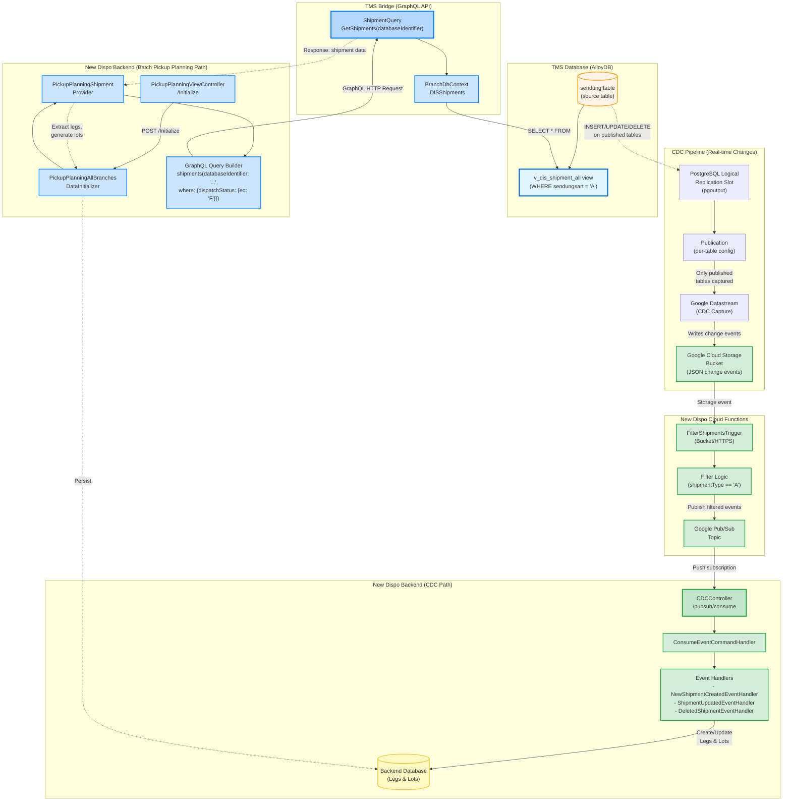

# Shipment Data Flow Architecture

**Date:** 2026-02-26
**Version:** 1.0
**Status:** Verified
**Source:** [08_Documentation/2026-02-26_leg-lot-creation-table-sendung/shipment-data-flow-architecture.md](../../08_Documentation/2026-02-26_leg-lot-creation-table-sendung/shipment-data-flow-architecture.md)

---

## Overview

Complete architecture for shipment data flows in the New Dispo system, showing how shipment data from the `sendung` table flows through two independent pipelines:

1. **CDC Pipeline (Real-time)** - Captures changes and publishes events
2. **Batch Pickup Planning Pipeline** - Queries unplanned shipments via GraphQL

---

## Diagram

---

## Key Characteristics

### CDC Pipeline (Real-time) 🟢
- ❌ Does NOT use `v_dis_shipment_all` view
- ❌ Does NOT query the database
- ✅ Reads raw data from CDC bucket
- ✅ Full shipment row data included in each event
- ✅ Real-time propagation
- ✅ Event-driven architecture

### Pickup Planning Pipeline (Batch) 🔵
- ✅ Uses `v_dis_shipment_all` view
- ✅ Batch processing
- ✅ Filters for unplanned shipments (`dispatchStatus = 'F'`)
- ✅ One-time or periodic execution
- ✅ Generates complete Lot structure

---

## Related Documentation

- **Detailed Documentation:** [08_Documentation/2026-02-26_leg-lot-creation-table-sendung/](../../08_Documentation/2026-02-26_leg-lot-creation-table-sendung/)
- **Other Diagrams:** [07_Diagrams/](../)
