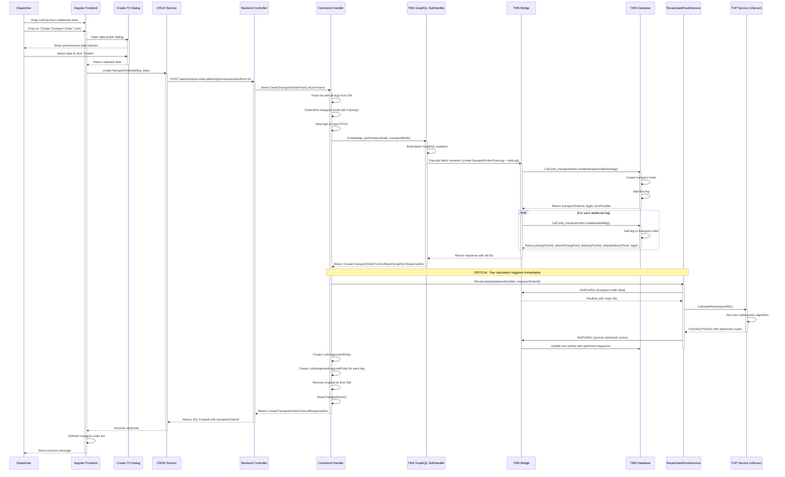

# Transport Order Creation via Drag and Drop Flow

**Date:** 2026-03-16
**Version:** 1.1
**Status:** Verified (Deep code check: 2026-03-25)
**Source:** [02_Explorations/2026-03-16_Transactional-Behaviour-New-Dispo-TMS-Transport-Orders/01-overview-and-flow.md](../../02_Explorations/2026-03-16_Transactional-Behaviour-New-Dispo-TMS-Transport-Orders/01-overview-and-flow.md)

---

## Overview

Complete drag-and-drop flow showing how dispatchers create transport orders from unplanned lots or legs. This orchestrates the full stack:

**Frontend → Backend → TMS Bridge → TMS Database → Tour Calculation → Response**

Key characteristics:
- ✅ User-initiated via drag & drop (Angular CDK)
- ✅ Date picker dialog for performance date selection
- ✅ Batch GraphQL mutation to TMS
- ✅ Automatic tour calculation trigger (xServer)
- ✅ Transformation from LotEntity to LotAssignmentEntity
- ✅ Transactional integrity across the stack

---

## Diagram

---

## Key Takeaways

### 1. Complete Stack Integration ✅
- Frontend (Angular CDK drag & drop)
- Backend (CQRS pattern with MediatR)
- TMS Bridge (GraphQL mutations)
- TMS Database (stored functions)
- External Services (xServer tour optimization)

### 2. Automatic Tour Calculation ⚡
- Triggered immediately after transport order creation
- Non-blocking (errors logged but don't fail creation)
- Can be manually retriggered from frontend
- Uses xServer for route optimization

### 3. Data Transformation Pattern 🔄
- `LotEntity` (unplanned) → `LotAssignmentEntity` (planned)
- Original lot deleted, legs preserved
- Links maintained via `LotAssignmentLegLinkEntity`
- Full traceability with `PreviousLotId`

### 4. Batch Processing Strategy 📦
- Single GraphQL mutation with multiple operations
- First leg: `createtransportorderfromleg()`
- Additional legs: `createandaddleg()` (internally calls `addleg()`)
- Transactional integrity across all leg additions
- Efficient network usage
- Variable export/import between operations

### 5. Flexible Assignment Model 🔗
- Legs can be reassigned to different transport orders
- Lots can be split across multiple transport orders
- Individual legs can be added to existing transport orders
- Original shipment data always preserved

---

## Related Documentation

- **Detailed Documentation:** [02_Explorations/2026-03-16_Transactional-Behaviour-New-Dispo-TMS-Transport-Orders/](../../02_Explorations/2026-03-16_Transactional-Behaviour-New-Dispo-TMS-Transport-Orders/)
- **Pre-existing PlantUML Diagram:** [07_Diagrams/pickup-planning-create-transport-order-from-lot.wsd](../pickup-planning-create-transport-order-from-lot.wsd)
- **Other Diagrams:** [07_Diagrams/](../)
