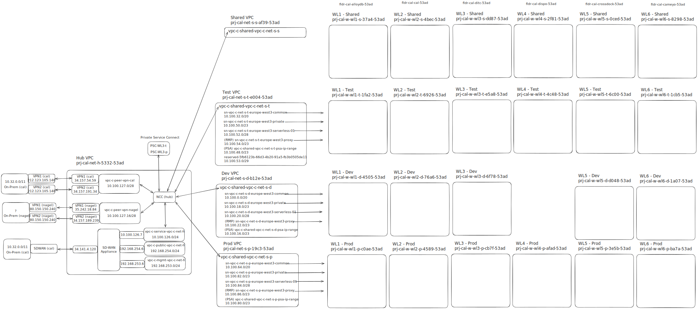

# Network Configuration

## Overview

The New Dispo infrastructure uses Google Cloud's Shared VPC architecture with separate network projects for test and production environments.

**Region:** europe-west3

## VPC Architecture

### Hub VPC and VPN Connectivity

The infrastructure uses a Hub VPC architecture with VPN connections to both CAL and Nagel on-premises networks.

> **Note:** This diagram and information is the result of an investigation by Dominik Landau and might contain mistakes. Please verify details before using in production configurations.



**Hub VPC:** `prj-cal-net-h-5332-53ad`

**VPN Gateways:**

**CAL VPN Connections:**
- VPN1 (GCP): `34.157.54.59` ↔ VPN1 (On-Prem): `212.123.105.148`
- VPN2 (GCP): `34.157.191.34` ↔ VPN2 (On-Prem): `212.123.105.148`
- Peering VPC: `vpc-c-peer-vpn-cal` (`10.100.127.0/28`)

**Nagel VPN Connections:**
- VPN1: `35.242.18.84`
- VPN2: `34.157.189.239`
- Peering VPC: `vpc-c-peer-vpn-nagel` (`10.100.127.16/28`)

**On-Premises Network (CAL):** `10.32.0.0/11`

**Network Cloud Router (NCC):** Hub configuration in the Hub VPC for centralized routing

### Test Environment

**VPC Network:** `projects/prj-cal-net-s-t-e004-53ad/global/networks/vpc-c-shared-vpc-c-net-s-t`

**Subnet:** `projects/prj-cal-net-s-t-e004-53ad/regions/europe-west3/subnetworks/sn-vpc-c-net-s-t-europe-west3-common`

**Network Project:** `prj-cal-net-s-t-e004-53ad`

**Workload Projects:**
- WL4 Test: `prj-cal-w-wl4-t-4c48-53ad`
- WL5 Test: `prj-cal-w-wl5-t-6c00-53ad`

### Production Environment

**VPC Network:** `projects/prj-cal-net-s-p-19c3-53ad/global/networks/vpc-c-shared-vpc-c-net-s-p`

**Subnet:** `projects/prj-cal-net-s-p-19c3-53ad/regions/europe-west3/subnetworks/sn-vpc-c-net-s-p-europe-west3-common`

**Network Project:** `prj-cal-net-s-p-19c3-53ad`

**Workload Projects:**
- WL4 Production: `prj-cal-w-wl4-p-afad-53ad`
- WL5 Production: `prj-cal-w-wl5-p-3e5b-53ad`

Both WL4 and WL5 production workloads share the same VPC and subnet.

## Network Tags

Network tags are applied to Cloud Run services via Azure DevOps pipelines.

### Backend (Disposition-Backend)

**Production (P-P):**
- `vpc-connector`
- `postgres-user`
- `http-web-user`
- `https-user`
- `p5101-user`
- `p8080-user`

**Test (T-T):**
- `vpc-connector`
- `postgres-user`
- `http-web-user`
- `https-user`
- `p5101-user`
- `p8080-user`
- `https-producer`
- `p5101-producer`
- `p8080-producer`

### TMS Bridge (Disposition-Abstraction-Layer)

**Production (P-P):**
- `vpc-connector`
- `postgres-user`
- `http-web-user`
- `https-user`
- `p5101-user`
- `p8080-user`
- `oracle-user`

**Test (T-T WL5):**
- `postgres-user`
- `http-web-user`
- `https-user`
- `p5101-user`
- `p8080-user`
- `https-producer`
- `p5101-producer`
- `p8080-producer`
- `oracle-user`

### Frontend (Disposition-Frontend)

**Production (P-P):**
- `vpc-connector`
- `postgres-user`
- `http-web-user`
- `https-user`
- `p5101-user`
- `p8080-user`
- `https-producer`
- `p8080-producer`
- `p5101-producer`

**Test (T-T):**
- `vpc-connector`
- `postgres-user`
- `http-web-user`
- `https-user`
- `p5101-user`
- `p8080-user`
- `https-producer`
- `p5101-producer`
- `p8080-producer`

### Cloud4Log

**Production (P-P) and Test (T-T):**
- `postgres-user`
- `http-web-user`
- `https-user`
- `p5101-user`
- `p8080-user`
- `https-producer`
- `p5101-producer`
- `p8080-producer`
- `oracle-user`
- `smb-op-user`

### Dispo Filter Functions

**Test (T-T UAT2820 and ABN1034):**
- `postgres-user`
- `http-web-user`
- `https-user`
- `p5101-user`
- `p8080-user`
- `https-producer`
- `p5101-producer`
- `p8080-producer`

## Cloud Run Configuration

### Ingress

All Cloud Run services are configured with:
```
--ingress internal
```

This restricts access to traffic from within the VPC and via Cloud Load Balancers only.

### VPC Egress

All Cloud Run services are configured with:
```
--vpc-egress all-traffic
```

All traffic (both to VPC and internet) is routed through the VPC.

## Service Endpoints

### Test Environment

- Frontend & Backend: `https://test.dispo.gcp.nagel-group.com`
- TMS Bridge: `https://test.tms-bridge.gcp.nagel-group.com`

### Production Environment

- Frontend & Backend: `https://dispo.gcp.nagel-group.com`
- TMS Bridge: `https://tms-bridge.gcp.nagel-group.com`

## CloudSQL Instances

### Production

- Backend: `prj-cal-w-wl4-p-afad-53ad:europe-west3:cal-new-disposition-postgres-p-p`

### Test

- Backend: `prj-cal-w-wl4-t-4c48-53ad:europe-west3:cal-new-disposition-psql-t-t`

CloudSQL instances are accessed from Cloud Run services using the `--add-cloudsql-instances` flag.

## Load Balancer Configuration (Legacy K8s Deployments)

The following configuration is from Kubernetes deployment.yaml files (not currently used for Cloud Run deployments):

### Frontend
- Type: LoadBalancer
- Static IP: `34.159.88.149`
- Port: `8081`

### TMS Bridge
- Type: LoadBalancer
- Port: `7153`

### Backend
- Type: ClusterIP (internal only)
- Port: `5101`
