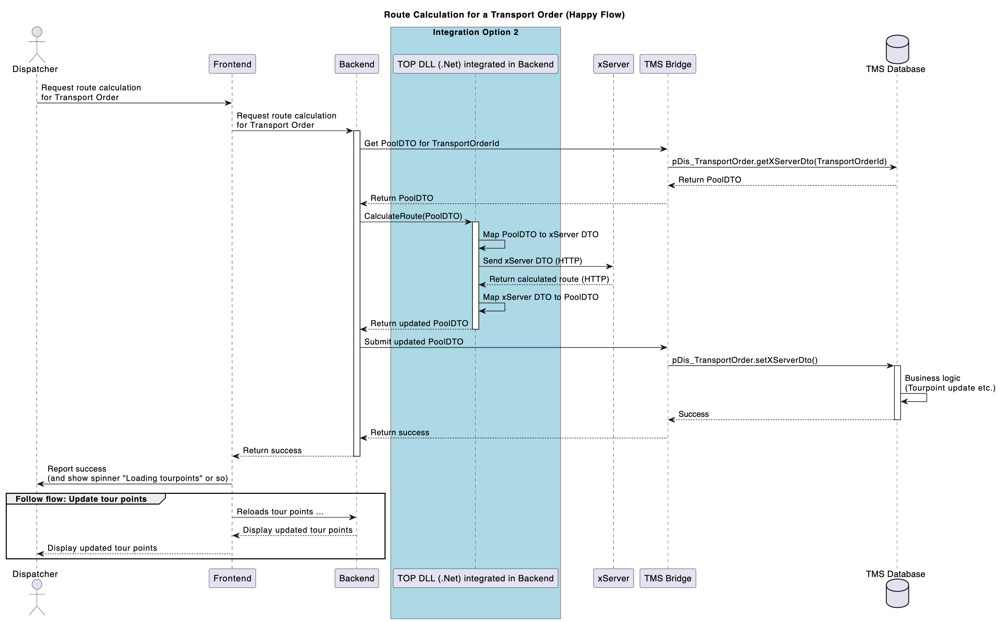

# [ADR002] xServer Integration for Tour Optimization

**Status:** Closed
**Date:** 2025-08-05

## Context

The New Disposition system requires integration with PTV xServer for tour planning and optimization capabilities. The integration must leverage existing tour optimization (TOP) functionality while maintaining clear separation of concerns between systems. The solution must be implemented by November 2025 as part of iteration 1, prioritizing feature delivery over architectural perfection.

* **xServer**: PTV's route planning and optimization service hosted at 10.32.3.102:30000 (requires Nagel VPN).
* **TOP Project**: Existing .NET 4.5 project by CAL that integrates TMS with xServer via a central `PoolDTO`.
* **New Disposition**: Cloud-native system requiring tour optimization capabilities.
* **TMS Database**: Source of transport orders and tour data, accessed via stored procedures.

Key requirements include:

1. **Retrieving Transport Order Data** from TMS database via `FRK_TIX` lookup.
2. **Generating PoolDTO** using existing `pTop_LoadingList.get()` stored procedure, wrapped as `pDis_TransportOrder.getXserverDto()`.
3. **Writing PoolDTO** using existing `pTop_LoadingList.put()` stored procedure, wrapped as `pDis_TransportOrder.setXserverDto()`.
4. **Calling xServer** for route calculation using TOP DLL functionality.
5. **Processing Results** and storing optimized tour information.
6. **Maintaining Compatibility** with existing TMS processes and data structures.
7. **Enabling P3 Independence** while reusing CAL's domain expertise.
8. **Supporting Future Migration** to a cleaner architecture in subsequent iterations.

The solution must integrate with Nagel's existing infrastructure while maintaining modularity for future expansion.

#### Options Considered

1. **Integration Approach:**

   * **Option A: New Cloud Component for TOP DLL Integration**
   * **Option B: Integrate TOP DLL into New Disposition Backend**
   * **Option C: Re-use Existing REST Web Service from CAL**

2. **Data Access Strategy:**

   * Utilize existing stored procedures for PoolDTO generation

3. **Results Processing:**

   * Store optimization results in existing TMS tour tables

> For details see the team refinement [here](https://dev.azure.com/p3ds/Nagel-CAL%20Disposition/_wiki/wikis/Nagel-CAL-Disposition.wiki/13872/2025-07-28?anchor=options-for-integrating-the-top-dll)

## Decision

1. **Integration Approach:**

   * **Decision:** Option B - Integrate TOP DLL into New Disposition Backend
   * Lowest integration effort while maintaining deployment control
   * Prepare as a modular monolith for future extraction to microservice

2. **Data Access Strategy:**

   * **Decision:** Create wrapper function combining FRK_TIX retrieval and PoolDTO generation
   * Simplifies integration and reduces round trips

3. **Results Processing:**

   * **Decision:** Use existing TMS result storage mechanisms
   * Maintains compatibility with current processes

## Rationale

* **Direct DLL Integration**: Chosen for its lower complexity and faster time-to-market given the November deadline. The .NET 4.5 compatibility risk is acceptable for iteration 1, with plans to modernize in future iterations.

* **Modular Monolith Approach**: Allows immediate functionality while preparing for future microservice extraction. Code will be organized in separate namespaces/projects within the backend to facilitate later separation.

* **Wrapper Function Strategy**: Reduces complexity in the application layer by encapsulating the two-step process (FRK_TIX lookup + PoolDTO generation) in a single database function.

* **Existing Infrastructure Reuse**: Leverages proven TOP project code and TMS stored procedures, reducing development risk and maintaining business logic consistency.

## Consequences

* **Positive**:

  * Rapid delivery meeting November deadline
  * Reuses proven business logic from TOP project
  * Maintains compatibility with existing TMS processes
  * P3 team gains deployment control and debugging capability
  * Clear migration path to cleaner architecture

* **Negative**:

  * Technical debt from .NET 4.5 dependency in .NET Core project
  * Temporary coupling between New Disposition and legacy TOP code
  * Potential deployment complexities with mixed framework versions
  * Limited ability to modify core TOP logic without CAL involvement

## Related ADRs

* Future ADR needed for iteration 2 microservice extraction strategy

## References

* TOP Project Repository: https://dev.azure.com/caldevops/Agile/_git/CALtms?path=/3GL/CALConsult.TOP
* xServer API Documentation: http://10.32.3.102:30000/services/openapi/2.26/swagger.json
* Code Analysis: https://dev.azure.com/p3ds/Nagel-CAL%20Disposition/_wiki/wikis/Nagel-CAL-Disposition.wiki/13731/xServer-Integration-with-TMS
* Test Implementation: 3GL/CALConsult.TOP/Test/CALConsult.TOP.Test.XServer.JS/Program.cs

**Exploration Results:**

* #117518: .NET Integration Options Exploration
* Identified exact DLL entry points via test case analysis
* Confirmed xServer connectivity requirements

[Link](https://dev.azure.com/p3ds/Nagel-CAL%20Disposition/_wiki/wikis/Nagel-CAL-Disposition.wiki/13950/Integration-of-TOP-project)

## Architecture Diagram

### Integration Flow



[Link to PlantUML](https://p3web.sharepoint.com/:u:/r/teams/P3CALConsult/Shared%20Documents/General/02_Architecture/Pickup_Planning/xServer/xServer.wsd?csf=1&web=1&e=agoEs4)

### Future State (Post-Iteration 1)

```
New Disposition Backend ---> Tour Optimization Service
                                     |
                                     v
                         [Modernized TOP Logic]
                                     |
                                     v
                                 xServer API
```