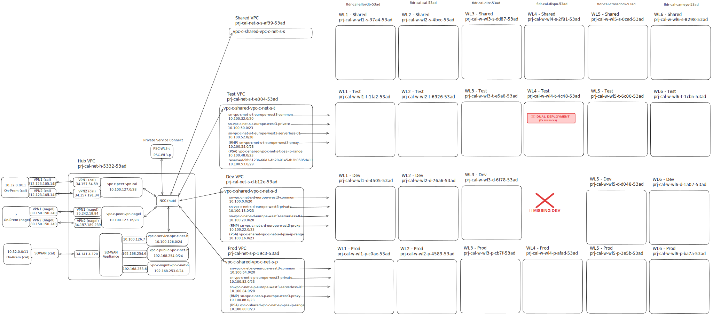

# [ADR005] Dual Instance Deployment in WL4 Test Environment

**Status:** Closed
**Date:** 2026-03-02

## Context

The New Dispo system and its associated components are deployed across multiple GCP Workload (WL) projects within the Nagel Group's GCP infrastructure. The standard deployment pattern for GCP projects follows a three-environment approach:

* **DEV Environment**: Used for internal development and testing by the development team
* **TEST Environment**: Used for customer-facing testing, UAT (User Acceptance Testing), and stakeholder validation
* **PROD Environment**: Production environment for live operations

This separation ensures that:
1. Internal development work does not interfere with customer testing
2. Customer testing environments remain stable while development continues
3. There is a clear promotion path from DEV → TEST → PROD

The Nagel Group currently operates five GCP Workload projects:
* **WL1, WL2, WL3, WL5**: Each contains DEV, TEST, and PROD environments
* **WL4**: Only contains TEST and PROD environments — **the DEV environment is missing**

The absence of the DEV environment in WL4 creates a deployment dilemma: where should internal development and testing deployments go before they are ready for customer validation?

**Systems Affected in WL4:**
* New Dispo Backend (Cloud Run)
* New Dispo Frontend (Cloud Run)
* New Dispo Database (CloudSQL PostgreSQL)
* KeyCloak (Identity Provider)

**Complete System Distribution Across Workloads:**

| Workload | Components |
|----------|------------|
| **WL3** | TMS Database (AlloyDB) |
| **WL4** | New Dispo Backend, New Dispo Frontend, New Dispo Database (CloudSQL), KeyCloak |
| **WL5** | TMS Bridge, Dispo Filter Function (Cloud Function), Cloud4Log Functions, CrossDock Event Publisher |

**Note:** Only WL4 components are affected by the dual instance deployment decision. WL5 components (TMS Bridge, Cloud Functions) maintain the standard three-environment pattern (DEV, TEST, PROD).

Key requirements include:

1. **Internal Testing Capability**: Development team needs an environment for internal testing before customer exposure
2. **Customer Testing Isolation**: Customer-facing testing should not be disrupted by ongoing development work
3. **Timely Deployment**: Solution must be implementable without significant delays
4. **Alignment with Standards**: Minimize deviation from standard GCP project structure where possible

#### Options Considered

**For handling the missing DEV environment:**

* **Option A: Request Creation of DEV Environment in WL4**
  * Engage Nagel IT infrastructure team to provision a missing DEV environment in WL4
  * Follow standard three-environment pattern (DEV, TEST, PROD)
  * Requires bureaucratic process, approvals, and provisioning time

* **Option B: Deploy Two Instances in WL4 TEST Environment**
  * Deploy two complete sets of all components within the single TEST environment
  * Instance 1: Internal development and testing (acting as "DEV")
  * Instance 2: Customer-facing testing (acting as "TEST")
  * Distinguishable by naming convention, configuration, or resource grouping

* **Option C: Use WL1/WL2/WL3/WL5 DEV for WL4 Development**
  * Utilize existing DEV environments from other workloads for WL4 internal testing
  * Requires cross-workload routing and configuration
  * Creates architectural inconsistency and dependency

* **Option D: Skip Internal Testing Environment**
  * Deploy directly to TEST environment for all testing (internal and customer)
  * Accept increased risk of disrupting customer testing activities

## Decision

1. **Deployment Strategy for WL4:**
   * **Decision:** Option B - Deploy Two Instances in WL4 TEST Environment
   * Two complete sets of all New Dispo components will be deployed within the WL4 TEST GCP project
   * Instance 1: Internal development/testing instance (DEV-equivalent)
   * Instance 2: Customer-facing testing instance (TEST-proper)

## Rationale

* **Option B (Dual Instance Deployment)**: Selected because:
  * **Immediate Implementation**: No waiting for infrastructure provisioning or bureaucratic approval processes
  * **Development Continuity**: Allows the development team to continue internal testing without delays
  * **Customer Isolation**: Maintains separation between internal testing and customer-facing validation
  * **Pragmatic Trade-off**: The bureaucratic overhead and timeline impact of requesting a new GCP project environment outweighs the technical debt of this workaround
  * **Cost-Effective**: Deploying two instances within one environment is cheaper and faster than provisioning an entire new environment
  * **Reversible**: Can be consolidated back to standard pattern if/when WL4 DEV environment is provisioned

* **Option A (Request DEV Environment)**: Rejected because:
  * **Bureaucratic Overhead**: Requires approval from multiple stakeholders, infrastructure provisioning, network configuration, IAM setup
  * **Timeline Impact**: Estimated weeks to months for completion, blocking current development needs
  * **Opportunity Cost**: Development team would be idle or forced into riskier deployment patterns during waiting period

* **Option C (Cross-Workload DEV Usage)**: Rejected because:
  * **Architectural Inconsistency**: Violates the principle that each workload should be self-contained
  * **Complex Configuration**: Requires cross-project networking and routing rules
  * **Operational Confusion**: Creates unclear boundaries for which workload owns which components

* **Option D (Skip Internal Testing)**: Rejected because:
  * **High Risk**: Directly deploying to customer-facing environment without internal validation
  * **Customer Impact**: Development bugs could disrupt stakeholder testing activities
  * **Quality Compromise**: Reduces testing rigor and increases chance of customer-visible defects

## Costs

This decision does not introduce significant new costs. The dual instance deployment within a single GCP project environment uses existing TEST environment quotas and resources.

**Dual Instance Deployment (WL4 TEST):**
* **Incremental Cost**: Approximately 2x the cost of a single TEST instance (one instance per environment equivalent)
* **Comparison to New Environment**: Significantly less than the cost of provisioning an entirely new DEV environment with its own networking, IAM, and infrastructure overhead
* **Note**: No cost estimate provided as the cost is absorbed within existing TEST environment budget allocation

**Additional Considerations:**
* Infrastructure costs are duplicated (2x Cloud Run services, 2x database instances, 2x KeyCloak instances, etc.)
* No additional GCP project quota or administrative overhead
* Lower cost than maintaining cross-workload routing (Option C)

## Consequences

* **Positive**:
  * Unblocks development and testing activities immediately
  * Maintains separation between internal and customer-facing testing
  * Avoids bureaucratic delays and approval processes
  * Preserves development velocity and project timeline
  * Can be implemented with existing infrastructure and permissions
  * Reversible if WL4 DEV environment is provisioned in the future

* **Negative**:
  * **Technical Debt**: Violates the standard three-environment pattern (DEV, TEST, PROD)
  * **Anti-Pattern**: Hosting multiple logical environments within a single GCP project environment is not a best practice
  * **Resource Management Complexity**: Requires careful naming conventions and configuration to distinguish between the two instances
  * **Potential for Confusion**: Operators and developers must understand which instance is which
  * **Increased Infrastructure Cost**: Running two sets of instances in TEST increases costs compared to a single instance
  * **Future Migration Effort**: If WL4 DEV is eventually provisioned, migration effort will be required to move one instance from TEST to DEV
  * **Quota Concerns**: Both instances share the TEST environment's resource quotas (compute, database, networking)

**Mitigation Strategies:**
* Implement clear naming conventions to distinguish instances (e.g., `new-dispo-backend-dev`, `new-dispo-backend-test`)
* Document the dual instance pattern clearly in deployment guides and runbooks
* Monitor resource usage to ensure quotas are not exceeded
* Plan for eventual consolidation when/if WL4 DEV environment becomes available

## Related ADRs

* [ADR-001: Data Exchange Between TMS and CALSuite's Cross-Dock](../ADR-001-data-exchange-tms-calsuite-cross-dock/ADR-001-data-exchange-tms-calsuite-cross-dock.md) - Context on overall system architecture
* [ADR-004: TMS Bridge Database Identifier Naming Convention](../ADR-004-tms-bridge-database-identifier/ADR-004-tms-bridge-database-identifier.md) - Related infrastructure and deployment considerations

## References

* **Management Summary**: [01_Communication/2026-03-02_wl4-dual-instance-deployment](../../01_Communication/2026-03-02_wl4-dual-instance-deployment/management-summary.md)
* **Communication - Workload Gap Analysis**: [01_Communication/2026-02-12_Dominik-Landau-GCP-workload-gap](../../01_Communication/2026-02-12_Dominik-Landau-GCP-workload-gap/wls.svg)
* **Related Discussion - Missing GCP Project**: [01_Communication/2026-02-18_missing-gcp-project](../../01_Communication/2026-02-18_missing-gcp-project)
* **Deployment & Workload Mapping**: [02_Explorations/2026-03-03_deployment_workload_mapping_and_pipeline_infrastructure](../../02_Explorations/2026-03-03_deployment_workload_mapping_and_pipeline_infrastructure/deployment-workload-mapping-and-pipeline-infrastructure.md)

## Architecture Diagram

**GCP Workload Structure - Missing WL4 DEV Environment:**



*Annotated GCP workload structure diagram showing:*
- *Red X (❌): Missing WL4 DEV environment*
- *Warning box (⚠️): Dual deployment (2x instances) in WL4 TEST*

**Dual Instance Deployment Pattern:**

The dual instance deployment pattern within WL4 TEST can be visualized as follows:

```
WL4 GCP Project (prj-cal-w-wl4-t-4c48-53ad for TEST)
│
├── TEST Environment (contains both instances)
│   ├── Instance 1 (DEV-equivalent) — Internal Development & Testing
│   │   ├── new-dispo-backend-dev (Cloud Run)
│   │   ├── new-dispo-frontend-dev (Cloud Run)
│   │   ├── new-dispo-database-dev (CloudSQL PostgreSQL)
│   │   └── keycloak-dev (Identity Provider)
│   │
│   └── Instance 2 (TEST-proper) — Customer-Facing Testing
│       ├── new-dispo-backend-test (Cloud Run)
│       ├── new-dispo-frontend-test (Cloud Run)
│       ├── new-dispo-database-test (CloudSQL PostgreSQL)
│       └── keycloak-test (Identity Provider)
│
└── PROD Environment (prj-cal-w-wl4-p-afad-53ad)
    └── (standard production deployment)
```

**WL5 Components (Not Affected):**
```
WL5 GCP Project
│
├── DEV Environment ✓
│   └── TMS Bridge, Dispo Filter Function, Cloud4Log, etc.
│
├── TEST Environment ✓
│   └── TMS Bridge, Dispo Filter Function, Cloud4Log, CrossDock Publisher, etc.
│
└── PROD Environment ✓
    └── TMS Bridge, Cloud4Log, etc.
```

**Comparison to Standard Pattern:**

```
Standard Pattern (WL1, WL2, WL3, WL5):
DEV Environment  → Instance 1 (internal testing)
TEST Environment → Instance 2 (customer testing)
PROD Environment → Instance 3 (production)

WL4 Workaround Pattern:
[DEV Environment - MISSING]
TEST Environment → Instance 1 (internal testing) + Instance 2 (customer testing)
PROD Environment → Instance 3 (production)
```
