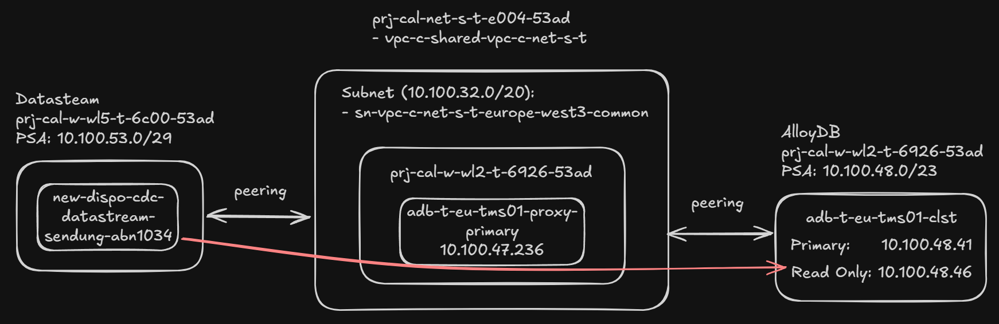

# [ADR007] Retain PSC Proxy for Datastream-to-AlloyDB Connectivity

**Status:** Pending decision
**Date:** 2026-04-08 (documented 2026-04-17)

## Context

The existing Postgres CDC pipeline uses Google Datastream to replicate data from AlloyDB to support the New Dispo system. Datastream connects to AlloyDB via an **intermediate TCP proxy server** in a peered subnet configuration, as required by [GCP documentation](https://cloud.google.com/datastream/docs/configure-alloydb-psql).

The team experienced **recurring connectivity issues** with Datastream instances and began investigating potential root causes in the connection chain. P3 proposed **removing the proxy** to eliminate one potential source of problems. Dominik Landau (P3/Constraight) was consulted and confirmed that a direct connection via Private Service Connect (PSC) might be feasible, though GCP documentation was inconclusive. This prompted an exploration ([2026-03-16 Datastream PSC Direct Connection](../../02_Explorations/2026-03-16_Datastream-PSC-Direct-Connection/datastream-psc-direct-connection.md)) into whether the proxy layer could be removed.

**Stakeholders:** Matthias Max (P3), Matt Wilkinson (Nagel), Ron Vervenne (Nagel Infrastructure), Yosif Mihaylov (P3)

#### Options Considered

1. **Datastream-to-AlloyDB connectivity:**
    * **Option A: Keep proxy in the chain** -- retain the current architecture where Datastream connects to AlloyDB through an intermediate proxy server
    * **Option B: Remove proxy, connect directly** -- eliminate the proxy and let Datastream connect directly to AlloyDB via a PSC endpoint

### Current Architecture

*Diagram by Dominik Landau (2026-03-16): Datastream (WL5) connects via peered subnet to the proxy (10.100.47.236, WL2), which peers through to AlloyDB (10.100.49.91, WL2).*

## Decision

**Option A: Keep proxy in the chain.** Retain the PSC proxy for Datastream-to-AlloyDB connectivity. Do not pursue the direct connection at this time.

## Rationale

The decision was reached in the Oracle CDC Follow-Up meeting on 2026-04-08. Four factors drove the outcome:

*   **Proxy-based connectivity is proven and reliable.** Ron Vervenne emphasised that this has been the standard way of connecting to databases from Google for years and has never caused issues. He does not expect problems now simply because a new direct option may exist.

*   **Performance is acceptable.** Matt Wilkinson reported on 2026-04-08 that the existing Postgres Datastream pipeline (AVN 1034) shows **10-15 seconds latency on average** over a full month of operation via the proxy. This is within the business tolerance confirmed by Patrick Uschmann (PO): ~10 seconds is fine, minutes would be problematic.

*   **No capacity to test the alternative.** The team's priority is the Oracle CDC pipeline (ADR-006) and the June 2026 go-live. Testing the direct PSC connection would divert effort from higher-priority work.

*   **Low switching cost if revisited.** Ron confirmed the change to direct PSC would be minor -- essentially swapping an IP address. This means the decision is easily reversible if circumstances change (e.g., resilience issues emerge, or the team has bandwidth after go-live).

The direct PSC option remains on Nagel's wish list for future consideration.

**Why not Option B (direct connection)?** GCP documentation explicitly requires a TCP proxy for Datastream-to-AlloyDB connectivity: *"To enable Datastream to connect to the AlloyDB instance, you need to set up a TCP proxy in the consumer project"* ([source](https://cloud.google.com/datastream/docs/configure-alloydb-psql)). Removing the proxy would go against the documented architecture, not just be unproven. The PSC interfaces documentation for Datastream does not mention AlloyDB as a supported direct-connection target.

## Consequences

*   **Positive**: No implementation effort required; architecture remains stable and well-understood by the Nagel infrastructure team; the team can focus on higher-priority Oracle CDC work (ADR-006).
*   **Negative**: The proxy remains an additional component to maintain; the theoretical resilience risk raised by Yosif Mihaylov (proxy failure causing stream loss, requiring manual reset) is accepted as low risk based on years of operational history.

## Related ADRs

*   [[ADR001] Data Exchange Between TMS and CALSuite's Cross-Dock](../ADR-001-data-exchange-tms-calsuite-cross-dock/ADR-001-data-exchange-tms-calsuite-cross-dock.md) -- established Datastream as CDC solution for Postgres

## References

- Exploration: [Datastream PSC Direct Connection](../../02_Explorations/2026-03-16_Datastream-PSC-Direct-Connection/datastream-psc-direct-connection.md) (Status: Abandoned)
- Original meeting notes: [2026-03-16 Datastream Direct Connection Postgres](../../00_Meetings/2026-03-16_Datastream-Direct-Connection-Postgres/readme.md)
- Decision meeting transcript: [2026-04-08 Oracle CDC Follow-Up](../../00_Meetings/2026-04-08_Oracle%20CDC%20_%20Follow-Up.vtt) (proxy discussion at ~10:18-14:53)

## Document History

| Date | Author | Change |
|------|--------|--------|
| 2026-04-17 | Virtual Architect | Initial ADR created from 2026-04-08 meeting decision |
