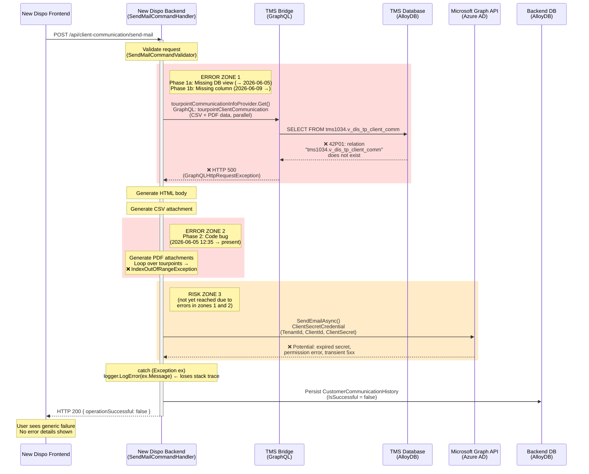

# BUG-124918: Email Can Not Be Sent

## Ticket Info

| Field            | Value                                                            |
| ---------------- | ---------------------------------------------------------------- |
| Ticket Number    | 124918                                                           |
| Type             | Bug                                                              |
| Priority         | 2                                                                |
| Severity         | 2 - High                                                         |
| State            | To Do                                                            |
| Sprint           | Sprint 47                                                        |
| Tags             | RUN                                                              |
| Created          | 2026-05-28                                                       |
| Created By       | Maximilian Kehder                                                |
| Last Updated     | 2026-06-08                                                       |
| Last Updated By  | Matthias Max                                                     |
| System Info      | ABN1034 (Database Identifier: D-10-34)                           |
| Found In         | current build 28/05/2026                                         |
| Parent Work Item | 111427                                                           |
| Environment      | test.dispo.gcp.nagel-group.com (WL4, `prj-cal-w-wl4-t-4c48-53ad`) |

**Current Behavior:** Cannot send mails.

**Expected Behavior:** It is possible to send mails if all prerequisites are met.

**Repro Steps:** Send email from the client communication view.

## Components Involved

| Component         | Repository                         | Role                                                     | GCP Project / Service                                         |
| ----------------- | ---------------------------------- | -------------------------------------------------------- | ------------------------------------------------------------- |
| New Dispo Backend | Code/Disposition-Backend           | Owns `/api/client-communication/send-mail`, orchestrates email assembly and sending via Microsoft Graph API | WL4 `prj-cal-w-wl4-t-4c48-53ad` / `cal-new-disposition-backend-t-t` |
| TMS Bridge        | Code/Disposition-Abstraction-Layer | Provides tourpoint communication data via GraphQL (`tourpointClientCommunication`), called by the Backend before email assembly | WL5 `prj-cal-w-wl5-t-6c00-53ad` / `cal-new-disposition-tmsbridge-t-t` |
| TMS Database      | Code/tms-alloydb-schema            | Source of truth for the `v_dis_tp_client_comm` view queried by the TMS Bridge | WL5 (AlloyDB)                                                  |
| New Dispo Frontend | Code/Disposition-Frontend         | UI that triggers the send-mail request                    | WL4 / `cal-new-disposition-frontend-t-t`                      |

## Architecture of the Email Flow



### Error Zone Summary

| Zone | Location | Error | Active Period | Root Cause |
|------|----------|-------|---------------|------------|
| 1a | TMS Bridge GraphQL call (`SendMailCommandHandler.cs:66-72`) | `The HTTP request failed with status code InternalServerError` | 2026-05-28 → 2026-06-05 ~12:00 | Missing view `tms1034.v_dis_tp_client_comm` (PostgreSQL 42P01) |
| 1b | TMS Bridge GraphQL call (same location) | Same error | 2026-06-09 → present | View exists but missing `trucklicenseplate` column; TMS Bridge (build `20260609.2`+) now requests it via PR 33244 |
| 2 | PDF/attachment generation loop (`SendMailCommandHandler.cs:78-137`) | `Index was outside the bounds of the array.` | 2026-06-05 12:35 → 2026-06-09 | Code bug in data processing — superseded by Zone 1b when TMS Bridge with `TruckLicensePlate` mapping was deployed |
| 3 | Microsoft Graph API call (`EmailApiProvider.cs:66-73`) | Not yet reached | — | Potential future risk: expired Azure AD ClientSecret, permission issues |

**Key files:**

- `CALConsult.Disposition.API/Application/Features/ClientCommunication/ClientCommunicationController.cs` — HTTP endpoint
- `CALConsult.Disposition.API/Application/Features/ClientCommunication/Requests/SendEmail/SendMailCommandHandler.cs` — Orchestration handler
- `CALConsult.Disposition.API/Infrastructure/EmailApi/EmailApiProvider.cs` — Microsoft Graph email sender
- `CALConsult.Disposition.API/Infrastructure/ServiceSetupExtensions/SMTP/GraphServiceSetupExtensions.cs` — Azure AD credential setup
- `CALConsult.Disposition.API/Infrastructure/EmailApi/Dtos/EmailApiSettingsDto.cs` — Configuration DTO

## Log Evidence (GCP Cloud Run, WL4 test)

**100% failure rate:** Every send-mail call in the last 14 days has failed (14/14 attempts). All returned HTTP 200 despite the failure.

### Phase 1: TMS Bridge GraphQL Failure (2026-05-28 → 2026-06-05 ~11:56)

| Timestamp           | Latency | Error Message                                                  |
| ------------------- | ------- | -------------------------------------------------------------- |
| 2026-05-28 10:53:12 | 253ms   | `The HTTP request failed with status code InternalServerError` |
| 2026-05-28 20:37:12 | **41ms**  | same                                                         |
| 2026-05-28 20:37:24 | **44ms**  | same                                                         |
| 2026-06-03 12:23:16 | 248ms   | same                                                           |
| 2026-06-05 11:54:38 | 270ms   | same                                                           |
| 2026-06-05 11:55:52 | **60ms**  | same                                                         |
| 2026-06-05 11:56:44 | **42ms**  | same                                                         |

**Interpretation:** The 40–60ms latencies mean the request fails almost immediately — before the Microsoft Graph API email call is even reached. The error message `"The HTTP request failed with status code InternalServerError"` matches the `GraphQL.Client.Http.GraphQLHttpRequestException` pattern. The handler calls `tourpointCommunicationInfoProvider.Get()` via TMS Bridge GraphQL **before** assembling or sending the email. This TMS Bridge call returns HTTP 500, and the handler catches the exception.

The bug was filed at 20:40 on 2026-05-28, minutes after two failed attempts at 20:37.

### Phase 2: Code Bug — IndexOutOfRangeException (2026-06-05 12:35 → present)

| Timestamp           | Latency    | Error Message                                     |
| ------------------- | ---------- | ------------------------------------------------- |
| 2026-06-05 12:35:37 | 492ms      | `Index was outside the bounds of the array.`      |
| 2026-06-05 12:37:44 | 413ms      | same                                              |
| 2026-06-05 15:09:00 | 646ms      | same                                              |
| 2026-06-05 15:11:30 | 404ms      | same                                              |
| 2026-06-05 15:21:33 | **1125ms** | same                                              |
| 2026-06-05 15:25:29 | 366ms      | same                                              |
| 2026-06-08 10:45:23 | 852ms      | same                                              |

**Interpretation:** Latencies jumped to 400–1125ms, meaning the TMS Bridge GraphQL call now **succeeds** (it takes ~250ms), but the processing crashes afterwards with an `IndexOutOfRangeException`. This error originates in the PDF/attachment generation loop or the Microsoft Graph API call. The TMS Bridge issue resolved itself around 2026-06-05 ~12:30 (possibly a deployment or transient recovery), which unblocked the data fetch step but exposed a second, pre-existing code bug.

## Log Entry Correlation: Confirming Error Attribution

A key question is whether the logged errors actually originate from the components attributed in this analysis, or could be unrelated log entries that happen to appear in the same timeframe.

### Error Zone 1: "The HTTP request failed with status code InternalServerError"

**Confirmed via cross-component trace ID correlation.** The error is produced by `GraphQL.Client.Http.GraphQLHttpClient` (`GraphQLHttpRequestException`) — a library used exclusively for TMS Bridge calls. The Microsoft Graph API uses `Microsoft.Graph.GraphServiceClient` which throws `ServiceException` with a different message format. No overlap in exception types.

The call chain is:
1. `SendMailCommandHandler.cs:66-72` → `TourpointCommunicationInfoProvider.Get()`
2. → `GraphQLQueryService.SendQuery()` (adds Bearer token)
3. → `RetryPolicyExecutor.ExecuteTmsCallWithRetryAsync()` (Polly: 3 attempts, exponential backoff — but only for 502/503/504, **not** 500)
4. → `GraphQLHttpClient.SendQueryAsync()` → TMS Bridge endpoint `/bridge/` with operation `tourpointClientCommunication`
5. → TMS Bridge queries `tms1034.v_dis_tp_client_comm` in AlloyDB

**Trace ID match (Backend WL4 ↔ TMS Bridge WL5):**

| Timestamp        | Backend (WL4)                        | TMS Bridge (WL5)                     | Trace ID                           |
|------------------|--------------------------------------|--------------------------------------|------------------------------------|
| 2026-05-28 20:37:12 | `SendMail` Error: "HTTP request failed with status code InternalServerError" | `TMS Bridge error ocurred`: `42P01: relation "tms1034.v_dis_tp_client_comm" does not exist` | `0662064fbb685929588b74a46328b34d` |
| 2026-05-28 20:37:24 | `SendMail` Error: "HTTP request failed with status code InternalServerError" | `TMS Bridge error ocurred`: `42P01: relation "tms1034.v_dis_tp_client_comm" does not exist` | `475a2a250068ffaff284a2e849fec108` |

Each Backend send-mail call generates two parallel GraphQL requests (CSV + PDF data), producing two TMS Bridge errors per attempt — all four TMS Bridge errors carry the matching trace IDs.

The TMS Bridge returns HTTP 500 (PostgreSQL error code 42P01 "undefined_table"), which is **not retried** by the Polly policy (only 502/503/504 are retried), so the exception propagates directly to the handler's catch block.

### Error Zone 2: "Index was outside the bounds of the array"

**Attributed to the email assembly step by response-time analysis and TMS Bridge log absence.** Since the handler logs only `ex.Message` (no stack trace), direct source attribution is not possible from Backend logs alone. However:

- Phase 1 errors (TMS Bridge failure) have latencies of 40–270ms
- Phase 2 errors have latencies of 366–1125ms — consistent with a successful TMS Bridge roundtrip (~250ms) followed by local processing time
- The TMS Bridge logs confirm: the last `v_dis_tp_client_comm` error is at 2026-06-05 11:56, and **no TMS Bridge errors appear during Phase 2 send-mail calls** — confirming the view was created between 11:56 and 12:35 on 2026-06-05
- The transition from Phase 1 to Phase 2 (no Backend deployment involved) is consistent with the TMS Bridge recovering and the handler reaching the data processing code for the first time

The `SourceContext: EmailApiProvider` on all errors is misleading — the handler injects `ILogger<EmailApiProvider>` instead of `ILogger<SendMailCommandHandler>` (line 27), so all handler-level logs appear under the wrong source context.

### Cross-Component Trace Correlation

GCP Cloud Trace correlates requests across services via W3C trace context propagation. Correlation was performed across GCP projects:

- **Backend errors** queried in WL4 (`prj-cal-w-wl4-t-4c48-53ad`, service `cal-new-disposition-backend-t-t`)
- **TMS Bridge errors** queried in WL5 (`prj-cal-w-wl5-t-6c00-53ad`, service `cal-new-disposition-tmsbridge-t-t`)

All Phase 1 trace IDs match 1:1 between Backend and TMS Bridge, confirming the causal chain: **missing database view → TMS Bridge 500 → Backend catches exception → returns silent failure to Frontend.**

## Root Causes

### 1. Missing Database View `tms1034.v_dis_tp_client_comm` (Original Trigger)

The view `v_dis_tp_client_comm` did not exist in the `tms1034` schema (depot ABN1034) in the TMS Database. When the Backend called `tourpointCommunicationInfoProvider.Get()` (`SendMailCommandHandler.cs:66-72`), the TMS Bridge attempted `SELECT FROM tms1034.v_dis_tp_client_comm` and received PostgreSQL error `42P01: relation does not exist`, causing it to return HTTP 500 to the Backend. This was the error active when the bug was filed on 2026-05-28.

The view was created between 2026-06-05 11:56 (last `v_dis_tp_client_comm` error in TMS Bridge logs) and 12:35 (first Phase 2 error with longer latency, indicating a successful TMS Bridge call).

### 2. IndexOutOfRangeException in Email Assembly (Current Blocker)

Since 2026-06-05 12:35, the TMS Bridge works again but the handler crashes with `"Index was outside the bounds of the array."` during the email assembly step (lines 78–137 of `SendMailCommandHandler.cs`). The most likely location is the PDF generation loop, which iterates `pdfTask.Result` and accesses nested data structures. No stack trace is available due to the logging deficiency described below.

### 3. Completely Inadequate Error Handling and Logging

This is the systemic issue that makes diagnosing the bug unnecessarily difficult:

**Wrong logger type** — `SendMailCommandHandler.cs:27` injects `ILogger<EmailApiProvider>` instead of `ILogger<SendMailCommandHandler>`. All errors logged by the handler appear with `SourceContext: EmailApiProvider`, making it impossible to distinguish handler-level errors from provider-level errors in log queries.

**Stack trace discarded** — `SendMailCommandHandler.cs:145`:
```csharp
_logger?.LogError(ex.Message);  // only logs the message string
```
This loses the stack trace, inner exception, and all structured context. Compare with the provider's logging which correctly passes the exception object:
```csharp
_logger.LogError(ex, "Graph API error occurred while sending email to {Recipient}", mailInfo.To);
```

**Silent failure to caller** — The handler always returns HTTP 200 with `{ operationSuccessful: false }`. No error type, no error message, no distinction between credential failures, data errors, or transient issues. The frontend user sees a generic failure with no guidance.

**Dead configuration** — `EmailApiSettingsDto` defines `RetryCount`, `RetryDelayMilliseconds`, and `TimeoutMilliseconds`, but none of these are wired up in `EmailApiProvider.SendEmailAsync()`. There is zero retry logic despite the config suggesting otherwise.

**No error classification** — All exceptions (auth failures, TMS Bridge errors, data bugs, transient Graph API failures) land in the same `catch (Exception ex)` bucket. As noted in the ticket comment: a Service Desk person cannot tell whether the failure is expired credentials (their responsibility) or a code bug (dev team).

## TMS Database Analysis (2026-06-10)

Live verification against AlloyDB at `10.100.47.236:5432` / database `abn1034` / schema `tms1034`.

### View Status: Exists but Outdated

The view `v_dis_tp_client_comm` now exists in `tms1034` (confirming it was created between 2026-06-05 11:56 and 12:35 as inferred from logs). However, the deployed version is outdated compared to the source code.

| Aspect | Deployed (DB) | Source (repo HEAD) | Gap |
|--------|---------------|-------------------|-----|
| Column count | 87 | 88 | `trucklicenseplate` missing |
| `comment` column name | `comment_` | `comment_` | Aligned |
| View definition version | Post May 26 rename, pre Jun 8 field add | Jun 8 (commit `6999e7d0`) | 1 commit behind |

**Verified:** `SELECT trucklicenseplate FROM tms1034.v_dis_tp_client_comm` returns `ERROR: column "trucklicenseplate" does not exist`. The column was added to the source on 2026-06-08 (Issue 173823) but never deployed.

### TMS Bridge Entity Mapping (PR 33244)

The TMS Bridge `master` branch includes the `TruckLicensePlate` mapping and the `comment_` column name alignment (merged via PR 33244: "Add field to client comm view"):

- `TourpointClientCommunicationEntity.cs:5` — `TruckLicensePlate` property
- `TourpointClientCommunicationEntity.cs:33` — `Comment_` property (matching the DB column `comment_`)
- `TourpointClientCommunicationEntityConfiguration.cs:15-16` — maps `TruckLicensePlate` → `"trucklicenseplate"`
- `TourpointClientCommunicationEntityConfiguration.cs:57-58` — maps `Comment_` → `"comment_"`

The entity expects 88 columns, but the deployed view only has 87. The `trucklicenseplate` column is the gap.

### Deployment Dependency: DB View Must Be Updated First

The Backend on `master` (`SendMailCommandHandler.cs:95`) now references `tourpoint.TruckLicensePlate` in the PDF generation. The `TourpointCommunicationInfoPDFDto` includes `[JsonProperty("truckLicensePlate")]`, and the `TourpointCommunicationInfoProvider` dynamically builds the GraphQL query by extracting field names from the DTO (line 19). This means:

1. Backend PDF query → requests `truckLicensePlate` from TMS Bridge GraphQL
2. TMS Bridge EF Core → includes `trucklicenseplate` in SQL projection
3. PostgreSQL → `ERROR: column "trucklicenseplate" does not exist` (verified via psql)
4. TMS Bridge → returns 500
5. Backend → catches exception, returns silent failure

**Deploying the current `master` of Backend + TMS Bridge to any environment where `v_dis_tp_client_comm` has not been updated will re-introduce the exact Phase 1 failure pattern.** The CSV query (which does NOT request `truckLicensePlate`) would still succeed, but the parallel PDF query would fail, causing the entire email send to fail.

The DB view **must** be updated via `CREATE OR REPLACE VIEW` from the current source (`V_DIS_TP_CLIENT_COMM.sql`) before or alongside the Backend/TMS Bridge deployment.

### Deployed TMS Bridge Version (Test Environment)

The TMS Bridge deployment pipeline `cal-new-dispo-tms-bridge-t-t-cloudrun` (Azure DevOps definition 2003) confirms the test environment is running `master`:

| Field | Value |
|---|---|
| Build Number | `20260610.1` |
| Source Branch | `master` |
| Commit | `e1960ce0f4e8e8e24a42c821449dfa07b3335979` |
| Triggered By | Boyan Valchev |
| Deployed | 2026-06-10 14:23 UTC |

Recent deployment history (all from `master`):

| Build | Date | Triggered By |
|---|---|---|
| `20260610.1` | 2026-06-10 | Boyan Valchev |
| `20260609.2` | 2026-06-09 | Kristiyan Paunov |
| `20260609.1` | 2026-06-09 | Boyan Valchev |
| `20260605.1` | 2026-06-05 | Boyan Valchev |
| `20260603.2` | 2026-06-03 | Boyan Valchev |

This confirms the test environment (WL5 `prj-cal-w-wl5-t-6c00-53ad`) is already running the TMS Bridge version that includes the `TruckLicensePlate` entity mapping (PR 33244). The deployment dependency described above is therefore **already active** — the deployed TMS Bridge expects `trucklicenseplate` from the view, but the column does not exist in the deployed `tms1034.v_dis_tp_client_comm`.

**Log proof — Phase 1 failure re-occurred on 2026-06-10:**

A send-mail test at 14:17:46 UTC (against TMS Bridge build `20260609.2`, 6 minutes before the `20260610.1` deployment) reproduced the exact Phase 1 pattern:

| Timestamp | Component | Result | Latency | Trace ID |
|---|---|---|---|---|
| 2026-06-10 14:17:46 | Backend `SendMailCommand` | Started — client "BARTH FEINKOST GMBH" | — | `19f2a301d3f6503b` |
| 2026-06-10 14:17:46 | TMS Bridge (CSV query) | **200 OK** | 405ms | same |
| 2026-06-10 14:17:46 | TMS Bridge (PDF query) | **500** | 28ms | same |
| 2026-06-10 14:17:46 | Backend error log | `The HTTP request failed with status code InternalServerError` | — | same |
| 2026-06-10 14:17:46 | Backend `SendMailCommand` | Ended — 614ms total | 614ms | same |

The CSV query succeeded (it does not request `truckLicensePlate`), while the PDF query failed instantly (28ms) — the same pattern as the original Phase 1, but now caused by the missing `trucklicenseplate` **column** rather than a missing view. This means the original Phase 1 failure was resolved (view created ~2026-06-05 12:00) but immediately replaced by a variant: the view exists but lacks the column that the deployed TMS Bridge now expects.

### Orphaned Views from Renames

The database contains 26 `v_dis_*` views but the source repo only has 19 definition files. The April 24 rename (commit `38d0766d`, Issue 173276) created new views without dropping the old ones:

| Old Name (DB orphan) | New Name (source + DB) |
|---|---|
| `v_dis_freight_exchange_tourpoints` | `v_dis_freight_exchange_tp` |
| `v_dis_to_tourpoint_target_dates` | `v_dis_to_tp_target_dates` |
| `v_dis_transportorder_count` | `v_dis_to_count` |
| `v_dis_transportorder_features` | `v_dis_to_features` |
| `v_dis_transportorder_filter` | `v_dis_to_filter` |
| `v_dis_transportorder_pickupplanning` | `v_dis_to_pickupplanning` |
| `v_dis_transportorder_vehicleprops` | No source equivalent |

These orphaned views are harmless but indicate that the deployment process has no mechanism for cleaning up renamed objects.

### Deployment Architecture: Root of All View Issues

Views are only created during initial schema creation via the GitHub Actions workflow `manual_db_schema_create.yml`. The flow is:

1. `tms-db-execute-scripts.sh` runs `all_create_views.sql` (line 216)
2. `all_create_views.sql` includes 606 view files via `\i` statements
3. Each file contains `CREATE OR REPLACE VIEW`

**There is no mechanism to update views in existing schemas.** Once a schema is created, it never receives view updates unless someone manually runs the SQL. This explains why:
- `tms1034` was missing `v_dis_tp_client_comm` entirely (schema created before Oct 2025 when the view was first added)
- The deployed view is behind by one commit (someone ran the SQL manually around Jun 5, but used a version from before the Jun 8 field addition)
- Old renamed views linger (no `DROP VIEW` for old names)

### Git History: `v_dis_tp_client_comm` Timeline

| Date | Commit | Author | Change |
|------|--------|--------|--------|
| 2025-10-17 | `d20d0f2c` | mohamadaomar | Created as `V_DIS_TOURPOINT_CLIENT_COMMUNICATION` |
| 2026-04-04 | `835ab3d0` | Sonja Petkovic | Removed hardcoded `tms1034` schema reference |
| 2026-04-24 | `38d0766d` | Sonja Petkovic | Renamed to `V_DIS_TP_CLIENT_COMM` (Issue 173276) |
| 2026-05-21 | `d3dd057f` | Boyan Valchev | Fixed view definition (Issue 172858) |
| 2026-05-26 | `41881163` | Sonja Petkovic | Renamed `comment` → `comment_` to match Oracle (Issue 173645) |
| 2026-06-08 | `6999e7d0` | Sonja Petkovic | Added `trucklicenseplate` field (Issue 173823) |

### Live Data Sample

```
   shipmentid   | pickuptourpointid |     primarytourinfo      | comment_
----------------+-------------------+--------------------------+----------
 10340434968455 |    10340434967777 |                          |
 10340434968458 |    10340434968459 |                          |
 10340434887175 |    10340434887176 | NAGEL-GROUP LOGISTICS SE |
```

The view returns data. Most `primarytourinfo` values are empty (contractor + license plate concat), and `comment_` is null across sampled rows.

### Summary of Issues Found

| # | Issue | Severity | Component | Status |
|---|-------|----------|-----------|--------|
| 1 | `trucklicenseplate` column missing from deployed view | **Critical** | TMS Database | OPEN — DB view must be updated before deploying current master |
| 2 | `comment_` column mapping + `TruckLicensePlate` entity property | High | TMS Bridge | Done (PR 33244) — code ready, blocked on DB view update |
| 3 | Deployment dependency: TMS Bridge `master` (build `20260610.1`) already deployed to test, expects `trucklicenseplate` from DB view | **Critical** | Cross-component | OPEN — actively failing; DB view update required |
| 4 | No view update mechanism for existing schemas | High | TMS Database / DevOps | OPEN — systemic issue |
| 5 | 7 orphaned views from rename without drop | Low | TMS Database | OPEN — cosmetic |

## Recommendations

### Immediate (Fix the Current Blocker)

1. **Reproduce the `IndexOutOfRangeException` locally** with the same tourpoint data (client "ANTONIO VIANI IMPORTE GMBH", database identifier D-10-34, tourpoint 10340435089214) to get a stack trace and pinpoint the array access error.

### Short-Term (Fix Logging — Matches Ticket Comment)

2. **Fix the handler's error logging** — change `SendMailCommandHandler.cs:145` from:
   ```csharp
   _logger?.LogError(ex.Message);
   ```
   to:
   ```csharp
   _logger?.LogError(ex, "SendMail failed for client {ClientName} on branch {Branch}",
       command.RequestBody.ClientName, command.DatabaseIdentifier);
   ```

3. **Fix the logger type** — change `SendMailCommandHandler.cs:27` from `ILogger<EmailApiProvider>` to `ILogger<SendMailCommandHandler>`.

4. **Classify errors** in the handler's catch block to enable Service Desk self-service:
   - `Azure.Identity.AuthenticationFailedException` → "Email credentials expired — rotate ClientSecret in EmailSettings"
   - `Microsoft.Graph.ServiceException` → "Microsoft Graph API error" + status code
   - `GraphQL.Client.Http.GraphQLHttpRequestException` → "TMS Bridge unavailable"
   - `IndexOutOfRangeException` / other → "Internal error — contact dev team"

### Short-Term (TMS Database — From Database Analysis)

5. **Re-deploy the view definition** — run the current `V_DIS_TP_CLIENT_COMM.sql` against `tms1034` (and any other schema that was created before October 2025) to add the `trucklicenseplate` column. The SQL uses `CREATE OR REPLACE VIEW`, so it's non-destructive. **This is a deployment prerequisite** — the current Backend and TMS Bridge `master` will fail on any database where this view is outdated.

### Medium-Term (Robustness)

6. **Wire up retry logic** using the existing `RetryCount`/`RetryDelayMilliseconds` config values with Polly (already a project dependency).
7. **Return structured error info** to the frontend so the user gets actionable feedback instead of a generic failure.
8. **Add a health check** for the Microsoft Graph credential (validate token acquisition at startup or periodically) to detect expired secrets before users hit them.
9. **Implement a view refresh pipeline** — the current deployment architecture has no mechanism to update views in existing schemas. Consider a GitHub Actions workflow that runs `all_create_views.sql` against all active schemas, or adopt a migration tool (Flyway/Liquibase) for incremental schema changes.
10. **Drop orphaned views** — remove the 7 renamed views that linger in the database without source definitions, after confirming no downstream dependencies.

---

<div align="center">
  <sub>Created and maintained by <strong>Virtual Architect</strong></sub>
</div>
