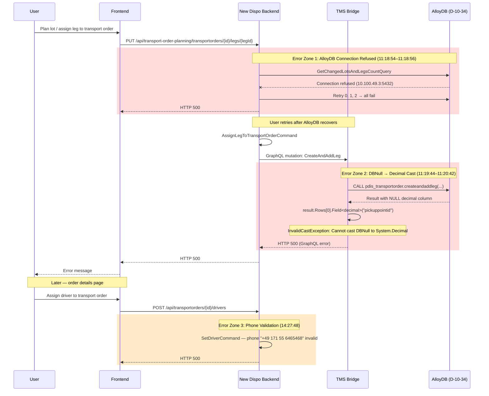

# BUG-125349: Traffic mode 3: Transport Order can not be created

## Ticket Info

| Field | Value |
|-------|-------|
| **ID** | 125349 |
| **Type** | Bug |
| **Severity** | 1 - Critical |
| **Priority** | 2 |
| **State** | To Do |
| **Sprint** | Sprint 46 |
| **Environment** | ABN (1034ABN) / Database `D-10-34` |
| **Created** | 2026-06-16 11:12 UTC |
| **Reporter** | Patrick Uschmann |
| **Last Changed By** | Matthias Max |
| **Repro Steps** | Create shipments with "Ohne Vorlauf" (VK3), plan the lot, if error → plan individual shipments |
| **Failing Shipments** | 6764478 (lot 6223), 6764502 (lot 6233) |
| **Working Shipments** | 6764481, 6764480 (lot 6223); 6764503, 6764501, 6764500 (lot 6233) |

## Components Involved

| Component | Repository | Role | GCP Project / Service |
|-----------|-----------|------|----------------------|
| New Dispo Backend | `Disposition-Backend` | API layer, orchestrates transport order creation | `prj-cal-w-wl4-t-4c48-53ad` / `cal-new-disposition-backend-t-t` (rev 00225-jwg) |
| TMS Bridge | `Disposition-Abstraction-Layer` | GraphQL gateway to stored procedures | `prj-cal-w-wl5-t-6c00-53ad` / `cal-new-disposition-tmsbridge-t-t` |
| AlloyDB | `tms-alloydb-schema` | Database (`pdis_transportorder.createandaddleg`) | `prj-cal-w-wl5-t-6c00-53ad` / `10.100.49.3:5432` |

## Architecture of the Transport Order Creation Flow (VK3)



### Error Zone Summary

| Zone | Location | Error | Time Window | Root Cause |
|------|----------|-------|-------------|------------|
| 1 | Backend → AlloyDB | `Failed to connect to 10.100.49.3:5432` | 11:18:54–11:18:56 | Transient AlloyDB connectivity loss (~2s) |
| 2 | TMS Bridge `CreateAndAddLegMutation:46` | `InvalidCastException: Cannot cast DBNull to System.Decimal` | 11:19:44–11:20:42 | **Deployed code used `Field<decimal>()` on nullable stored procedure output** |
| 3 | Backend `SetDriverCommandHandler:31` | `Phone number +49 171 55 6465468 is not valid` | 14:27:48 | Driver master data phone format (separate issue) |

### Key Files

- **Deployed (buggy) code:** `CreateAndAddLegMutation.cs` at commit `e212ccc` — used `result.Rows[0].Field<decimal>("pickuppointid")`
- **Fix commit 1:** `9c84a3f` (Ivaylo, June 15) — replaced `Field<decimal>()` with custom `GetInt64()` extension
- **Fix commit 2:** `a099979` (Ivaylo, June 16) — added `?? 0` null coalescing for all output fields
- Backend handler: `AssignLegToTransportOrderCommand` → calls TMS Bridge GraphQL `CreateAndAddLeg` mutation
- Stored procedure: `pdis_transportorder.createandaddleg`

## Log Evidence (GCP Cloud Run, ABN)

Investigated 2026-06-16 across both `prj-cal-w-wl4-t-4c48-53ad` (Backend) and `prj-cal-w-wl5-t-6c00-53ad` (TMS Bridge). Found 3 distinct error clusters — 2 caused HTTP 500s on the transport order flow, 1 on an unrelated driver assignment.

### Phase 1: AlloyDB Connection Refused (11:18:54–11:18:56 UTC)

| Timestamp (UTC) | Latency | Endpoint | Error |
|-----------------|---------|----------|-------|
| 11:18:54.394 | 520ms | `POST .../lots-and-legs/changes-count` | `RetryLimitExceededException` → `SocketException (111): Connection refused` |
| 11:18:55.444 | 520ms | `POST .../transportorders/from-leg` | `RetryLimitExceededException` → `SocketException (111): Connection refused` |
| 11:18:55.759 | 520ms | `POST .../lots-and-legs/changes-count` | `RetryLimitExceededException` → `SocketException (111): Connection refused` |

The Backend's `PostgresRetryExecutionStrategy` exhausted all 2 retries within ~500ms. AlloyDB at `10.100.49.3:5432` was unreachable for ~2 seconds. Concurrent requests to other queries (`GetChangedTransportOrdersCountQuery`) succeeded at 11:18:55 (HTTP 200), confirming the outage was brief and possibly connection-pool specific.

### Phase 2: TMS Bridge CreateAndAddLeg DBNull Cast (11:19:44–11:20:42 UTC)

| Timestamp (UTC) | Backend Latency | Trace ID | Leg ID |
|-----------------|----------------|----------|--------|
| 11:19:44.769 | 386ms | `6727ebf26a48ceaa08466d726edfd6a9` | `35621f45-5d1e-4686-83ed-d7f78612c8b9` |
| 11:19:56.194 | 302ms | `8be74b44c0743f2b827af4b5afbb9c79` | `5e3fc515-521f-4371-b817-97807e4e9424` |
| 11:20:42.295 | 350ms | `2128eaf1b9189c87edaf1b0353632d84` | `6d8c9051-ac4a-4af0-ab9f-80d7cc0df0b6` |

All 3 attempts targeted transport order `10340435515181` via `AssignLegToTransportOrderCommand` with lot assignment `7f14a88e-044e-4f3d-b12c-ca8377a63dec`. All failed with the same exception in the TMS Bridge.

### Phase 3: Phone Number Validation (14:27:48 UTC)

| Timestamp (UTC) | Latency | Transport Order | Error |
|-----------------|---------|----------------|-------|
| 14:27:48.608 | 4ms | `10340435518182` | `Phone number +49 171 55 6465468 is not valid` |
| 14:27:38.394 | 11ms | `10340435518182` | Same — retry by user |

Separate issue. Driver "Maximilian Beisheim" has phone `491715564654` in the request body, but the `SetDriverCommandHandler` formats/validates it as `+49 171 55 6465468` and rejects it. Very fast failures (4-11ms) confirm this is a validation-layer rejection, not a downstream error.

## Log Entry Correlation: Confirming Error Attribution

### Cross-Component Trace ID Match (Error Zone 2)

| Trace ID | Backend Log | TMS Bridge Log |
|----------|-------------|---------------|
| `6727ebf26a48ceaa08466d726edfd6a9` | 11:19:45.155 `GraphQLHttpRequestException: InternalServerError` (span `6d3d30ccd9a9f0b1`) | 11:19:45.151 `InvalidCastException: Cannot cast DBNull to Decimal` (span `3011809c7310cea4`) |
| `8be74b44c0743f2b827af4b5afbb9c79` | 11:19:56.497 `GraphQLHttpRequestException: InternalServerError` (span `259be471ed3f064f`) | 11:19:56.492 `InvalidCastException: Cannot cast DBNull to Decimal` (span `3627e6aa6910844d`) |
| `2128eaf1b9189c87edaf1b0353632d84` | 11:20:42.645 `GraphQLHttpRequestException: InternalServerError` (span `014d4556839556d2`) | 11:20:42.640 `InvalidCastException: Cannot cast DBNull to Decimal` (span `6b67d24dafe50c30`) |

All 3 trace IDs match exactly across components. The TMS Bridge log timestamps precede the Backend logs by 4-6ms (the time for the HTTP 500 response to propagate back). The Backend exception type (`GraphQL.Client.Http.GraphQLHttpRequestException`) confirms the Backend is the HTTP client calling the TMS Bridge — it wraps the 500 response, it does not produce the original error.

### Exception Type Provenance

- `System.Data.DataRowExtensions.UnboxT`1.NonNullableField` → standard .NET `DataRow.Field<T>()` — used when `T` is non-nullable and the cell value is `DBNull`. This is from the TMS Bridge code at `CreateAndAddLegMutation.cs:46`.
- `GraphQL.Client.Http.GraphQLHttpRequestException` → the `GraphQL.Client` NuGet package used by the Backend to call the TMS Bridge. This is a wrapper, not the original error.
- `Microsoft.EntityFrameworkCore.Storage.RetryLimitExceededException` → EF Core retry policy in the Backend. Inner exception `Npgsql.NpgsqlException` → `System.Net.Sockets.SocketException (111)` confirms a TCP-level connection refusal to AlloyDB.

## Root Causes

### 1. TMS Bridge: Non-nullable decimal read on stored procedure output (FIXED)

**Deployed code** (commit `e212ccc`, deployed June 15 15:23 UTC via build 194619):

```csharp
// CreateAndAddLegMutation.cs — DEPLOYED AT TIME OF BUG
PickupPointId = Convert.ToInt64(result.Rows[0].Field<decimal>("pickuppointid")),
DeliveryPointId = Convert.ToInt64(result.Rows[0].Field<decimal>("deliverypointid")),
LegId = Convert.ToInt64(result.Rows[0].Field<decimal>("legid")),
```

`DataRow.Field<decimal>()` throws `InvalidCastException` when the cell is `DBNull` because `decimal` is a non-nullable value type. The stored procedure `pdis_transportorder.createandaddleg` returns NULL for one or more of these decimal output parameters when called with VK3 ("Ohne Vorlauf") shipments.

**Fix** (commits `9c84a3f` + `a099979`, deployed June 16 12:42 UTC via build 194689):

```csharp
// CreateAndAddLegMutation.cs — CURRENT (FIXED)
PickupPointId = row.GetInt64("pickuppointid") ?? 0,
DeliveryPointId = row.GetInt64("deliverypointid") ?? 0,
LegId = row.GetInt64("legid") ?? 0,
```

The custom `GetInt64()` extension uses `DbTypeConverter.ToNullable<long>()` which properly handles `DBNull` → `null`, and the `?? 0` provides a default.

### 2. Transient AlloyDB connectivity loss (RESOLVED ITSELF)

AlloyDB at `10.100.49.3:5432` refused TCP connections for ~2 seconds around 11:18:54 UTC. The `PostgresRetryExecutionStrategy` with 2 retries was insufficient for this window. This error is independent of the VK3 bug — it affected polling queries too (`GetChangedLotsAndLegsCountQuery`).

### 3. Phone number validation failure (SEPARATE BUG)

`SetDriverCommandHandler.cs:31` rejects phone number `+49 171 55 6465468` (formatted from raw `491715564654`). This affects transport order `10340435518182` and is unrelated to VK3 / traffic mode 3.

## Why It's Not Reproducible Now

**The fix was deployed on the same day as the bug report.** Pipeline history:

| Build | Time (UTC) | Source Commit | Contains Fix? |
|-------|-----------|---------------|---------------|
| 194619 | June 15, 15:23 | `e212ccc` (PR 33344) | No — uses `Field<decimal>()` |
| 194689 | June 16, 12:42 | `d4146e29` (PR 33373, includes PR 33345) | **Yes** — includes `9c84a3f` + `a099979` |
| 194728 | June 16, 15:02 | `d4146e29` (same) | Yes — redeployment |

The bug occurred at 11:18 UTC. Boyan deployed the fix at 12:42 UTC (~1.5 hours later). The fix was part of PR 33345 ("Handle bool parameters in oracle procedures") by Ivaylo Petrov, which also addressed nullable response fields.

## Remaining Risk

The fix defaults NULL output parameters to `0` (`?? 0`). If the stored procedure `pdis_transportorder.createandaddleg` returns NULL because VK3 shipments genuinely lack a pickup/delivery point, then `PickupPointId = 0` may cause incorrect behavior downstream (silent data corruption instead of a crash). The stored procedure should be checked to confirm whether NULL outputs are valid for VK3 or indicate a procedure-level bug.

## Recommendations

### Immediate
- **Close ticket as fixed** — the root cause (Error Zone 2) was deployed as part of PR 33345 on June 16 12:42 UTC. Recommend verifying with the original VK3 shipments to confirm end-to-end success.
- **File separate ticket** for the phone number validation issue (Error Zone 3, transport order `10340435518182`).

### Short-Term
- **Audit stored procedure** `pdis_transportorder.createandaddleg` — determine whether NULL outputs for VK3 are intentional or a procedure bug. If intentional, document the semantics of `PickupPointId = 0`. If not, fix the procedure to always return valid IDs.
- **Review other TMS Bridge mutations** for similar `Field<T>()` usage — the fix replaced several mutations but others may remain.

### Medium-Term
- **AlloyDB connection resilience** — the 2-retry policy with ~500ms total budget is tight. Consider increasing retries or adding jitter for transient network issues.
- **Structured error logging in TMS Bridge** — the current `"TMS Bridge error ocurred"` log message lacks input context (which shipment, which transport order). Adding the `CreateAndAddLegInput` parameters to the error log would accelerate future diagnosis.

---

<div align="center">
  <sub>Created and maintained by <strong>Virtual Architect</strong></sub>
</div>
