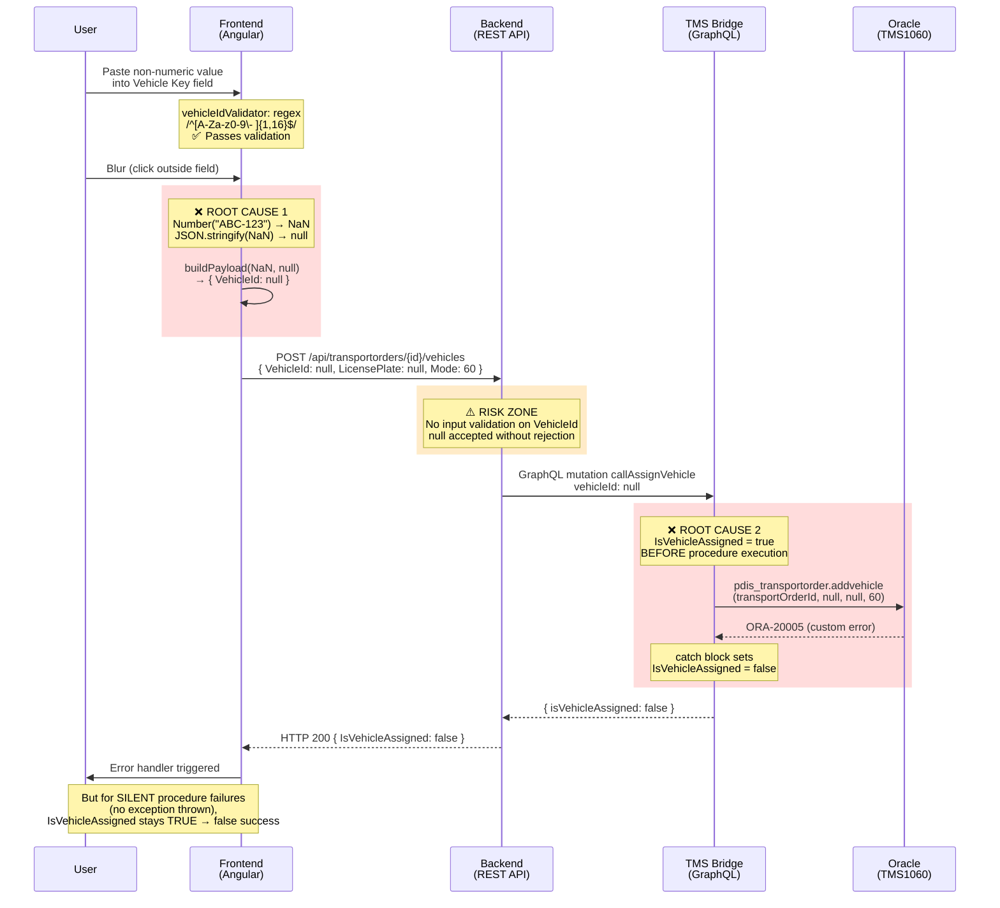

# BUG-125379: Vehicle not persisted in the DB and not displayed on the FE after refreshing the page

## Ticket Info

| Field | Value |
|-------|-------|
| **ID** | 125379 |
| **Type** | Bug |
| **State** | To Do |
| **Priority** | 2 |
| **Severity** | 3 - Medium |
| **Sprint** | Sprint 48 |
| **Created** | 2026-06-17T12:19:54 |
| **Created By** | Vesela Todorova |
| **Assigned To** | Kaloyan Karaivanov |
| **Last Changed By** | Maximilian Kehder |
| **Environment** | ABN 1060 |
| **Parent** | 125358 (QA Testing ABN1060 - Findings) |

**Repro Steps**: Open a TO without a vehicle, fill in the Vehicle Key field with a non-numeric value (pasting to bypass validation), blur the field. The response indicates success, but on page refresh the vehicle is gone.

**Key Observation from Ticket**: Not reproducible with numeric key-value pairs (e.g., vehicleid = 340). Pasting was used to bypass the frontend input validation.

## Components Involved

| Component | Repository | Role | GCP Project / Service |
|-----------|-----------|------|----------------------|
| New Dispo Frontend | `Code/Disposition-Frontend` | Vehicle assignment UI, input validation, NaN conversion | `prj-cal-w-wl4-t-4c48-53ad` / `cal-new-disposition-frontend-t-t` |
| New Dispo Backend | `Code/Disposition-Backend` | REST API, CQRS orchestration, GraphQL relay | `prj-cal-w-wl4-t-4c48-53ad` / `cal-new-disposition-backend-t-t` |
| TMS Bridge | `Code/Disposition-Abstraction-Layer` | GraphQL → Oracle procedure execution | `prj-cal-w-wl5-t-6c00-53ad` / `cal-new-disposition-tmsbridge-t-t` |
| TMS Database | Oracle `TMS1060` | `pdis_transportorder.addvehicle` procedure | Oracle on-prem (ABN 1060) |

## Architecture of the Vehicle Assignment Flow



### Error Zone Summary

| Zone | Location | Error | Active Period | Root Cause |
|------|----------|-------|---------------|------------|
| **Data Loss** | Frontend `assignTruckHandler.ts:58` | `Number()` converts non-numeric input to NaN → null | Ongoing | Regex validator allows non-numeric but handler assumes numeric |
| **Optimistic Default** | TMS Bridge `AssignVehicleMutation.cs:34` | `IsVehicleAssigned = true` hardcoded before procedure call | Ongoing | Silent procedure failures report success |
| **Missing Validation** | Backend `AssignVehicleRequestDto.cs:5` | `VehicleId` accepts null without rejection | Ongoing | No server-side validation layer |

### Key Files

- `Code/Disposition-Frontend/.../vehicle-validators/vehicle-validators.ts` — vehicleIdValidator regex
- `Code/Disposition-Frontend/.../assignHandlers/assignTruckHandler.ts:58` — `Number(valueToAssign)` conversion
- `Code/Disposition-Frontend/libs/nagel-types/src/lib/asssign-vehicle-types.ts` — response type definition
- `Code/Disposition-Backend/.../AssignVehicle/Dtos/AssignVehicleRequestDto.cs` — request DTO (no validation)
- `Code/Disposition-Backend/.../AssignVehicle/AssignVehicleCommandHandler.cs:26` — trusts `IsVehicleAssigned` flag
- `Code/Disposition-Backend/.../AssignVehicle/SubHandlers/AssignVehicleMutationSubHandler.cs` — GraphQL relay
- `Code/Disposition-Backend/.../GetUpdatedVehicleFieldsSubHandler.cs` — secondary query for vehicle data
- `Code/Disposition-Abstraction-Layer/.../AssignVehicleMutation.cs:34` — optimistic `IsVehicleAssigned = true`

## Log Evidence (GCP Cloud Run, ABN 1060)

All 12 POST requests to `/api/transportorders/10600644560588/vehicles` returned **HTTP 200** — including the 4 that had Oracle errors downstream. The Backend never returns an error HTTP status for vehicle assignment failures.

### Phase 1: Valid Numeric IDs (11:43–11:44, no errors)

| Timestamp | VehicleId | Latency | TMS Bridge Error |
|-----------|-----------|---------|-----------------|
| 11:43:41 | `"123"` | 67ms | None |
| 11:44:47 | `"1210"` | 73ms | None |
| 11:44:56 | `"134"` | 66ms | None |

These requests sent valid numeric vehicle IDs. No TMS Bridge errors logged. Relatively short latencies suggest either the procedure succeeded quickly or the vehicle didn't exist and the procedure returned without assigning.

### Phase 2: Non-Numeric Input → null VehicleId (11:47–11:49, ORA-20005)

| Timestamp | VehicleId | Latency | TMS Bridge Error | Trace ID |
|-----------|-----------|---------|-----------------|----------|
| 11:47:16 | `null` | 60ms | ORA-20005 | `42e00640ef3b5013654ef5aa0ca77400` |
| 11:47:31 | `null` | 74ms | ORA-20005 | `1ef441c1b6510dadd4be83eae2a6b082` |
| 11:48:24 | `null` | 69ms | ORA-20005 | `f57af4f1e6ba5123ccb70d4b1f1fa4f5` |
| 11:49:03 | `null` | 62ms | ORA-20005 | `17cd3ec271b19ad5db9919162e0c6c33` |

The tester entered non-numeric values (bypassing validation via paste). The frontend's `Number()` conversion turned them into `NaN`, which serialized as `null` in JSON. The Oracle procedure `pdis_transportorder.addvehicle` rejected the null vehicleid with `ORA-20005`.

All 4 TMS Bridge error logs confirm `System.InvalidOperationException` wrapping the Oracle error:
```
ORA-20005:
ORA-06512: at "TMS1060.PTA", line 1255
ORA-06512: at "TMS1060.PTA", line 5498
ORA-06512: at "TMS1060.PDIS_TRANSPORTORDER", line 425
```

### Phase 3: Confirmed Working with Numeric IDs (12:08–14:00)

| Timestamp | VehicleId | Latency | TMS Bridge Error |
|-----------|-----------|---------|-----------------|
| 12:08:19 | `"1210"` | 147ms | None |
| 12:10:54 | `"1210"` | 139ms | None |
| 14:00:54 | `"340"` | 105ms | None |

These requests used valid numeric vehicle IDs. The ~2x latency increase (105–147ms vs 60–74ms) corresponds to the Backend's second GraphQL call (`GetUpdatedVehicleFields`) that only executes when `IsVehicleAssigned = true`. This confirms these assignments succeeded.

## Log Entry Correlation: Confirming Error Attribution

### Cross-Component Trace Match (Backend ↔ TMS Bridge)

All 4 ORA-20005 errors correlate 1:1 between Backend and TMS Bridge via W3C trace IDs:

| Backend PROPS Timestamp | Backend Trace | TMS Bridge Error Timestamp | TMS Bridge Trace | VehicleId |
|------------------------|---------------|---------------------------|-----------------|-----------|
| 11:47:16.078 | `42e00640...` | 11:47:16.133 | `42e00640...` | null |
| 11:47:31.791 | `1ef441c1...` | 11:47:31.861 | `1ef441c1...` | null |
| 11:48:24.602 | `f57af4f1...` | 11:48:24.669 | `f57af4f1...` | null |
| 11:49:03.213 | `17cd3ec2...` | 11:49:03.272 | `17cd3ec2...` | null |

The 55–70ms delta between Backend PROPS and TMS Bridge error timestamps represents the GraphQL round-trip.

### Exception Provenance

The `System.InvalidOperationException` wrapping `ORA-20005` originates from the Oracle data provider (not application code). The call chain `TMS1060.PTA → TMS1060.PDIS_TRANSPORTORDER.addvehicle` is the Oracle stored procedure. The TMS Bridge's `ExecuteRoutineAsync` surfaces this as a .NET exception, caught in `AssignVehicleMutation.cs:47-52`.

### Latency as Signal

| Scenario | Backend Latency | Second GraphQL Call? |
|----------|----------------|---------------------|
| null VehicleId (ORA-20005) | 57–74ms | No (`IsVehicleAssigned = false`) |
| Valid numeric ID (success) | 105–147ms | Yes (`GetUpdatedVehicleFields`) |

The ~2x latency difference confirms the Backend's conditional logic at `AssignVehicleCommandHandler.cs:26`: when `IsVehicleAssigned` is false, the second query is skipped.

## Root Causes

### 1. Frontend: `Number()` Silently Destroys Non-Numeric Input

**File**: `Code/Disposition-Frontend/.../assignHandlers/assignTruckHandler.ts:58`

```typescript
payload: this.buildPayload(Number(valueToAssign), null),
```

When the user enters a non-numeric string (e.g., `"ABC-123"`, `"12 34"`, `"FZ-1210"`), `Number()` returns `NaN`. JavaScript's `JSON.stringify(NaN)` produces `null`. The user's actual input is permanently lost — the Backend never sees what was typed, only `null`.

The `vehicleIdValidator` at `vehicle-validators.ts:32` uses regex `/^[A-Za-z0-9\- ]{1,16}$/` which intentionally allows letters, hyphens, and spaces. This creates a mismatch: the validator accepts values that the handler silently discards.

### 2. TMS Bridge: Optimistic `IsVehicleAssigned` Default

**File**: `Code/Disposition-Abstraction-Layer/.../AssignVehicleMutation.cs:31-35`

```csharp
var response = new AssignVehicleResponse
{
    TransportOrderId = input.TransportOrderId,
    IsVehicleAssigned = true  // ← Set BEFORE procedure execution
};
```

The response defaults to success. Only if the procedure throws an exception does the catch block flip it to false (line 51). For the observed ORA-20005 errors, this works correctly. However, any procedure execution path that completes without throwing — but also without persisting — would falsely report success.

The procedure's return value (`DataTable` from `ExecuteRoutineAsync`) is not captured or inspected (line 46). There is no output parameter check.

### 3. Backend: No Input Validation

**File**: `Code/Disposition-Backend/.../AssignVehicle/Dtos/AssignVehicleRequestDto.cs`

```csharp
public record AssignVehicleRequestDto
{
    public required string? VehicleId { get; init; }  // ← Accepts null, no format check
    public required string? LicensePlate { get; init; }
    public required int Mode { get; init; }
}
```

The Backend accepts `VehicleId: null` with both `VehicleId` and `LicensePlate` being null simultaneously — a request that can never result in a valid assignment. No FluentValidation or data annotations reject this.

### 4. Frontend: Validator Regex Does Not Match Assignment Logic

**File**: `Code/Disposition-Frontend/.../vehicle-validators/vehicle-validators.ts:32`

```typescript
const regex = /^[A-Za-z0-9\- ]{1,16}$/;
```

The Vehicle Key field accepts any alphanumeric string up to 16 characters (including letters, hyphens, spaces). But the `assignByIdHandler` at line 58 assumes the value is numeric. The validator and the handler have incompatible assumptions about what constitutes a valid vehicle key.

## Recommendations

### Immediate

1. **Frontend: Guard against NaN before sending request** (`assignTruckHandler.ts:58`)
   - After `Number(valueToAssign)`, check for `isNaN()` before building the payload
   - Show an inline validation error: "Vehicle key must be numeric"
   - Alternatively, reject non-numeric input at the validator level if "old keys" are not a current requirement

### Short-Term

2. **Backend: Add input validation** (`AssignVehicleRequestDto.cs`)
   - Reject requests where both VehicleId and LicensePlate are null/empty
   - If VehicleId is provided, validate it's a parseable number (or matches the expected key format)
   - Return HTTP 400 with a clear error message

3. **TMS Bridge: Fix optimistic default** (`AssignVehicleMutation.cs:31-35`)
   - Initialize `IsVehicleAssigned = false` (pessimistic default)
   - Set to `true` only after confirming procedure success
   - Alternatively: capture and inspect the `DataTable` returned by `ExecuteRoutineAsync` for success indicators

### Medium-Term

4. **Frontend: Clarify "old key" support**
   - The ticket's expected behavior mentions: "If it is an old key, this should be allowed"
   - If old alphanumeric keys are a valid use case, the `assignByIdHandler` should NOT use `Number()` — send the raw string and let the Backend/TMS Bridge handle it
   - If old keys are NOT supported, restrict the validator regex to `/^[0-9]{1,16}$/` (numeric only)

5. **Harmonize naming**: The frontend type file has a typo: `asssign-vehicle-types.ts` (three s's)

---

<div align="center">
  <sub>Created and maintained by <strong>Virtual Architect</strong></sub>
</div>
