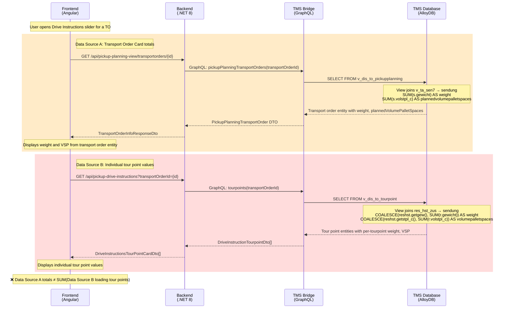

# BUG-125383: Total VSP and Weight values are not updated in the Drive instructions slider

## TL;DR

The "total" VSP and Weight displayed in the Drive instructions slider's transport order card do not match the sum of loading tour point values. This is not a staleness or refresh bug — it is an **architectural data source mismatch**. The totals are read from the transport order entity (via `v_dis_to_pickupplanning` view, which aggregates shipments through `v_ta_sen7`), while individual tour point values are computed by a completely different view (`v_dis_to_tourpoint`, which aggregates through `res_hst_zus` with stored-value overrides). These two aggregation paths can produce different numbers for the same transport order. The fix is to compute the displayed totals by summing loading-type tour point values on the Frontend or Backend, rather than reading transport order entity values.

## Ticket Info

| Field | Value |
|-------|-------|
| **ID** | 125383 |
| **Title** | Total VSP and Weight values are not updated in the Drive instructions slider |
| **Type** | Bug |
| **State** | To Do |
| **Priority** | 2 |
| **Severity** | 2 - High |
| **Environment** | ABN 1060 |
| **Reporter** | Vesela Todorova |
| **Created** | 2026-06-17T14:24:25Z |
| **Sprint** | Sprint 48 |
| **Tags** | June2026 |
| **Parent** | 125358 — QA Testing ABN1060 - Findings |

## Components Involved

| Component | Repository | Role | GCP Project / Service |
|-----------|-----------|------|----------------------|
| New Dispo Frontend | Disposition-Frontend | Displays totals in transport order card within Drive instructions slider | `prj-cal-w-wl4-t-4c48-53ad` / `cal-new-disposition-frontend-t-t` |
| New Dispo Backend | Disposition-Backend | Serves drive instructions endpoint and single transport order endpoint | `prj-cal-w-wl4-t-4c48-53ad` / `cal-new-disposition-backend-t-t` |
| TMS Bridge | Disposition-Abstraction-Layer | Exposes `pickupPlanningTransportOrders` and `tourpoints` GraphQL queries | `prj-cal-w-wl5-t-*` / `cal-new-disposition-tmsbridge-t-t` |
| TMS Database | tms-alloydb-schema | Views `v_dis_to_pickupplanning` and `v_dis_to_tourpoint` compute values from different sources | AlloyDB |

## Architecture of the Drive Instructions Data Flow



### Error Zone Summary

| Zone | Location | Issue | Root Cause |
|------|----------|-------|------------|
| Data Source Mismatch | TMS Database views | Transport order totals computed from `v_ta_sen7` → `sendung`, tour point values computed from `res_hst_zus` → `sendung` with COALESCE overrides | Two different aggregation paths in the database produce different results |
| Display Logic | Frontend transport order card | Shows transport order entity values instead of summing loading tour point values | Architectural choice — card reads entity values rather than computing from tour points |

### Key Files

**Frontend:**
- `apps/nagel-cal-disposition/src/app/components/pickup-planning-transport-order-card/pickup-planning-transport-order-card.component.html:60-69` — Displays `plannedVolumePalletSpaces` (VSP) and `weight` from transport order entity
- `apps/nagel-cal-disposition/src/app/components/transport-order-drive-instructions-dialog/tour-points-list/group-tour-point-list.component.ts:60` — Holds `transportOrderData` with stale totals
- `apps/nagel-cal-disposition/src/app/services/drive-instructions-drawer.service.ts:61-67` — `toggleDrawer()` sets transport order data from list

**Backend:**
- `CALConsult.Disposition.API/Application/Features/PickupDriveInstructions/Requests/GetDriveInstructions/GetDriveInstructionsQueryHandler.cs` — Returns tour point data (no totals computed)
- `CALConsult.Disposition.API/Application/Features/PickupPlanningView/Requests/GetTransportOrderById/GetTransportOrderByIdQueryHandler.cs` — Returns transport order entity with `plannedVolumePalletSpaces` and `weight`
- `CALConsult.Disposition.API/Application/Features/PickupPlanningView/Requests/GetTransportOrderById/Dtos/TransportOrderInfoResponseDto.cs:47-54` — DTO with `PlannedVolumePalletSpaces` and `Weight`

**TMS Bridge:**
- `CALConsult.TMSBridge.API/Data/Entities/TransportOrderPickupPlanning/TransportOrderPickupPlanningEntityConfiguration.cs:11` — Maps to `v_dis_to_pickupplanning` view

**TMS Database:**
- `src/sql/view/V_DIS_TO_PICKUPPLANNING.sql:58-65` — Transport order totals via `v_ta_sen7` → `sendung`
- `src/sql/view/V_DIS_TO_TOURPOINT.sql:52-62` — Tour point values via `res_hst_zus` → `sendung` with COALESCE overrides
- `src/sql/view/v_ta_sen7.sql` — Transport order → shipment chain (sen_zuord based)

## Log Evidence (GCP Cloud Run, ABN)

No errors detected. All requests to both endpoints return HTTP 200 with normal latencies. This confirms the bug is a data source mismatch, not a runtime error.

### Drive Instructions Endpoint Activity (2026-06-17 14:20–14:44 UTC)

| Timestamp | Latency | Status | Endpoint |
|-----------|---------|--------|----------|
| 14:20:59 | 143ms | 200 | `/api/pickup-drive-instructions?transportOrderId=10600644560588` |
| 14:21:08 | 127ms | 200 | `/api/pickup-drive-instructions?transportOrderId=10600644502293` |
| 14:21:17 | 126ms | 200 | `/api/pickup-drive-instructions?transportOrderId=10600644560588` |
| 14:41:19 | 193ms | 200 | `/api/pickup-drive-instructions?transportOrderId=10600644560588` |
| 14:41:23 | 84ms | 200 | `/api/pickup-drive-instructions?transportOrderId=10600644566209` |
| 14:41:26 | 195ms | 200 | `/api/pickup-drive-instructions?transportOrderId=10600644560588` |
| 14:43:32 | 73ms | 200 | `/api/pickup-drive-instructions?transportOrderId=10600644502442` |
| 14:43:35 | 59ms | 200 | `/api/pickup-drive-instructions?transportOrderId=10600644502561` |
| 14:43:37 | 166ms | 200 | `/api/pickup-drive-instructions?transportOrderId=10600644504199` |
| 14:44:01 | 128ms | 200 | `/api/pickup-drive-instructions?transportOrderId=10600644560588` |

Application logs confirm `GetDriveInstructionsQuery` handler executed successfully with 40–133ms processing time. Database identifier: `dispo-O-10-60`. No errors logged.

### Transport Order Grouped Endpoint Activity (2026-06-17 14:00–14:53 UTC)

Multiple calls to `/api/pickup-planning-view/transportorders/grouped` — all HTTP 200, latency 1.2s–16.5s (expected for large grouped queries). No errors.

## Log Entry Correlation: Confirming Error Attribution

This is not an error attribution case — there are no errors. The bug is a **data source divergence** at the database view level:

1. **Transport order totals**: `v_dis_to_pickupplanning` uses `v_ta_sen7` (transport order → shipment chain via `sen_zuord`) to compute `SUM(s.gewicht)` and `SUM(s.volstpl_c)`. This path follows shipment assignment records (`sen_zuord.typ = 'S'`) through intermediary shipment types.

2. **Tour point values**: `v_dis_to_tourpoint` uses `res_hst_zus` (tour point extras, `art = 101, typ = 100`) → `sendung` to get shipment data per tour point. But critically, it applies **COALESCE overrides**:
   - `COALESCE(reshst.getgew(min(r.res_hst_tix)), sum(r.gewicht))` for weight — uses stored tour point weight if available, otherwise sums shipments
   - `COALESCE(reshst.getstpl_c(min(r.res_hst_tix)), sum(...))` for VSP — uses stored tour point VSP if available, otherwise sums shipments

These COALESCE functions mean tour point values may reflect **manually overridden** or **pre-calculated** values rather than dynamic shipment sums. The transport order totals always dynamically sum shipments. This structural difference guarantees divergence whenever overrides exist.

## Root Causes

### 1. Data Source Mismatch: Transport Order Totals vs Tour Point Values Use Different Aggregation Paths

The VSP and Weight totals displayed in the transport order card within the Drive instructions slider come from `TransportOrderInfoResponseDto.PlannedVolumePalletSpaces` and `TransportOrderInfoResponseDto.Weight`, which are sourced from the TMS database view `v_dis_to_pickupplanning`. This view computes totals by:

```sql
-- v_dis_to_pickupplanning (line 58-65)
LEFT JOIN LATERAL (SELECT 
    t.ta_tix AS transportorderid,
    SUM(s.gewicht) AS weight,
    SUM(s.volstpl_c) AS plannedvolumepalletspaces,
    SUM(s.bodenstpl_c) AS plannedfloorpalletspaces
FROM v_ta_sen7 t
JOIN sendung s ON s.sendung_tix = t.sen_tix
GROUP BY t.ta_tix) l ON t_pp.transportorderid = l.transportorderid
```

While the individual tour point values come from `v_dis_to_tourpoint` (lines 52-62):

```sql
-- Tour point weight
COALESCE(reshst.getgew(min(r.res_hst_tix)), sum(r.gewicht))
-- Tour point VSP
COALESCE(reshst.getstpl_c(min(r.res_hst_tix)), sum(COALESCE(r.volstpl_c, sen.fgetstellplatzc(r.sendung_tix, null))))
```

The COALESCE with `reshst.getgew()` / `reshst.getstpl_c()` returns stored override values when they exist, making tour point values potentially different from the raw shipment sums.

### 2. Frontend Displays Entity Values Instead of Computing from Tour Points

The Frontend component `pickup-planning-transport-order-card.component.html:60-69` displays:
```html
{{this.getHeaderItemValue("plannedVolumePalletSpaces", '0')}} VSP
{{this.getHeaderItemValue("weight", '0')}} kg
```

These read directly from the transport order entity object. The expected behavior (per the ticket) is that these should be the **sum of all loading tour point values**. The tour point data IS available (fetched via the drive instructions endpoint), but it is not used for total computation.

## Recommendations

### Immediate

**Compute totals from loading tour point data on the Frontend.** Instead of displaying `transportOrderData.plannedVolumePalletSpaces` and `transportOrderData.weight`, sum the `volumePalletSpaces` and `weight` values from loading-type (type=1) tour points returned by the drive instructions API. This ensures the displayed totals always match what the user sees in the tour point list.

Implementation approach:
- In `GroupTourPointListComponent`, compute `totalWeight` and `totalVsp` from `this.tourPoints` filtered by `type === 1`
- Pass these computed values to the transport order card component (or display them separately below the card)
- Update whenever `tourPointsSubject` emits new data

### Short-Term

**Add computed total fields to the drive instructions endpoint response.** Modify the `GetDriveInstructionsQueryHandler` to return a wrapper DTO that includes:
- The existing tour point cards array
- Computed `totalWeight`, `totalVolumePalletSpaces`, `totalFloorPalletSpaces` from loading-type tour points

This makes the Backend the single source of truth for these totals, avoiding Frontend-side aggregation logic.

### Medium-Term

**Investigate and document the divergence between `v_ta_sen7` and `res_hst_zus` aggregation paths.** The fact that TMS has two different ways to aggregate shipment values for the same transport order (one at the TO level, one at the tour point level, with override functions) is a systemic data integrity concern. Document which values are authoritative for which use case, and whether the override functions (`reshst.getgew()`, `reshst.getstpl_c()`) reflect intended business logic or a legacy artifact.

---

<div align="center">
  <sub>Created and maintained by <strong>Virtual Architect</strong></sub>
</div>

<internal>

## Run Metrics

| Metric | Value |
|--------|-------|
| **Date** | 2026-06-19 |
| **Ticket** | BUG-125383 |
| **Duration** | ~12 min (excluding user wait time) |
| **Phases executed** | Ticket fetch, Environment resolution, GCP log investigation, Code analysis (3 agents + direct reads), Report |
| **Components analyzed** | 4 (Frontend, Backend, TMS Bridge, TMS Database) |
| **Root causes found** | 2 |
| **Live verified** | No |
| **Severity recommendation** | No change (2 - High is appropriate — data display mismatch in core planning feature) |

</internal>
