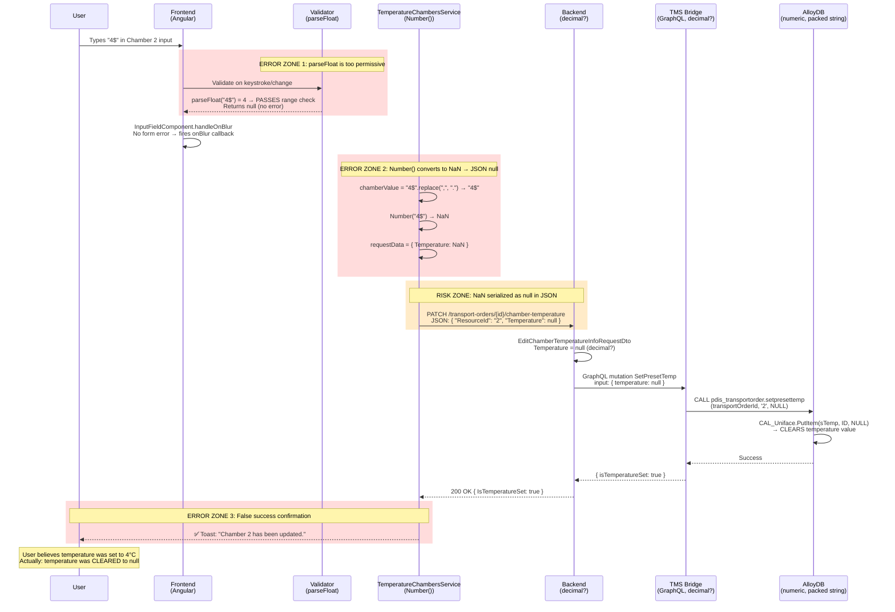

# BUG-125592: Validation issues in temperature chamber values

## TL;DR

**Severity escalation recommended: 3 → 2.** This is not just a missing validation — it is **silent data corruption**.

The frontend temperature validator uses `parseFloat()`, which silently ignores trailing garbage (`parseFloat("4$")` → `4`). So inputs like `4$`, `7%`, or `2.345.2` pass validation. But the service that builds the API request uses `Number()`, which correctly rejects them — returning `NaN`. JavaScript's `JSON.stringify(NaN)` produces `null`, so the backend receives `Temperature: null` and **clears the stored temperature**. The user sees a success toast ("Chamber 2 has been updated.") while the value was actually erased.

**Fix:** Replace `parseFloat()` with `Number()` (or a strict regex) in `chamber-temperature-validators.ts:16`. One-line change. Add `invalidNumber` to the error message map so users see text, not just a red border.

**Deeper issues found:** No server-side validation exists anywhere (Backend, TMS Bridge, stored procedure). Read path uses `double?` while write path uses `decimal?` (precision mismatch). Database column is `numeric(4,0)` — integer only, so decimal inputs are silently truncated.

## Ticket Info

| Field | Value |
|-------|-------|
| **ID** | 125592 |
| **Title** | Validation issues in temperature chamber values |
| **Type** | Bug |
| **State** | To Do |
| **Priority** | 2 |
| **Severity** | 3 - Medium |
| **Created** | 2026-06-18 14:17 UTC |
| **Reporter** | Valentin Varbanov |
| **Sprint** | Sprint 48 |
| **Parent** | 111427 — Minor Bugs - Pickup Planning |
| **Environment** | test |
| **Found In** | test |

### Screenshot Evidence (from ticket)

The attached screenshot shows Transport Order #839750 on the Transport Features tab:

| Chamber | Input | Red Border? | Toast? | What Actually Happened |
|---------|-------|-------------|--------|----------------------|
| Chamber 1 | `4$` | No | — | `parseFloat("4$")` = 4 → validator passes → **bug** |
| Chamber 2 | `7%` | No | "Chamber 2 has been updated." ✅ | `parseFloat("7%")` = 7 → validator passes → `Number("7%")` = NaN → sent as `null` → **temperature CLEARED** |
| Chamber 3 | `%5` | **Yes** (red) | — | `parseFloat("%5")` = NaN → validator catches → blocked correctly |

The success toast on Chamber 2 with value `7%` is the **smoking gun** for silent data corruption: the system confirmed the update while actually clearing the temperature to null.

Note: Chamber 3 shows the red border but **no error message text** — the `invalidNumber` error key has no display mapping.

### Repro Steps

1. Login to NagelCALDisposition web app
2. Navigate to Transport Orders page
3. Click details
4. Go to Transport Features tab
5. Add values in the Temperature Chambers as follows:
   - `2.345.2` (double decimal separator)
   - `4$` or `5%` (trailing special characters)
6. Observe: no validation error, success toast appears

**Note from reporter:** If the value is `$4` or `%5` then the field IS highlighted with a red border (expected behavior). But `4$` / `5%` are NOT caught.

## Components Involved

| Component | Repository | Role | Type Carried |
|-----------|-----------|------|-------------|
| New Dispo Frontend | `Code/Disposition-Frontend` | Input, validation, API call | `string` (user input) → `number \| null` (JSON payload) |
| New Dispo Backend | `Code/Disposition-Backend` | Pass-through to TMS Bridge | `decimal?` (C#) |
| TMS Bridge | `Code/Disposition-Abstraction-Layer` | GraphQL → stored procedure call | `decimal?` (C# → SQL `numeric`) |
| TMS Database | `Code/tms-alloydb-schema` | Stored procedure writes to packed string | `numeric` → Uniface packed string |

## Architecture of the Temperature Chamber Write Flow



### Error Zone Summary

| Zone | Location | Error | Impact | Root Cause |
|------|----------|-------|--------|------------|
| 1 | Frontend Validator | `parseFloat()` parses leading digits, ignores trailing garbage | Invalid values pass validation | Wrong parsing function for input validation |
| 2 | Frontend Service | `Number()` returns `NaN` for same input, serialized as `null` | Temperature cleared instead of set | Validator/service use different parsers |
| 3 | Frontend Service | Success toast shown for null-write | User misinformed | No downstream verification of actual value stored |

## Live Verification (test environment, 2026-06-19)

Bug reproduced on `https://test.dispo.gcp.nagel-group.com`, Branch 10-34 Kaufungen, Transport Order #438415.

### Test 1: `4$` in Chamber 1 — silent data corruption


- Input `4$` in Chamber 1: **no red border**, success toast "Kammer 1 wurde aktualisiert."
- **Network request** (PATCH `/api/transportorders/10340435559715/chamber-temperature`):
  ```json
  Request:  {"ResourceId":"1","Temperature":null}
  Response: {"TransportOrderId":10340435559715,"IsTemperatureSet":true}
  ```
- **Verdict:** User typed `4$`, backend received `null`, temperature **cleared**. Success toast shown. Silent data corruption confirmed.

### Test 2: `2.345.2` in Chamber 2 — silent data corruption


- Input `2.345.2` in Chamber 2: **no red border**, success toast "Kammer 2 wurde aktualisiert."
- **Network request** (PATCH `/api/transportorders/10340435559715/chamber-temperature`):
  ```json
  Request:  {"ResourceId":"2","Temperature":null}
  Response: {"TransportOrderId":10340435559715,"IsTemperatureSet":true}
  ```
- **Verdict:** Same pattern. Double decimal → `parseFloat` reads `2.345` (passes) → `Number` returns `NaN` → JSON `null` → temperature cleared.

### Test 3: `%5` in Chamber 3 — correctly blocked

- Input `%5` in Chamber 3: **red border shown**, no toast, **no PATCH request sent**
- **Verdict:** `parseFloat("%5")` = `NaN` → validator returns `{ invalidNumber: true }` → form error blocks blur handler. Correctly caught.

### Network Evidence Summary

| Test | Input | Validator | API Sent? | Payload Temperature | DB Effect | Toast |
|------|-------|-----------|-----------|-------------------|-----------|-------|
| 1 | `4$` | `parseFloat("4$")` = 4 → pass | Yes | `null` | **Cleared** | "Kammer 1 wurde aktualisiert." |
| 2 | `2.345.2` | `parseFloat("2.345.2")` = 2.345 → pass | Yes | `null` | **Cleared** | "Kammer 2 wurde aktualisiert." |
| 3 | `%5` | `parseFloat("%5")` = NaN → fail | No | — | Unchanged | None |

### Key Files

**Frontend:**
- `Code/Disposition-Frontend/apps/nagel-cal-disposition/src/app/components/forms/cal-order-details-forms/cal-load-details-form/chamber-temperatures/chamber-temperature-validators.ts` — **the broken validator** (parseFloat on line 16)
- `Code/Disposition-Frontend/apps/nagel-cal-disposition/src/app/components/forms/cal-order-details-forms/cal-load-details-form/chamber-temperatures/chamber-temperatures.component.ts` — component using the validator
- `Code/Disposition-Frontend/apps/nagel-cal-disposition/src/app/services/cal-order-details-services/temperature-chambers.service.ts` — service that sends API request (Number() on line 53)
- `Code/Disposition-Frontend/libs/nagel-form/src/lib/fields/input-field/input-field.component.ts` — InputFieldComponent with blur-gate (line 89-98)
- `Code/Disposition-Frontend/apps/nagel-cal-disposition/src/models/loadDetailsTypes.ts` — type definitions, MIN/MAX constants
- `Code/Disposition-Frontend/libs/nagel-form/src/lib/formErrorsConsts.ts` — error message map (missing `invalidNumber`)
- `Code/Disposition-Frontend/libs/nagel-utils/src/lib/commonErrorResolver.ts` — common error resolver (also missing `invalidNumber`)

**Backend:**
- `Code/Disposition-Backend/CALConsult.Disposition.API/Application/Resources/TransportOrders/TransportOrdersController.cs:70` — PATCH endpoint
- `Code/Disposition-Backend/CALConsult.Disposition.API/Application/Resources/TransportOrders/Requests/EditChamberTemperatureInfo/Dtos/EditChamberTemperatureInfoRequestDto.cs` — `decimal? Temperature`
- `Code/Disposition-Backend/CALConsult.Disposition.API/Application/Resources/TransportOrders/Requests/EditChamberTemperatureInfo/EditChamberTemperatureInfoQueryHandler.cs` — handler (pass-through)
- `Code/Disposition-Backend/CALConsult.Disposition.API/Shared/GraphQL/RequestExecutors/Mutations/CallSetPresetTempRequestExecutor.cs` — GraphQL mutation call

**TMS Bridge:**
- `Code/Disposition-Abstraction-Layer/CALConsult.TMSBridge.API/GraphQL/Mutations/PdisTransportOrder/SetPresetTemp/SetPresetTempMutation.cs` — mutation calling stored procedure
- `Code/Disposition-Abstraction-Layer/CALConsult.TMSBridge.API/GraphQL/Mutations/PdisTransportOrder/SetPresetTemp/Dtos/SetPresetTempInput.cs` — `decimal? Temperature`
- `Code/Disposition-Abstraction-Layer/CALConsult.TMSBridge.API/Data/Entities/PresetTemp/PresetTempEntity.cs` — entity with `decimal? Temp`

**Database:**
- `Code/tms-alloydb-schema/src/sql/package/PDIS_TRANSPORTORDER.sql:514` — `SetPresetTemp` procedure (accepts `numeric`)
- `Code/tms-alloydb-schema/src/sql/view/V_DIS_TO_PresetTemp.sql` — read view extracting temperature from packed string
- `Code/tms-alloydb-schema/src/sql/view/V_DIS_TRANSPORTORDER_PRESETTEMP.sql` — alternate view (same logic)

## Root Cause Analysis

### Root Cause 1: `parseFloat()` is the wrong parser for input validation

**File:** `chamber-temperature-validators.ts:16`

```typescript
const parsedValue = parseFloat(value);

if (isNaN(parsedValue)) {
    return { invalidNumber: true };
}
```

JavaScript's `parseFloat()` parses as many leading characters as possible and **silently ignores trailing garbage**:

| Input | `parseFloat()` result | Validator verdict | Correct verdict |
|-------|----------------------|-------------------|-----------------|
| `"4$"` | `4` | ✅ Valid | ❌ Invalid |
| `"5%"` | `5` | ✅ Valid | ❌ Invalid |
| `"2.345.2"` | `2.345` | ✅ Valid | ❌ Invalid |
| `"4.5abc"` | `4.5` | ✅ Valid | ❌ Invalid |
| `"$4"` | `NaN` | ❌ Invalid | ❌ Invalid |
| `"%5"` | `NaN` | ❌ Invalid | ❌ Invalid |
| `"abc"` | `NaN` | ❌ Invalid | ❌ Invalid |

This explains the exact asymmetry reported: leading special characters are caught (`$4`), trailing ones are not (`4$`).

### Root Cause 2: Validator and service use different parsing functions

The validator uses `parseFloat()` (permissive), but the service that builds the API request uses `Number()` (strict):

**File:** `temperature-chambers.service.ts:53`
```typescript
const temperature = chamberValue !== '' ? Number(chamberValue) : null;
```

| Input | `parseFloat()` (Validator) | `Number()` (Service) | Consequence |
|-------|---------------------------|---------------------|-------------|
| `"4$"` | `4` → passes | `NaN` → serialized as `null` | **Temperature CLEARED** |
| `"2.345.2"` | `2.345` → passes | `NaN` → serialized as `null` | **Temperature CLEARED** |
| `"4.5"` | `4.5` → passes | `4.5` → correct | ✅ Works correctly |

When `Number()` returns `NaN` and it's serialized to JSON, `NaN` becomes `null` per the JSON specification. The backend receives `Temperature: null` (valid `decimal?`), the TMS Bridge passes `null` to the stored procedure, and the database clears the temperature value.

### Root Cause 3: False success confirmation (silent data corruption)

The TMS Bridge mutation responds with `IsTemperatureSet: true` unconditionally before the try block, only setting it to `false` if an exception is thrown. Since passing `null` to `CAL_Uniface.PutItem` doesn't throw — it successfully writes null — the response confirms success.

The frontend then shows a success toast: *"Chamber 2 has been updated."*

The user believes their temperature was set. In reality, it was cleared.

### Root Cause 4: Type inconsistency in read vs write path

**Write path** (edit temperature): `decimal?` throughout (Frontend → Backend → TMS Bridge → DB `numeric`)

**Read path** (load temperature): `numeric` (DB) → `decimal?` (TMS Bridge entity `PresetTempEntity.Temp`) → **`double?`** (Backend `ChamberDto.PresetTemperature` at `Shared/GraphQL/Dtos/Queries/transportOrderDetails/Shared/ChamberDto.cs:17`) → `string` (Frontend, via `.toString().replace('.', ',')`)

The read path uses `double?` while the write path uses `decimal?`. While not the cause of this specific bug, `double` has floating-point precision issues (e.g., `0.1 + 0.2 ≠ 0.3`) that could cause subtle display or comparison errors for temperature values.

Additionally, the underlying database type is `numeric(4,0)` — integer-only, no decimal places. Decimal inputs like `4.5` would be truncated to `4` at the database level without any warning to the user.

### Secondary Issue: Missing error message for `invalidNumber`

When the validator does catch an invalid input (like `$4`), the red border appears but **no error message** is shown. The `invalidNumber` error key is not mapped in:
- `CUSTOM_ERROR_MESSAGES` (only has `min`, `max`)
- `commonErrorResolver.ts` (doesn't include `invalidNumber`)

The error display path in `InputFieldComponent.getValidationErrors()` falls through all branches and returns `null`.

## Complete Data Type Chain

```
Frontend Input     → string         "4$" (from HTML text input)
Frontend Validator → parseFloat()   4 (ignores "$")        ← BUG: should reject
Frontend Service   → Number()       NaN                    ← different parser!
JSON Serialization → null           (NaN → null per spec)
Backend DTO        → decimal?       null
GraphQL Variable   → Float          null
TMS Bridge Input   → decimal?       null
Stored Procedure   → numeric        NULL
DB Packed String   → null/empty     temperature CLEARED
```

## Impact Assessment

| Scenario | User Sees | Actual Result | Severity |
|----------|-----------|---------------|----------|
| `"4$"` entered | ✅ Success toast | Temperature **cleared** to null | **High** — silent data loss |
| `"2.345.2"` entered | ✅ Success toast | Temperature **cleared** to null | **High** — silent data loss |
| `"4.5abc"` entered | ✅ Success toast | Temperature **cleared** to null | **High** — silent data loss |
| `"$4"` entered | 🔴 Red border (no text) | Not sent (correct) | **Low** — UX only |

The ticket is classified as Severity 3 (Medium), but the silent data corruption behavior warrants escalation to **Severity 2 (High)**.

## Recommendations

### Immediate

1. **Replace `parseFloat()` with strict numeric validation** in `chamber-temperature-validators.ts`:

   Replace the validator logic to use either:
   - `Number()` (matching the service), OR
   - A regex like `/^-?\d+([.,]\d+)?$/` to ensure the entire string is a valid number

   This ensures the validator and the service agree on what constitutes a valid number.

2. **Add `invalidNumber` to error message mappings** in `formErrorsConsts.ts`:

   ```typescript
   export const CUSTOM_ERROR_MESSAGES = {
       'min': (min: number) => $localize`Minimum value is ${min}`,
       'max': (max: number) => $localize`Maximum value is ${max}`,
       'invalidNumber': () => $localize`Please enter a valid number`
   };
   ```

### Short-Term

3. **Add backend validation** in `EditChamberTemperatureInfoRequestDto` or a FluentValidation validator — the backend currently accepts any value without server-side validation. Defense in depth:
   - Validate `Temperature` is within `[-50, 50]` range (matching frontend constants)
   - Validate `ResourceId` is one of `"1"`, `"2"`, `"3"`

4. **Consider using `type="number"` on the input field** — the `lib-input-field` currently defaults to `type="text"`. While `type="number"` has locale issues with decimal separators, it would prevent most non-numeric input from being entered.

### Medium-Term

5. **Harmonize parsing across validator and service** — using different parsing strategies (`parseFloat` vs `Number`) for the same input is a systemic risk. Establish a single shared parsing function used by both validation and request building.

6. **Add response verification in the service** — after a successful save, verify the stored value matches the intended value (read-after-write verification) to catch silent corruption.

7. **Audit other numeric input fields** for the same `parseFloat` pattern — this bug pattern may exist in other numeric inputs across the application.

---

<div align="center">
  <sub>Created and maintained by <strong>Virtual Architect</strong></sub>
</div>
